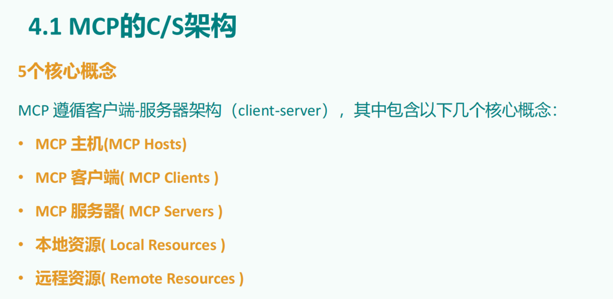
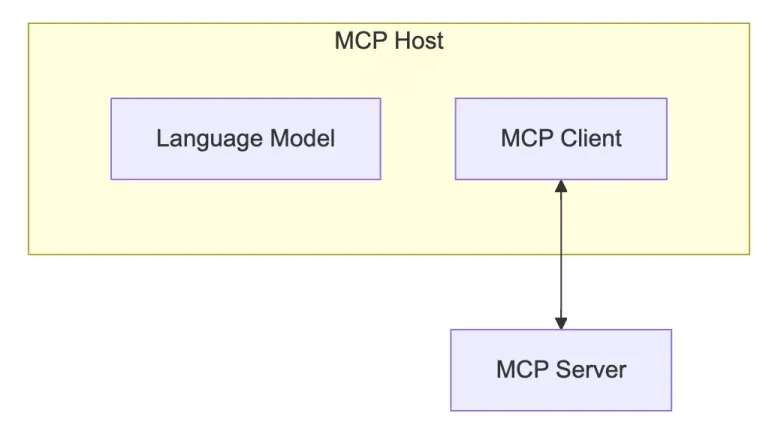
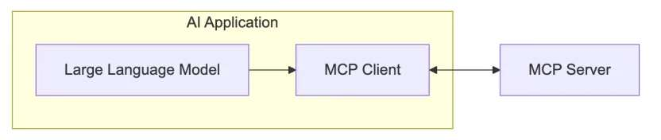
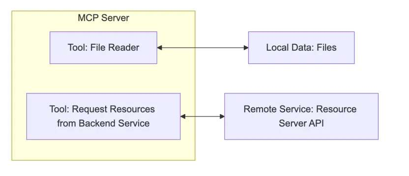
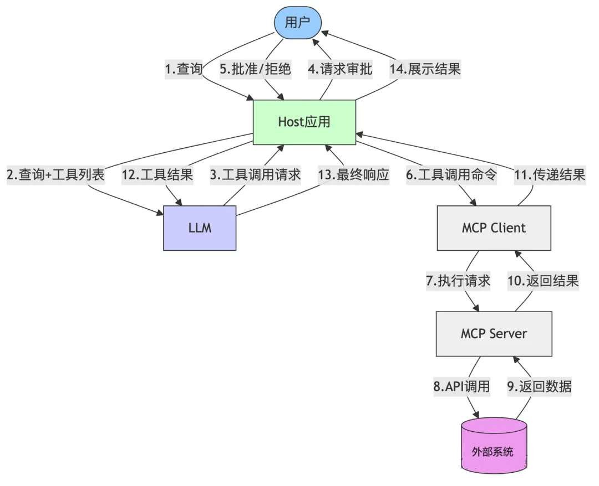

# **①** **MCP****的通信机制：

## **stdio方式**

**优点**

• 这种方式适用于客户端和服务器在同一台机器上运行的场景，简单。

• stdio模式无需外部网络依赖，通信速度快，适合快速响应的本地应用。

• 可靠性高，且易于调试

**缺点**

• Stdio 的配置比较复杂，我们需要做些准备工作，你需要提前安装需要的命令行工具。

• stdio模式为单进程通信，无法并行处理多个客户端请求，同时由于进程资源开销较大，不适合

在本地运行大量服务。（限制了其在更复杂分布式场景中的使用）

## ***SSE***方式

**场景**

• SSE方式适用于客户端和服务器位于不同物理位置的场景。

• 适用于实时数据更新、消息推送、轻量级监控和实时日志流等场景

• 对于分布式或远程部署的场景，基于 HTTP 和 SSE 的传输方式则更为合适。

**优点**

• 配置方式非常简单，基本上就一个链接就行，直接复制他的链接填上就行

# MCP的c/s架构

## **①** **MCP Host**

作为运行 MCP 的主应用程序，例如 Claude Desktop、Cursor、Cline 或 AI 工具。

为用户提供与LLM交互的接口，同时集成 MCP Client 以连接 MCP Server。

## **②** **MCP Client**

MCP client 充当 LLM 和 MCP server 之间的桥梁，嵌入在主机程序中，主要负责：

• 接收来自LLM的请求；

• 将请求转发到相应的 MCP server

• 将 MCP server 的结果返回给 LLM

## **3** **MCP Server**

每个 MCP 服务器都提供了一组特定的工具，负责从本地数据或远程服务中检索信息。

是 MCP 架构中的关键组件。

与传统的远程 API 服务器不同，MCP 服务器既可以作为**本地应用程序**在用户设备上运

行，也可部署至**远程服务器**。

比如你让助手：

• “帮我查航班信息” → 它调用航班查询 API

• “算一下 37% 折扣后多少钱” → 它运行计算器函数

作用：让 LLM 不仅能“说”，还能“做”（执行代码、查询数据等）。

## **MCP Server** **的本质**

本质是运行在电脑上的一个nodejs或python程序。可以理解为客户端用命令行调用了

电脑上的nodejs或python程序。

• 使用 TypeScript 编写的 MCP server 可以通过 **npx** 命令来运行

• 使用 Python 编写的 MCP server 可以通过 **uvx** 命令来运行。

# **MCP的工作流程**

API 主要有两个

• **tools/list****：**列出 Server 支持的所有工具

• **tools/call****：**Client 请求 Server 去执行某个工具，

并将结果返回

# **A2A协议：开启Agent间自然协作**

## 在 AI Agent 的世界里，主要解决两大互联领域的挑战：

**第一、****Agent** **与** **Tools****（工具）的交互** **-------------------> MCP**

Agent 需要调用外部 API、访问数据库、执行代码等。

**第二、****Agent** **与** **Agent****（其他智能体或用户）的交互**------------------> A2A****

Agent 需要理解其他 Agent 的意图、协同完成任务、

与用户进行自然的对话。