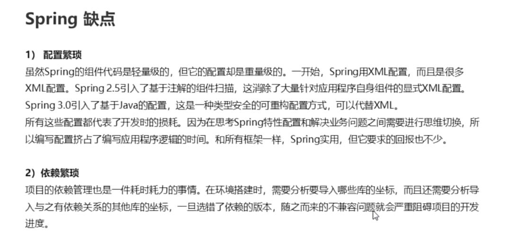

# 以下是一个 **Spring Boot 后端开发入门示例**，以用户管理功能为例，涵盖基础配置、数据操作和 API 设计。通过分步拆解，帮助新人快速理解核心概念和实现流程。

------




### ** 一、项目创建与依赖配置**

#### 1.1 使用 Spring Initializr 创建项目

访问 Spring Initializr，配置如下：

- 

  **Project**: Maven

- 

  **Language**: Java

- 

  **Spring Boot**: 3.2.2（最新稳定版）

- 

  **Group**: `com.example`

- 

  **Artifact**: `springboot-demo`

- 

  **Dependencies**: 添加 `Spring Web`和 `Spring Data JPA`

点击 **Generate** 下载项目压缩包，解压后导入 IDE（如 IntelliJ IDEA）。

#### 1.2 项目结构说明

```
src/main/java
└── com.example.springbootdemo
    ├── SpringbootDemoApplication.java  # 启动类
    ├── controller                      # 控制器层
    │   └── UserController.java
    ├── service                       # 服务层
    │   └── UserService.java
    ├── repository                    # 数据访问层
    │   └── UserRepository.java
    └── entity                        # 实体类
        └── User.java
src/main/resources
├── application.properties            # 配置文件
└── static/                           # 静态资源
```

------

### **二、核心代码实现**

#### 2.1 配置文件 `application.properties`

properties

复制

```
# 服务器端口
server.port=8080

# H2 内存数据库配置
spring.datasource.url=jdbc:h2:mem:testdb
spring.datasource.driver-class-name=org.h2.Driver
spring.datasource.username=sa
spring.datasource.password=password

# JPA 配置
spring.jpa.hibernate.ddl-auto=update
spring.jpa.show-sql=true
```

- 

  **作用**：配置服务器端口、数据库连接及 JPA 行为

  

------

#### 2.2 实体类 `User.java`

java

下载

复制

运行

```
package com.example.springbootdemo.entity;

import jakarta.persistence.Entity;
import jakarta.persistence.GeneratedValue;
import jakarta.persistence.GenerationType;
import jakarta.persistence.Id;

@Entity  // 声明为 JPA 实体
public class User {
    @Id
    @GeneratedValue(strategy = GenerationType.IDENTITY)  // 主键自增
    private Long id;
    private String name;
    private String email;

    // Getter/Setter 省略（可用 Lombok 简化）
}
```

- 

  **作用**：定义数据库表结构，通过注解映射到数据库

  

------

#### 2.3 数据访问层 `UserRepository.java`

java

下载

复制

运行

```
package com.example.springbootdemo.repository;

import com.example.springbootdemo.entity.User;
import org.springframework.data.jpa.repository.JpaRepository;

public interface UserRepository extends JpaRepository<User, Long> {
    // 自定义查询方法（按名称查询）
    User findByName(String name);
}
```

- 

  **作用**：继承 `JpaRepository`，自动获得 CRUD 方法，无需手动实现

  

------

#### 2.4 服务层 `UserService.java`

java

下载

复制

运行

```
package com.example.springbootdemo.service;

import com.example.springbootdemo.entity.User;
import com.example.springbootdemo.repository.UserRepository;
import org.springframework.stereotype.Service;

import java.util.List;

@Service  // 声明为服务组件
public class UserService {
    private final UserRepository userRepository;

    // 构造器注入依赖
    public UserService(UserRepository userRepository) {
        this.userRepository = userRepository;
    }

    // 业务逻辑：获取所有用户
    public List<User> getAllUsers() {
        return userRepository.findAll();
    }

    // 业务逻辑：创建用户
    public User createUser(User user) {
        return userRepository.save(user);
    }
}
```

- 

  **作用**：封装数据访问逻辑，实现业务规则

  

------

#### 2.5 控制器层 `UserController.java`

java

下载

复制

运行

```
package com.example.springbootdemo.controller;

import com.example.springbootdemo.entity.User;
import com.example.springbootdemo.service.UserService;
import org.springframework.web.bind.annotation.*;

import java.util.List;

@RestController  // 组合注解：@Controller + @ResponseBody
@RequestMapping("/api/users")  // 路由前缀
public class UserController {
    private final UserService userService;

    // 构造器注入服务
    public UserController(UserService userService) {
        this.userService = userService;
    }

    // 获取所有用户
    @GetMapping
    public List<User> getAllUsers() {
        return userService.getAllUsers();
    }

    // 创建用户
    @PostMapping
    public User createUser(@RequestBody User user) {
        return userService.createUser(user);
    }
}
```

- 

  **关键注解**：

  - 

    `@RestController`：处理 HTTP 请求并返回 JSON 数据。

  - 

    `@GetMapping`/`@PostMapping`：映射 HTTP 方法到方法。

  - 

    `@RequestBody`：将请求体 JSON 转换为 Java 对象

    

------

### **三、运行与测试**

#### 3.1 启动应用

运行 `SpringbootDemoApplication`类的 `main`方法，控制台输出类似：

复制

```
Tomcat started on port(s): 8080 (http) with context path ''
```

#### 3.2 使用 Postman 测试 API

1. 

   **获取所有用户**：

   - 

     **请求**：`GET http://localhost:8080/api/users`

   - 

     **响应**：

     json

     复制

     ```
     []
     ```

2. 

   **创建用户**：

   - 

     **请求**：`POST http://localhost:8080/api/users`

   - 

     **Body**（JSON）：

     json

     复制

     ```
     {
       "name": "Alice",
       "email": "alice@example.com"
     }
     ```

   - 

     **响应**：

     json

     复制

     ```
     {
       "id": 1,
       "name": "Alice",
       "email": "alice@example.com"
     }
     ```

------

### **四、扩展功能示例**

#### 4.1 添加 H2 控制台（内存数据库管理）

1. 

   在 `pom.xml`添加依赖：

   xml

   复制

   ```
   <dependency>
       <groupId>com.h2database</groupId>
       <artifactId>h2</artifactId>
       <scope>runtime</scope>
   </dependency>
   ```

2. 

   在 `application.properties`开启控制台：

   properties

   properties

   复制

   ```
   spring.h2.console.enabled=true
   spring.h2.console.path=/h2-console
   ```

3. 

   访问 `http://localhost:8080/h2-console`，使用 JDBC URL `jdbc:h2:mem:testdb`登录。

------

### **五、总结**

通过以上步骤，我们实现了一个简单的 Spring Boot 后端应用，涵盖：

1. 

   **项目结构**：分层设计（Controller-Service-Repository）。

2. 

   **数据持久化**：通过 JPA 操作数据库。

3. 

   **RESTful API**：使用注解定义接口。

**新人学习建议**：

- 

  先掌握 **MVC 分层思想** 和 **注解驱动开发**。

- 

  多练习数据库操作（如条件查询、事务管理）。

- 

  结合 Swagger 生成 API 文档，提升可维护性

# 要理解**MVC分层思想**和**注解驱动开发**，我们需要从**设计理念**和**技术实现**两个维度入手，结合Spring Boot的具体实践，用“分层职责+注解落地”的方式拆解，让新人能快速建立直观认知。

### **一、MVC分层思想：Web开发的核心架构模式**

MVC（Model-View-Controller）是一种**分离关注点**的设计模式，将应用程序分为三个核心层，解决传统Web开发中“代码混乱、维护困难”的问题。在Spring Boot中，MVC分层被进一步细化为**三层架构**（表现层、业务逻辑层、数据访问层），对应MVC的具体实现。

#### **1. MVC分层的核心逻辑**

MVC的本质是**“职责分离”**：

- 

  **Model（模型）**：负责**数据表示**和**业务逻辑**，是应用程序的“数据核心”。

  例如，用户信息（`User`实体类）、订单数据（`Order`实体类）都属于Model层，它们封装了数据结构和业务规则（如用户密码加密、订单金额计算）。

- 

  **View（视图）**：负责**数据展示**，是用户与应用程序交互的“界面”。

  例如，网页（HTML/JSP）、移动端界面（XML/Compose）都属于View层，它们将Model的数据渲染成用户可理解的形式。

- 

  **Controller（控制器）**：负责**请求调度**，是Model与View之间的“桥梁”。

  例如，处理用户登录请求的`LoginController`、查询订单的`OrderController`，它们接收用户请求，调用Model层处理业务，再将结果返回给View层。

#### **2. Spring Boot中的MVC分层实现**

Spring Boot将MVC分层与**三层架构**结合，形成更具体的**四层结构**（启动类所在包为根包）：

- 

  **表现层（Controller层）**：

  对应`@Controller`或`@RestController`注解的类，负责接收HTTP请求，调用Service层处理业务，返回响应（JSON/XML或视图）。

  例如：`UserController`处理`/users`路径的请求，调用`UserService`获取用户列表。

- 

  **业务逻辑层（Service层）**：

  对应`@Service`注解的类，负责**核心业务逻辑**（如用户注册、订单支付），调用Repository层操作数据库。

  例如：`UserService`中的`getAllUsers()`方法，调用`UserRepository`的`findAll()`方法获取所有用户。

- 

  **数据访问层（Repository层）**：

  对应`@Repository`注解的接口（继承`JpaRepository`），负责**数据库操作**（增删改查），Spring Data JPA会自动生成实现。

  例如：`UserRepository`接口中的`findByUsername(String username)`方法，用于根据用户名查询用户。

- 

  **实体层（Model层）**：

  对应`@Entity`注解的类，负责**映射数据库表**（如`User`类映射`user`表），封装数据结构。

  例如：`User`类中的`id`、`username`、`password`字段，对应数据库表的列。

#### **3. MVC分层的优势**

- 

  **可维护性**：各层职责明确，修改业务逻辑只需调整Service层，不会影响Controller或View层。

- 

  **可复用性**：Service层的方法可以被多个Controller调用（如`UserService`的`getAllUsers()`可以被`UserController`和`AdminController`调用）。

- 

  **可测试性**：各层可以独立测试（如用JUnit测试Service层的业务逻辑，无需启动Web服务器）。

### **二、注解驱动开发：Spring Boot的“魔法”**

注解（Annotation）是Spring Boot的**核心特性**，它通过“元数据”（标记）告诉框架“如何做”，无需手动编写大量配置代码。Spring Boot的注解分为**核心注解**、**MVC注解**、**依赖注入注解**、**数据访问注解**等，覆盖了应用程序的各个层面。

#### **1. 核心注解：启动与配置**

- 

  **`@SpringBootApplication`**：

  Spring Boot的**入口注解**，组合了`@SpringBootConfiguration`（配置类）、`@EnableAutoConfiguration`（自动配置）、`@ComponentScan`（组件扫描）三个注解。

  作用：标记主类，启动Spring Boot应用，自动配置依赖（如引入`spring-boot-starter-web`会自动配置Tomcat和Spring MVC），扫描根包下的组件（`@Controller`、`@Service`等）。

  示例：

  java

  下载

  复制

  运行

  ```
  @SpringBootApplication
  public class Application {
      public static void main(String[] args) {
          SpringApplication.run(Application.class, args);
      }
  }
  ```
  
- 

  **`@Configuration`**：

  标记类为**配置类**，替代传统的XML配置（如`applicationContext.xml`）。

  作用：定义Bean（如数据源、事务管理器），通过`@Bean`注解注册Bean到Spring容器。

  示例：

  java

  下载

  复制

  运行

  ```
  @Configuration
  public class WebConfig implements WebMvcConfigurer {
      // 自定义MVC配置（如拦截器、视图解析器）
  }
  ```
  
- 

  **`@ComponentScan`**：

  扫描**组件**（`@Controller`、`@Service`、`@Repository`等），将其注册为Spring Bean。

  作用：默认扫描主类所在包及其子包，无需手动配置`beans.xml`。

  示例：

  java

  下载

  复制

  运行

  ```
  @SpringBootApplication
  @ComponentScan(basePackages = "com.example.demo") // 指定扫描包（可选）
  public class Application {
      // ...
  }
  ```

#### **2. MVC注解：Web请求处理**

- 

  **`@Controller`**：

  标记类为**控制器**，负责接收HTTP请求，返回视图（如JSP、Thymeleaf）。

  作用：与`@RequestMapping`配合，映射请求路径到处理方法。

  示例：

  java

  下载

  复制

  运行

  ```
  @Controller
  @RequestMapping("/users")
  public class UserController {
      @Autowired
      private UserService userService;
  
      @RequestMapping(method = RequestMethod.GET)
      public String getAllUsers(Model model) {
          model.addAttribute("users", userService.getAllUsers());
          return "userList"; // 返回视图名称（对应userList.html）
      }
  }
  ```
  
- 

  **`@RestController`**：

  **`@Controller`+ `@ResponseBody`**的组合注解，标记类为**RESTful控制器**，返回JSON/XML数据（而非视图）。

  作用：适用于前后端分离的项目，直接返回数据给前端。

  示例：

  java

  下载

  复制

  运行

  ```
  @RestController
  @RequestMapping("/api/users")
  public class UserApiController {
      @Autowired
      private UserService userService;
  
      @GetMapping
      public List<User> getAllUsers() {
          return userService.getAllUsers(); // 返回JSON数据
      }
  }
  ```
  
- 

  **`@RequestMapping`**：

  映射**HTTP请求**到处理方法，支持`GET`、`POST`、`PUT`、`DELETE`等方法。

  属性：

  - 

    `value`：请求路径（如`/users`）；

  - 

    `method`：请求方法（如`RequestMethod.GET`）；

  - 

    `params`：请求参数（如`params = "username"`，表示请求必须包含`username`参数）。

    示例：

  java

  下载

  复制

  运行

  ```
  @RequestMapping(value = "/users/{id}", method = RequestMethod.GET)
  public User getUserById(@PathVariable Long id) {
      return userService.getUserById(id); // 根据ID查询用户
  }
  ```
  
- 

  **`@PathVariable`**：

  从**URL路径**中获取参数（如`/users/{id}`中的`id`）。

  作用：将URL中的变量映射到方法参数。

  示例：

  java

  下载

  复制

  运行

  ```
  @GetMapping("/users/{id}")
  public User getUserById(@PathVariable("id") Long userId) { // 变量名与路径中的占位符一致
      return userService.getUserById(userId);
  }
  ```
  
- 

  **`@RequestParam`**：

  从**请求参数**中获取值（如`/users?username=admin`中的`username`）。

  属性：

  - 

    `value`：参数名称（如`username`）；

  - 

    `required`：是否必须（默认`true`，若请求中没有该参数会报错）；

  - 

    `defaultValue`：默认值（如`defaultValue = "guest"`）。

    示例：

  java

  下载

  复制

  运行

  ```
  @GetMapping("/users")
  public List<User> getUsersByUsername(@RequestParam("username") String username) {
      return userService.getUsersByUsername(username); // 根据用户名查询用户
  }
  ```
  
- 

  **`@RequestBody`**：

  将**HTTP请求体**（如JSON、XML）转换为Java对象。

  作用：适用于POST、PUT请求，接收前端传递的JSON数据。

  示例：

  java

  下载

  复制

  运行

  ```
  @PostMapping("/users")
  public User createUser(@RequestBody User user) {
      return userService.createUser(user); // 创建用户
  }
  ```

#### **3. 依赖注入注解：组件协作**

- 

  **`@Autowired`**：

  **自动注入**依赖（如Service注入Repository），Spring会自动寻找匹配的Bean并注入。

  属性：

  - 

    `required`：是否必须（默认`true`，若找不到Bean会报错）；

  - 

    `@Qualifier`：指定Bean的名称（当有多个同类型Bean时使用）。

    示例：

  java

  下载

  复制

  运行

  ```
  @Service
  public class UserService {
      @Autowired
      private UserRepository userRepository; // 自动注入UserRepository
  }
  ```
  
- 

  **`@Resource`**：

  **按名称注入**依赖（JSR-250规范），默认按名称查找Bean，找不到再按类型查找。

  属性：

  - 

    `name`：Bean的名称（如`name = "userRepository"`）；

  - 

    `type`：Bean的类型（如`type = UserRepository.class`）。

    示例：

  java

  下载

  复制

  运行

  ```
  @Service
  public class UserService {
      @Resource(name = "userRepository")
      private UserRepository userRepo; // 按名称注入
  }
  ```
  
- 

  **`@Component`**：

  通用**组件注解**，标记类为Spring Bean（如工具类、配置类）。

  示例：

  java

  下载

  复制

  运行

  ```
  @Component
  public class DateUtils {
      // 日期工具方法
  }
  ```

#### **4. 数据访问注解：数据库操作**

- 

  **`@Entity`**：

  标记类为**实体**，映射数据库表（如`User`类映射`user`表）。

  属性：

  - 

    `name`：表名称（如`name = "t_user"`，默认与类名一致）。

    示例：

  java

  下载

  复制

  运行

  ```
  @Entity
  public class User {
      @Id
      @GeneratedValue(strategy = GenerationType.IDENTITY)
      private Long id;
      private String username;
      private String password;
      // getter/setter
  }
  ```
  
- 

  **`@Id`**：

  标记字段为**主键**（如`User`类的`id`字段）。

  示例：

  java

  java

  下载

  复制

  运行

  ```
  @Entity
  public class User {
      @Id
      private Long id;
      // ...
  }
  ```

- 

  **`@GeneratedValue`**：

  标记主键的**生成策略**（如`GenerationType.IDENTITY`表示自增，适用于MySQL的`AUTO_INCREMENT`）。

  示例：

  java

  java

  下载

  复制

  运行

  ```
  @Id
  @GeneratedValue(strategy = GenerationType.IDENTITY)
  private Long id;
  ```

- 

  **`@Repository`**：

  标记类为**数据访问层组件**（如`UserRepository`），Spring会自动处理数据库异常（将SQL异常转换为Spring的`DataAccessException`）。

  示例：

  java

  java

  下载

  复制

  运行

  ```
  @Repository
  public interface UserRepository extends JpaRepository<User, Long> {
      List<User> findByUsername(String username);
  }
  ```

### **三、MVC与注解的结合：实战示例**

为了更直观地理解MVC分层与注解驱动开发，我们以**用户管理**为例，展示一个简单的Spring Boot应用：

#### **1. 项目结构**


复制

```
src/main/java
└── com.example.demo
    ├── Application.java                # 启动类（@SpringBootApplication）
    ├── controller
    │   └── UserController.java         # 控制层（@RestController）
    ├── service
    │   └── UserService.java            # 业务逻辑层（@Service）
    ├── repository
    │   └── UserRepository.java         # 数据访问层（@Repository）
    └── entity
        └── User.java                   # 实体层（@Entity）
```

#### **2. 代码实现**

- 

  **实体层（Model）**：`User.java`

  java

  java

  下载

  复制

  运行

  ```
  package com.example.demo.entity;
  
  import jakarta.persistence.Entity;
  import jakarta.persistence.GeneratedValue;
  import jakarta.persistence.GenerationType;
  import jakarta.persistence.Id;
  
  @Entity // 标记为实体，映射user表
  public class User {
      @Id // 主键
      @GeneratedValue(strategy = GenerationType.IDENTITY) // 自增
      private Long id;
      private String username;
      private String password;
  
      // getter/setter（省略）
  }
  ```

- 

  **数据访问层（Repository）**：`UserRepository.java`

  java

  java

  下载

  复制

  运行

  ```
  package com.example.demo.repository;
  
  import com.example.demo.entity.User;
  import org.springframework.data.jpa.repository.JpaRepository;
  import org.springframework.stereotype.Repository;
  
  @Repository // 标记为数据访问层组件
  public interface UserRepository extends JpaRepository<User, Long> {
      // 根据用户名查询用户（Spring Data JPA自动生成实现）
      List<User> findByUsername(String username);
  }
  ```

- 

  **业务逻辑层（Service）**：`UserService.java`

  java

  java

  下载

  复制

  运行

  ```
  package com.example.demo.service;
  
  import com.example.demo.entity.User;
  import com.example.demo.repository.UserRepository;
  import org.springframework.beans.factory.annotation.Autowired;
  import org.springframework.stereotype.Service;
  
  import java.util.List;
  
  @Service // 标记为业务逻辑层组件
  public class UserService {
      @Autowired // 自动注入UserRepository
      private UserRepository userRepository;
  
      // 获取所有用户
      public List<User> getAllUsers() {
          return userRepository.findAll();
      }
  
      // 根据用户名查询用户
      public List<User> getUsersByUsername(String username) {
          return userRepository.findByUsername(username);
      }
  
      // 创建用户
      public User createUser(User user) {
          return userRepository.save(user);
      }
  }
  ```

- 

  **控制层（Controller）**：`UserController.java`

  java

  java

  下载

  复制

  运行

  ```
  package com.example.demo.controller;
  
  import com.example.demo.entity.User;
  import com.example.demo.service.UserService;
  import org.springframework.beans.factory.annotation.Autowired;
  import org.springframework.web.bind.annotation.*;
  
  import java.util.List;
  
  @RestController // RESTful控制器（@Controller + @ResponseBody）
  @RequestMapping("/api/users") // 请求路径前缀
  public class UserController {
      @Autowired // 自动注入UserService
      private UserService userService;
  
      // 获取所有用户（GET /api/users）
      @GetMapping
      public List<User> getAllUsers() {
          return userService.getAllUsers();
      }
  
      // 根据用户名查询用户（GET /api/users?username=admin）
      @GetMapping("/by-username")
      public List<User> getUsersByUsername(@RequestParam("username") String username) {
          return userService.getUsersByUsername(username);
      }
  
      // 创建用户（POST /api/users，接收JSON数据）
      @PostMapping
      public User createUser(@RequestBody User user) {
          return userService.createUser(user);
      }
  }
  ```

- 

  **启动类**：`Application.java`

  java

  java

  下载

  复制

  运行

  ```
  package com.example.demo;
  
  import org.springframework.boot.SpringApplication;
  import org.springframework.boot.autoconfigure.SpringBootApplication;
  
  @SpringBootApplication // 启动类（@SpringBootConfiguration + @EnableAutoConfiguration + @ComponentScan）
  public class Application {
      public static void main(String[] args) {
          SpringApplication.run(Application.class, args);
      }
  }
  ```

#### **3. 运行与测试**

- 

  **启动应用**：运行`Application`类的`main`方法，控制台输出`Tomcat started on port(s): 8080 (http)`表示启动成功。

- 

  **测试接口**：

  - 

    获取所有用户：`GET http://localhost:8080/api/users`（返回JSON数组）；

  - 

    根据用户名查询用户：`GET http://localhost:8080/api/users/by-username?username=admin`（返回匹配的用户）；

  - 

    创建用户：`POST http://localhost:8080/api/users`（请求体为JSON，如`{"username": "admin", "password": "123456"}`，返回创建的用户）。

### **四、总结：MVC与注解的关系**

MVC是**设计理念**，解决“如何分层”的问题；注解是**实现工具**，解决“如何简化配置”的问题。两者结合，让Spring Boot应用具备**高内聚、低耦合**的特点：

- 

  **MVC分层**：让各层职责明确，便于维护和扩展；

- 

  **注解驱动**：让开发者专注于业务逻辑，无需手动编写大量配置代码。

对于新人来说，建议先掌握**MVC分层的职责划分**（比如Controller负责接收请求，Service负责业务逻辑，Repository负责数据库操作），再学习**常用注解的用法**（比如`@RestController`、`@Autowired`、`@RequestMapping`），最后通过**实战项目**（如用户管理、订单系统）巩固所学内容。