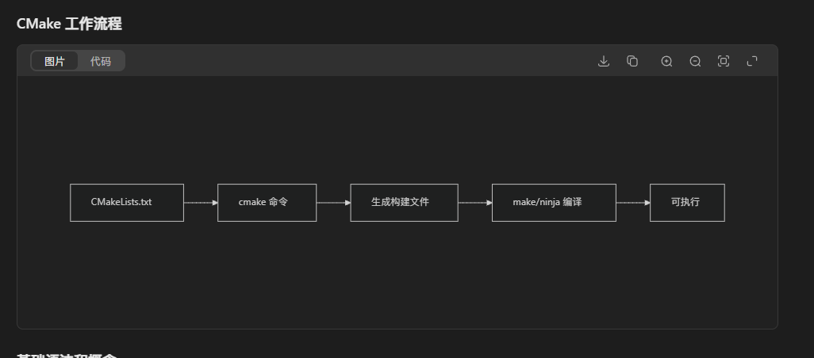

# CMake 介绍与基础使用方法

## 什么是 CMake？

CMake 是一个**跨平台的自动化构建系统**，它使用名为 `CMakeLists.txt`的配置文件来生成标准的构建文件（如 Makefile、Visual Studio 项目等）。

## CMake 的主要优势

- **跨平台**: Windows、Linux、macOS 都能使用
- **编译器无关**: 支持 GCC、Clang、MSVC 等
- **管理复杂项目**: 适合大型项目的依赖管理
- **生态系统丰富**: 广泛用于 C++ 项目

## CMake 工作流程




## 基础语法和概念

### 基本命令

cmake

复制

```
# 设置CMake最低版本要求
cmake_minimum_required(VERSION 3.10)

# 定义项目名称和语言
project(MyProject CXX)

# 设置C++标准
set(CMAKE_CXX_STANDARD 11)
set(CMAKE_CXX_STANDARD_REQUIRED ON)

# 添加可执行文件
add_executable(my_app main.cpp)

# 添加头文件目录
target_include_directories(my_app PRIVATE include)

# 添加链接库
target_link_libraries(my_app PRIVATE some_library)
```

## 完整示例项目结构

复制

```
my_project/
├── CMakeLists.txt          # 根目录CMake文件
├── include/
│   └── mylib.h            # 头文件
├── src/
│   ├── main.cpp           # 主程序
│   └── mylib.cpp          # 库实现
└── build/                 # 构建目录（推荐）
```

## 基础 CMakeLists.txt 示例

### 简单单文件项目

cmake

复制

```
# CMakeLists.txt
cmake_minimum_required(VERSION 3.10)

# 项目信息
project(HelloWorld VERSION 1.0.0 LANGUAGES CXX)

# 设置C++标准
set(CMAKE_CXX_STANDARD 11)
set(CMAKE_CXX_STANDARD_REQUIRED ON)

# 创建可执行文件
add_executable(hello_world main.cpp)

# 设置编译器选项（可选）
if(MSVC)
    target_compile_options(hello_world PRIVATE /W4)
else()
    target_compile_options(hello_world PRIVATE -Wall -Wextra)
endif()
```

### 包含多个源文件的项目

cmake

复制

```
cmake_minimum_required(VERSION 3.10)
project(MyApp VERSION 1.0.0 LANGUAGES CXX)

set(CMAKE_CXX_STANDARD 11)

# 查找所有源文件
file(GLOB SOURCES "src/*.cpp")

# 创建可执行文件
add_executable(my_app 
    src/main.cpp
    src/mylib.cpp
    src/utils.cpp
)

# 添加头文件目录
target_include_directories(my_app PRIVATE include)

# 在Windows上链接必要的库
if(WIN32)
    target_link_libraries(my_app PRIVATE opengl32 glfw3)
else()
    target_link_libraries(my_app PRIVATE GL glfw)
endif()
```

## OpenGL 项目的完整 CMake 示例

cmake

复制

```
cmake_minimum_required(VERSION 3.15)
project(OpenGLTutorial LANGUAGES CXX)

# 设置C++标准
set(CMAKE_CXX_STANDARD 17)
set(CMAKE_CXX_STANDARD_REQUIRED ON)

# 查找包
find_package(OpenGL REQUIRED)
find_package(glfw3 REQUIRED)
find_package(GLEW REQUIRED)

# 添加可执行文件
add_executable(opengl_tutorial
    src/main.cpp
    src/shader.cpp
    src/texture.cpp
)

# 包含目录
target_include_directories(opengl_tutorial PRIVATE
    ${PROJECT_SOURCE_DIR}/include
)

# 链接库
target_link_libraries(opengl_tutorial PRIVATE
    OpenGL::GL
    glfw
    GLEW::GLEW
)

# 在Windows上需要额外的库
if(WIN32)
    target_link_libraries(opengl_tutorial PRIVATE
        opengl32
        gdi32
    )
endif()
```

## 使用 CMake 的步骤

### 1. 命令行方式（推荐）

bash

复制

```
# 1. 创建并进入构建目录
mkdir build
cd build

# 2. 运行cmake生成构建文件
cmake ..

# 3. 编译项目（Linux/macOS）
make

# 或者在Windows上使用（如果使用Visual Studio生成器）
cmake --build .

# 4. 运行程序
./my_app  # Linux/macOS
# 或者直接运行生成的.exe文件（Windows）
```

### 2. 使用图形界面（可选）

bash

复制

```
# 启动CMake GUI
cmake-gui .
```

## 常用 CMake 命令详解

### 变量操作

cmake

复制

```
# 设置变量
set(MY_VARIABLE "hello")
set(SOURCES main.cpp util.cpp)

# 使用变量
message(STATUS "Variable value: ${MY_VARIABLE}")

# 列表操作
list(APPEND SOURCES newfile.cpp)
list(REMOVE_ITEM SOURCES util.cpp)
```

### 条件判断

cmake

复制

```
if(WIN32)
    # Windows特定设置
    set(PLATFORM_LIBS opengl32 glu32)
elseif(APPLE)
    # macOS特定设置
    set(PLATFORM_LIBS "-framework OpenGL")
else()
    # Linux特定设置
    set(PLATFORM_LIBS GL GLU)
endif()
```

### 查找包

cmake

复制

```
# 查找必需的包
find_package(OpenGL REQUIRED)
find_package(Threads REQUIRED)

# 查找可选的包
find_package(Boost COMPONENTS system filesystem)
if(Boost_FOUND)
    message(STATUS "Boost found")
endif()
```

## 实用技巧和最佳实践

### 1. 分离构建目录

bash

复制

```
# 推荐：在项目外构建
mkdir ../build
cd ../build
cmake ../my_project
make
```

### 2. 选择生成器

bash

复制

```
# 使用Ninja（更快）
cmake -G Ninja ..

# 使用Visual Studio（Windows）
cmake -G "Visual Studio 16 2019" ..

# 使用Xcode（macOS）
cmake -G Xcode ..
```

### 3. 设置构建类型

bash

复制

```
# 调试版本
cmake -DCMAKE_BUILD_TYPE=Debug ..

# 发布版本
cmake -DCMAKE_BUILD_TYPE=Release ..
```

### 4. 常用变量

cmake

复制

```
# 常用CMake变量
${CMAKE_SOURCE_DIR}    # 根CMakeLists.txt所在目录
${CMAKE_BINARY_DIR}    # 构建目录
${CMAKE_CURRENT_SOURCE_DIR}  # 当前处理的CMakeLists.txt目录
${PROJECT_SOURCE_DIR}  # 项目根目录
```

## 调试 CMake

cmake

复制

```
# 打印消息
message(STATUS "This is a status message")
message(WARNING "This is a warning")
message(FATAL_ERROR "This stops processing")

# 打印变量值
message(STATUS "Source dir: ${CMAKE_SOURCE_DIR}")

# 打印所有变量（调试用）
get_cmake_property(VARS VARIABLES)
foreach(VAR ${VARS})
    message(STATUS "${VAR}=${${VAR}}")
endforeach()
```

## 总结

CMake 学习路径建议：

1. **先掌握基础语法**：`project()`, `add_executable()`, `target_link_libraries()`
2. **理解变量和作用域**：`PRIVATE`, `PUBLIC`, `INTERFACE`
3. **学习包管理**：`find_package()`, `FetchContent`
4. **掌握高级特性**：宏、函数、模块

通过实践小项目来逐步掌握CMake，这是学习C++开发的必备技能！