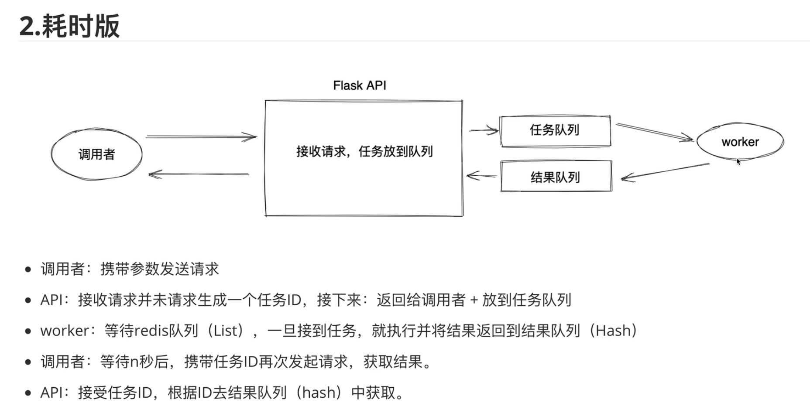

# flask学习

##  不耗时版本的flask

###  基于文件进行授权


```py
from flask import Flask,request,jsonify
import hashlib
import requests
import json

app =Flask(__name__)

def get_user_dict():
    info_dict={}
    with open("db.txt",mode="r",encoding="utf-8")as f:
        for line in f:
            line=line.strip()
            token,name=line.split(",")
            info_dict[token]=name
        return info_dict
@app.route("/bill",methods=["POST"])
def bill():
    """
    请求的URL中需要带/bill?token=1ad426b4-260f-4bec-9d41-73bda62c2e9c
    请求的数据格式要求：{"ordered_string":"1234567890"}
    :return:

    """
    token=request.args.get("token")
    if not token:
        return jsonify({"code":400,"msg":"认证失败"})
    
    user_dict=get_user_dict()
    if token not in user_dict:
        return jsonify({"code":400,"msg":"认证失败"})


    ordered_string=request.json.get("ordered_string")
    if not ordered_string:
        return jsonify({"code":400,"msg":"参数错误"})
    
    #调用核心算法，生成sign签名
    encrypt_string=ordered_string+"123345465465dsvgd"
    obj=hashlib.md5(encrypt_string.encode('utf-8'))
    sign=obj.hexdigest()
    
    return jsonify({"code":200,"msg":sign})


if __name__=="__main__":
    app.run(host="127.0.0.1",port=5000)


```

### 连接数据库

``` py
from flask import Flask,request,jsonify
import hashlib
import pymysql

app =Flask(__name__)

# def get_user_dict():
#     info_dict={}
#     with open("db.txt",mode="r",encoding="utf-8")as f:
#         for line in f:
#             line=line.strip()
#             token,name=line.split(",")
#             info_dict[token]=name
#         return info_dict

def fetch_one(sql,params):

    conn=pymysql.connect(host='127.0.0.1',port=3306,user='root',password='524100',charset="utf8",db='falsk')
    cursor=conn.cursor()
    cursor.execute(sql,params)
    result=cursor.fetchone()
    cursor.close()
    conn.close()
    return result

@app.route("/bill",methods=["POST"])
def bill():
    """
    请求的URL中需要带/bill?token=1ad426b4-260f-4bec-9d41-73bda62c2e9c
    请求的数据格式要求：{"ordered_string":"1234567890"}
    :return:

    """
    #1.token是否为空
    token=request.args.get("token")
    if not token:
        return jsonify({"code":400,"msg":"认证失败"})
    #2.token是否合法，连接mysql


    result=fetch_one("select * from user where token=%s",[token,])
    if not result:
        return jsonify({"code":400,"msg":"认证失败"})


    ordered_string=request.json.get("ordered_string")
    if not ordered_string:
        return jsonify({"code":400,"msg":"参数错误"})
    
    #调用核心算法，生成sign签名
    encrypt_string=ordered_string+"123345465465dsvgd"
    obj=hashlib.md5(encrypt_string.encode('utf-8'))
    sign=obj.hexdigest()
    
    return jsonify({"code":200,"msg":sign})


if __name__=="__main__":
    app.run(host="127.0.0.1",port=5000)


```


### 连接池

```py
from flask import Flask,request,jsonify
import hashlib
import pymysql
from dbutils.pooled_db import  PooledDB

app =Flask(__name__)

#数据库连接池
POOL=PooledDB(
    creator=pymysql,
    maxconnections=10,#最大连接数
    mincached=2,#最小连接数
    maxcached=5,#最大闲置连接数
    blocking=True,#阻塞连接数
    setsession=[],#创建会话时执行的命令
    ping=0,
    #**settings.MYSQL_CONN_PARAMS
    host='127.0.0.1',port=3306,user='root',password='524100',charset="utf8",db='falsk'
)


def fetch_one(sql,params):

    # conn=pymysql.connect(host='127.0.0.1',port=3306,user='root',password='524100',charset="utf8",db='falsk')
    conn=POOL.connection()
    cursor=conn.cursor()
    cursor.execute(sql,params)
    result=cursor.fetchone()
    cursor.close()
    conn.close()
    return result

@app.route("/bill",methods=["POST"])
def bill():
    """
    请求的URL中需要带/bill?token=1ad426b4-260f-4bec-9d41-73bda62c2e9c
    请求的数据格式要求：{"ordered_string":"1234567890"}
    :return:

    """
    #1.token是否为空
    token=request.args.get("token")
    if not token:
        return jsonify({"code":400,"msg":"认证失败"})
    #2.token是否合法，连接mysql


    result=fetch_one("select * from user where token=%s",[token,])
    if not result:
        return jsonify({"code":400,"msg":"认证失败"})


    ordered_string=request.json.get("ordered_string")
    if not ordered_string:
        return jsonify({"code":400,"msg":"参数错误"})
    
    #调用核心算法，生成sign签名
    encrypt_string=ordered_string+"123345465465dsvgd"
    obj=hashlib.md5(encrypt_string.encode('utf-8'))
    sign=obj.hexdigest()
    
    return jsonify({"code":200,"msg":sign})


if __name__=="__main__":
    app.run(host="127.0.0.1",port=5000)


```


## 耗时版本的flask




