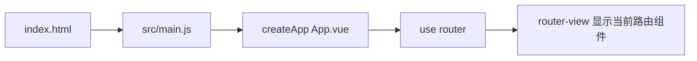

# AquaGarden 前端（Vue 3 + Vite）项目结构与说明

本文档说明 `front-vue` 工程的目录职责、主要模块功能以及运行与构建所需环境。

---

## 一、运行环境

| 依赖 | 版本要求 | 说明 |
|------|----------|------|
| **Node.js** | 18 LTS 或 20 LTS（推荐） | 与 Vite 8、Vue 3.5 生态兼容 |
| **npm** | 随 Node 安装（或 pnpm/yarn，需自行对照锁文件） | 本仓库默认使用 **npm** 与 `package-lock.json` |
| **浏览器** | 现代 Chromium / Firefox / Safari / Edge | 开发调试与生产访问 |

**与后端联调：**

- 开发时默认假设 Spring Boot 监听 **`http://localhost:8090`**。
- `vite.config.js` 中配置了 **`server.proxy`**：将前端的 **`/api`**、**`/ws`** 代理到该地址，避免跨域与手写完整域名。
- WebSocket 在开发环境下由 `src/api/http.js` 中的 **`wsLogsUrl()`** 指向 **`ws://localhost:8090/ws/logs`**（与 Vite 开发服务器端口不同属正常情况）。

**可选环境变量（`.env` / `.env.production`）：**

| 变量 | 含义 |
|------|------|
| **`VITE_API_BASE`** | API 根地址；不设时开发环境用空字符串走同源代理，生产可设为 `https://your-api.example.com` |
| **`VITE_WS_BASE`** | WebSocket 根（不含路径）；不设则按 `http.js` 内逻辑拼接 |

---

## 二、仓库根目录一览

```
front-vue/
├── index.html                 # HTML 入口：挂载 #app、全局 title、外链字体等
├── vite.config.js             # Vite 配置：Vue 插件、路径别名 @、开发服务器与代理
├── package.json               # 项目元数据、脚本、依赖声明
├── package-lock.json          # npm 锁定版本（建议提交仓库）
├── .gitignore                 # Git 忽略规则（通常含 node_modules、dist）
├── public/                    # 公共静态资源（不经打包处理，按原路径访问）
├── dist/                      # 生产构建输出（npm run build 生成，勿手改源码）
├── node_modules/              # npm 安装的依赖包（勿提交、勿手改）
├── docs/
│   └── PROJECT-STRUCTURE.md   # 本说明文档
└── src/                       # 源代码主目录
    ├── main.js                # JS 入口：创建 Vue 应用、注册路由、引入全局样式
    ├── App.vue                # 根组件：仅承载 <router-view />
    ├── api/                   # 与后端通信的封装
    ├── assets/                # 需经构建处理的资源（图片、全局 CSS 等）
    ├── components/            # 可复用布局/通用组件
    ├── router/                # 路由定义与导航守卫
    └── views/                 # 各页面级视图组件
```

---

## 三、根目录文件

### `index.html`

- **作用**：Vite 应用的 HTML 壳。
- **功能**：引入 `src/main.js`、设置页面语言为中文、配置 viewport、外链 Font Awesome 等；**`<div id="app">`** 为 Vue 挂载点。

### `vite.config.js`

- **作用**：Vite 构建与开发服务器配置。
- **功能**：
  - 注册 **`@vitejs/plugin-vue`** 以编译 `.vue` 单文件组件。
  - **`resolve.alias['@']`** 指向 **`src`**，便于 `import xxx from '@/...'`。
  - **`server.port`**：开发服务器端口（默认 5173）。
  - **`server.proxy`**：将 **`/api`**、**`/ws`** 代理到后端，便于本地联调。

### `package.json`

- **作用**：npm 项目清单。
- **功能**：声明依赖（**vue**、**vue-router** 等）、脚本 **`dev`** / **`build`** / **`preview`**。

---

## 四、`public/`（公共静态目录）

- **作用**：不参与模块打包的文件，构建时**原样复制**到 `dist/` 根路径。
- **典型内容**：`favicon.svg`、无需 import 的固定资源。
- **注意**：不要放仅被 `import` 引用的业务资源（应放 `src/assets`），否则无法享受哈希文件名与优化。

---

## 五、`src/`（源代码）

### 5.1 `src/main.js`

- **作用**：前端应用入口脚本。
- **功能**：`createApp(App)`、**`use(router)`**、挂载 **`#app`**；全局引入 **`./assets/styles/main.css`**（全站布局与侧栏等样式）。

### 5.2 `src/App.vue`

- **作用**：根组件。
- **功能**：模板中仅 **`<router-view />`**，由路由决定渲染登录页、注册页或带侧栏的布局子页面。

### 5.3 `src/api/http.js`

- **作用**：与后端地址、鉴权头、WebSocket URL 相关的工具函数。
- **功能**：
  - **`apiUrl(path)`**：拼接 API 路径（结合 `VITE_API_BASE`）。
  - **`authHeaders()`**：带 **`Authorization: Bearer <token>`** 与 JSON Content-Type。
  - **`wsLogsUrl()`**：根据是否开发环境、是否配置 `VITE_WS_BASE` 返回日志 WebSocket 完整 URL。

### 5.4 `src/assets/`（静态资源）

| 子路径 | 作用 |
|--------|------|
| **`assets/styles/main.css`** | 从旧版静态站迁移的全局主样式（侧栏、主内容区、仪表板卡片等）。 |
| **`assets/styles/login.css`** | 登录/注册页背景与表单区域样式。 |
| **`assets/styles/register-page.css`** | 注册页额外布局与表单样式。 |
| **`assets/styles/*-page.css`** | 各业务页独立样式：`cameras-page`、`robot-page`、`history-page`、`alerts-page`、`settings-page` 等。 |
| **其他图片/svg** | Vite 脚手架遗留或占位资源；可按需清理或替换。 |

### 5.5 `src/components/`

| 文件 | 作用 |
|------|------|
| **`AppLayout.vue`** | 已登录后的公共骨架：左侧导航、顶栏标题/副标题、演示与服务模式切换、退出登录；中间区域为 **`<router-view />`** 渲染子页面。 |
| **`HelloWorld.vue`** | Vite 默认示例组件；**当前路由未使用**，可删除以保持仓库整洁。 |

### 5.6 `src/router/index.js`

- **作用**：Vue Router 单页路由配置。
- **功能**：
  - 定义 **`/login`**、**`/register`** 与 **`/`** 下子路由（仪表板、摄像头、历史、机械臂、警报、设置）。
  - **`beforeEach` 导航守卫**：无 `localStorage.token` 时跳转登录；已登录访问登录/注册可重定向首页（可按需调整）。

### 5.7 `src/views/`（页面视图）

每个文件对应一个功能界面，与旧版 HTML 页面一一对应。

| 文件 | 作用 |
|------|------|
| **`LoginView.vue`** | 登录表单、调用 **`POST /api/login`**、记住用户名。 |
| **`RegisterView.vue`** | 注册表单、密码强度展示、调用 **`POST /api/register`**。 |
| **`DashboardView.vue`** | 仪表板：传感器轮询、双路视频、控制盘、系统日志与 WebSocket、键盘快捷键等。 |
| **`CamerasView.vue`** | 视频监控：双画面 MJPEG、录制/截图 UI（演示逻辑）。 |
| **`HistoryView.vue`** | 历史数据：筛选、表格分页、柱状趋势（前端模拟数据）。 |
| **`RobotView.vue`** | 机械臂控制：方向键/API、摇杆拖拽、预设位、操作日志。 |
| **`AlertsView.vue`** | 警报阈值与通知开关（前端演示，保存为 `alert`）。 |
| **`SettingsView.vue`** | 系统设置各区块（演示按钮与开关）。 |

### 5.8 `src/style.css`（若存在）

- **作用**：Vite 模板默认全局样式。
- **说明**：若 **`main.js` 未引用** 则不影响构建；与 **`main.css`** 重复时可删除引用或合并，避免样式冲突。

---

## 六、`dist/`（生产构建输出）

- **作用**：执行 **`npm run build`** 后生成，用于部署到 Nginx、静态托管或嵌入后端。
- **内容**：压缩后的 JS/CSS、`index.html`、从 `public` 复制的资源。
- **注意**：不要手工编辑 `dist/`；修改应始终在 **`src/`** 进行后重新构建。

---

## 七、`node_modules/`（依赖目录）

- **作用**：存放 `package.json` 声明的依赖包及传递依赖。
- **功能**：供 Vite 与 Node 在 `dev`/`build` 时解析模块。
- **注意**：体积大，**勿提交 Git**；新环境执行 **`npm install`** 即可恢复。

---

## 八、常用命令

```bash
# 在项目根 front-vue 下执行

# 安装依赖（首次或 package.json 变更后）
npm install

# 开发服务器（热更新）
npm run dev

# 生产构建
npm run build

# 本地预览构建结果（先 build）
npm run preview
```

---

## 九、与后端协作关系

| 场景 | 说明 |
|------|------|
| **开发** | 浏览器访问 Vite 端口（如 5173）；`/api`、`/ws` 由 Vite 代理到 Spring Boot **8090**。 |
| **生产** | 若前后端不同域，需配置 CORS、或将 `VITE_API_BASE` / `VITE_WS_BASE` 指向真实 API 与 WS 地址；或由网关统一反代。 |

若后端修改端口，请同步修改 **`vite.config.js`** 中的 **`proxy.target`**，或改用环境变量统一配置。

# Vue 3 入门：核心概念、运行逻辑与在本项目中的实操

面向「能跑起来项目、想搞懂代码从哪进、从哪出」的初学者。建议边读边打开 `front-vue` 工程，按 **实操任务** 改一两行代码看效果。

---

## 第一部分：Vue 3 在解决什么问题

传统网页：HTML 里写结构，JS 里用 `document.getElementById` 改文字、改样式，**数据和页面容易不同步**。

Vue 的思路：**把「页面显示」和「数据」绑在一起**。数据变了，依赖这块数据的界面会自动更新（**响应式**）。你只关心「数据是什么」，少写大量手动操作 DOM 的代码。

本仓库里，**一个界面 ≈ 一个 `.vue` 文件**（单文件组件，SFC），再配合 **Vue Router** 决定「当前 URL 显示哪个界面」。

---

## 第二部分：单文件组件（`.vue`）长什么样

每个 `.vue` 通常三块（顺序可调整）：

```vue
<template>
  <!-- 这里写「长得像 HTML」的界面结构 -->
</template>

<script setup>
// 这里写逻辑：变量、函数、请求接口、监听路由等
</script>

<style scoped>
/* 可选：只作用于本组件的样式 */
</style>
```

| 区块 | 作用 |
|------|------|
| **`<template>`** | 描述界面结构。里面的标签可绑定数据、事件。 |
| **`<script setup>`** | **组合式 API（Composition API）** 写法：顶层的 `const` / `function` 可直接在模板里用。 |
| **`<style scoped>`** | 样式只加在本组件根元素上，避免污染全局（本项目中不少样式在全局 `main.css`，子页也可能 `@import` 独立 css）。 |

**实操 1**：打开 `src/views/LoginView.vue`，在 `<template>` 里给某个文字外包一层 `<strong>`，保存后看浏览器是否立刻变化（开发模式下通常 **热更新**，不用整页刷新）。

---

## 第三部分：响应式——`ref` 与模板绑定

**响应式**：普通 JS 变量改了，界面不会变；用 Vue 提供的包装后，改了会触发界面更新。

最常用的包装是 **`ref`**：

```js
import { ref } from 'vue'

const count = ref(0)
// 在 script 里读写要用 .value
count.value = 1
<!-- 在 template 里会自动解包，不用写 .value -->
<button @click="count++">{{ count }}</button>
```

**为什么要有 `.value`？**  
`ref` 返回的是一个对象 `{ value: 0 }`，Vue 才能拦截对 `value` 的修改。模板里为了省事，自动帮你解包。

**实操 2**：在任意一个 `views/*.vue` 的 `<script setup>` 里增加：

```js
const demo = ref('你好 Vue')
```

在对应 `<template>` 里某处写 `{{ demo }}`，保存后在浏览器里确认文字出现。

---

## 第四部分：从「打开页面」到「看到界面」——本项目的启动链

下面这条链建议你 **对照文件走一遍**，比背概念快。



1. **`index.html`**  
   只有一个 `<div id="app"></div>` 和一行引入 `src/main.js`。这是 Vite 打包/开发时的 HTML 入口。

2. **`src/main.js`**  
   - `createApp(App)`：用根组件 `App.vue` 创建应用实例。  
   - `app.use(router)`：挂上路由。  
   - `app.mount('#app')`：把应用挂到页面上的 `#app` 里。

3. **`src/App.vue`**  
   当前项目里根组件几乎只有一句：`<router-view />`。意思是：**具体画什么页面，交给路由决定**。

4. **`src/router/index.js`**  
   定义路径与组件的对应表，例如 `/login` → `LoginView`，`/` → 带侧栏的 `AppLayout`，其 **子路由** 再决定是仪表板还是摄像头页等。

**实操 3**：打开 `src/router/index.js`，找到 `dashboard` 那条路由，把 `meta.title` 改成一句你自己的话；再打开浏览器看 **顶栏标题**（标题在 `AppLayout.vue` 里用 `route.meta.title` 显示）。体会：**改配置 → 界面变**。

---

## 第五部分：Vue Router——URL 和组件的对应表

**路由**做两件事：

1. **地址栏路径**（如 `/robot`）对应 **哪个组件**。  
2. **导航守卫**：在跳转前做检查（本项目里检查是否已登录）。

关键概念：

| 概念 | 含义 |
|------|------|
| **`routes`** | 路由表：path、component、children、meta。 |
| **`router-link`** | 声明式导航，像超链接，但由 Vue 处理切换、不整页刷新。 |
| **`router-view`** | 「插槽」：当前匹配到的组件渲染在这里。 |
| **`useRoute()`** | 在组件里读当前路由信息（path、meta、query）。 |
| **`useRouter()`** | 编程式导航，如 `router.push('/login')`。 |

**嵌套路由**：本项目中 `/` 使用 `AppLayout`，其 `children` 里的页面会渲染在 **`AppLayout` 内部的 `<router-view />`** 里，所以侧栏常驻、右侧内容随子路由变化。

**实操 4**：在浏览器已登录状态下访问 `/robot`，再在 `AppLayout.vue` 里看 `<router-view />` 的位置，对照 `RobotView.vue` 的模板，理解「布局 + 子页面」拼装关系。

---

## 第六部分：常见模板语法（够读懂本项目）

| 语法 | 含义 |
|------|------|
| `{{ expr }}` | 把表达式的结果显示在页面上。 |
| `:src="url"` | **v-bind** 缩写：把属性 `src` 绑定到变量 `url`，`url` 变则 `src` 变。 |
| `@click="fn"` | **v-on** 缩写：点击时调用 `fn`（可传参 `@click="fn(1)"`）。 |
| `v-if` / `v-for` | 条件渲染、列表渲染（本项目中 `v-for` 出现在日志列表等）。 |
| `v-model` | 表单双向绑定（如输入框与变量同步）。 |

**实操 5**：在 `DashboardView.vue` 里找到 `@click` 或 `v-model`，各改一处小逻辑（例如按钮点击时 `pushLog` 多打一行字），保存后在仪表板验证。

---

## 第七部分：生命周期——`onMounted` 为什么到处出现

组件被插入页面后，往往需要：**拉数据、开定时器、连 WebSocket**。适合写在 **`onMounted`** 里（组件挂载完成后执行一次）。

对称地，离开页面或组件销毁时，用 **`onUnmounted`** 清理定时器、关闭 WebSocket，避免内存泄漏。

**实操 6**：打开 `src/views/DashboardView.vue`，在 `onMounted` 第一行加 `console.log('仪表板挂载了')`，打开浏览器 **开发者工具 → Console**，进入仪表板看是否打印。

---

## 第八部分：Vite 是什么（和 Vue 的关系）

- **Vue**：负责组件、响应式、路由等「应用逻辑」。  
- **Vite**：负责 **开发服务器**（快速启动、热更新）、**打包构建**（`npm run build` 产出 `dist`）、解析 `.vue` 等。

本项目的 **`vite.config.js`** 里配置了 **`server.proxy`**：开发时浏览器只访问 `localhost:5173`，以 **`/api` 开头的请求** 会被转发到 Spring Boot（默认 8090），这样前端代码里写 **`fetch('/api/...')`** 即可，不必处理跨域。

**实操 7**：确认后端已启动，在 `LoginView.vue` 的登录请求前后各打 `console.log`，看 Network 里请求 URL 是否为 `/api/login`、状态码是否为 200。

---

## 第九部分：和本仓库目录的对应关系（速查）

| 你想做的事 | 优先看的目录/文件 |
|------------|-------------------|
| 改登录/注册页 | `src/views/LoginView.vue`、`RegisterView.vue` |
| 改侧栏、顶栏、退出登录 | `src/components/AppLayout.vue` |
| 加一个新页面 + 路由 | `src/views/YourPage.vue` + `src/router/index.js` |
| 改接口地址、Token、WebSocket | `src/api/http.js` |
| 改全局样式 | `src/assets/styles/main.css` |
| 改某一页的独立样式 | `src/assets/styles/*-page.css` 或对应 `.vue` 的 `<style>` |

---

## 第十部分：推荐学习顺序（1～2 天可走完）

1. 跑通 `npm run dev`，登录进入仪表板。  
2. 读 `main.js` → `App.vue` → `router/index.js`，画出「URL → 哪个组件」。  
3. 精读 **`LoginView.vue`**：表单、`ref`、`fetch`、`router.push`。  
4. 精读 **`AppLayout.vue`**：`useRoute` / `useRouter`、子路由出口。  
5. 精读 **`DashboardView.vue`**：`onMounted`、定时器、`ref` 绑定、`wsLogsUrl()`。  
6. 官方文档选读：[Vue 3 简介](https://cn.vuejs.org/guide/introduction.html)、[组合式 API 概述](https://cn.vuejs.org/guide/extras/composition-api-faq.html)、[Vue Router](https://router.vuejs.org/zh/)。

把上面 **实操 1～7** 都做一遍，你对本前端项目的「数据从哪来、界面怎么更新、路由怎么切」会有直观框架；之后再深入 Composition API 高级用法或 Pinia 状态管理会更轻松。