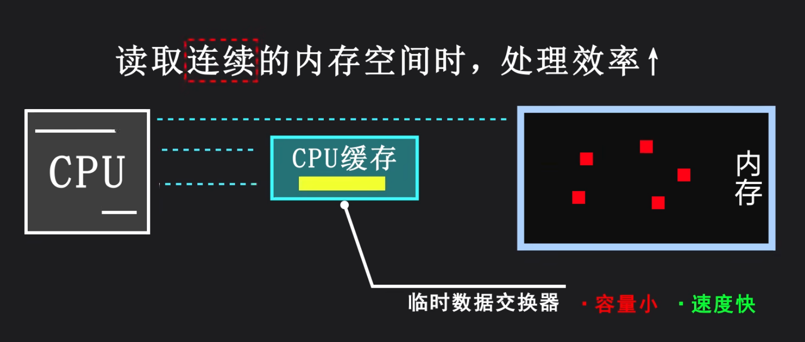
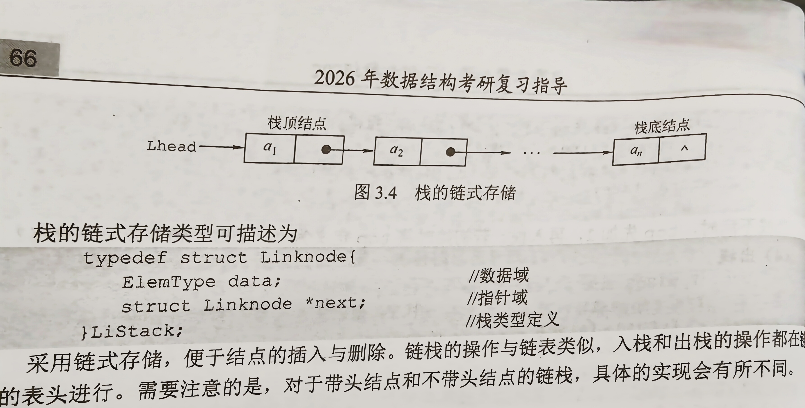
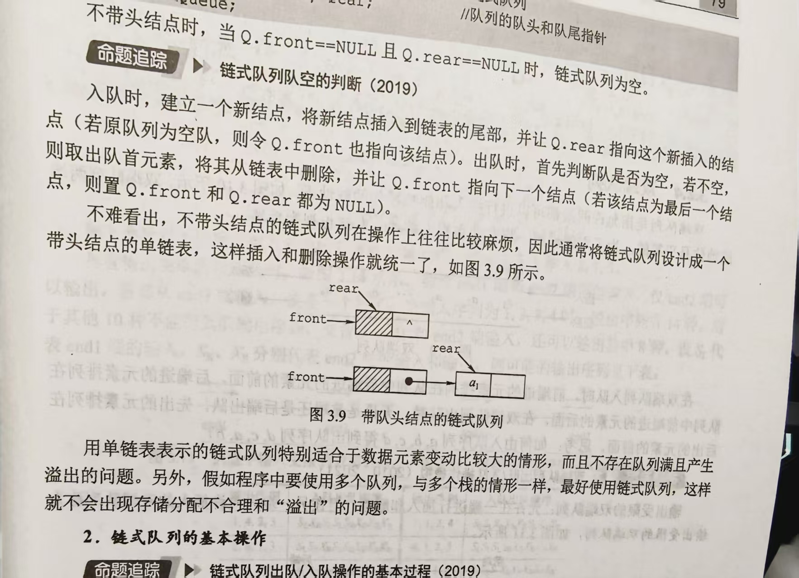
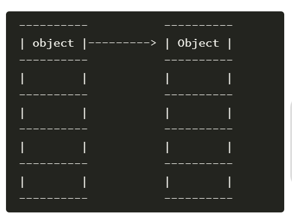
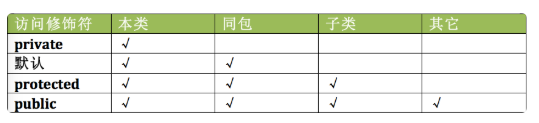
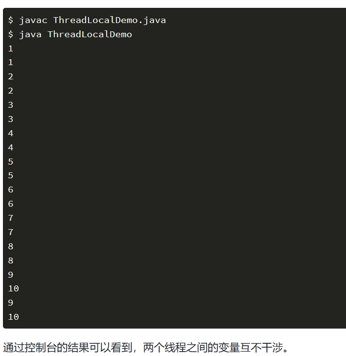

# 计算机基础

## 数据结构与算法

### 数据结构

**是一种存储和组织数据的方式，目的在便于访问和修改**

#### 1.链表

用于线性方式存储数据，**物理存储结构上非连续，非顺序**的存储结构，元素的**逻辑顺序**通过**链表上的指针链接次序**实现


**特点：**

1）动态大小

2）元素连接

3）无需连续内存

4）插入和删除操作比数组快

底层机制介绍：                      

**分类：**

1）单向与非单向


单链表：

```c
typedef struct LNode{
   ElemType data;   		//数据域
   struct LNode *next;  	//指针域
}LNode,*LinkList;
```

 双链表：

```c
typedef struct DNode{
    ElemType data;
    struct DNode *prior,*next;
}DNode ,*DLinkList;
```

2）带头与非带头

哨兵节点是一个虚拟节点，可以简化删除操作，避免空链表，统一处理逻辑


3）循环与非循环


**基本操作（接口）：**

插入

删除

搜索

遍历


**单链表的实现：**

1.初始化

```c
bool InitList (LinkList &L)
{
	L=(LNode* )malloc(sizeof(LNode)); //创建头结点
	L->next=NULL;
	return true;
}
```

2.求表长

```C
int Length(LinkList L)
{
	int len=0;
	LNode *p=L;
	while(p->next!=NULL){
        p=p->next;
        len++;
}
    return len;
}
```

3.按序号查找结点

```c
LNode  *GetElem(LinkList L,int i)
{
    	LNode *p=L;
    	int j=0;
    	while(p!=NULL&&j<i)		//循环找到第i个结点
        {
            p=p->next;
            j++;
		}
   		return p;
}
```

4.按值查找表结点

```c
LNode *LocateElem(LinkList L,ElemType e){
	LNode *p=L->next;
    while(p!=NULL&&p->data!=e)
        p=p->next;
    return p;
}
```

5.插入结点

```c
bool ListInsert(LinkList &L,int i,ElemType e) //在第i处插入数值e
{
	LNode *p=L;
    int j=0;
    while(p!=NULL&&j<i-1) //用p结点找到第i-1处
    {
        p=p->next;
        j++;
	}
    if (p==NULL)
        return false;
    
    LNode *s=(LNode *)malloc(sizeof(LNode));// 新建s结点
    s->data=e;
    
    s->next=p->next;  //尾插法，在p的后面插入s结点
    p->next=s;
    return true; 
}
```

6.删除结点：

```c
bool  ListDelete(LinkList &L ,int i,ElemType &e)
{
    LNode *p=L;
    int j=0;
    while(p->next!=NULL&&j<i-1)
    {
        p=p->next;
        j++;
	}
    if(p->next==NULL||j>i-1) //检查i值是否合法
        return false;
    LNode *q=p->next;	//用q指向被删除的结点
    e=q->data;
    p->next=q->next;
    free(q);		//释放结点的存储空间
    return true;
        
}
```

7.使用头插法创建单链表


```c
LinkList List_HeadInsert(LinkList &L){
    LNode *s;
    int x;
    L=(LNode*)malloc(sizeof(LNode));//创建头结点
    L->next=NULL;					//初始链表为空链表
    scanf("%d",&x);
    
    while(x!=9999){
        s=(LNode*)malloc(sizeof(LNode));
        s->data=x;
        
        s->next=L->next;
        L->next=s;
        scanf("%d",&x);
    }
    return L;
}
```

8.使用尾插法创建单链表


```C
LinkList List_TailInsert(LinkList &L){
    int x;
    L=(LNode*)malloc(sizeof(LNode));
    L->next=NULL;
    LNode *s,*r=L;
    scanf("%d",&x);
    while(x!=99999){
        s=(LNode*)malloc(sizeof(LNode));
        s->data=x;
        r->next=s;
        r=s;
        scanf("%d",&x);
    }
    r->next=NULL;
    return L;
}
```

**双链表的实现方法：**


1.插入操作：


```c
s->next=p->next;
p->next->prior=s;
s->prior=p;
p->next=s;
```

2.删除操作：


```c
p->next=q->next;
q->next->prior=p;
free(q);
```


#### 2.栈

是**只允许在一端**进行插入和删除操作的**线性表**

栈顶（Top)：允许进行插入和删除的一端

栈底（Bottom）：固定的，不允许插入和删除

空栈：不含任何元素的空表


**基本操作：**

```c
InitStack(&S):初始化一个空栈S
StackEmpty(S):判断栈是否为空，为空返回true ，不为空返回false
Push(&S,x):入栈，若栈S未满，将x加入成为新栈顶
Pop(&S,&x):出栈，若栈S非空，弹出栈顶元素，用x返回
GetTop(S,&x):读栈顶元素但不出栈，若栈S非空，用x返回栈顶元素
DestoryStack(&S):销毁栈，并释放栈S占用的存储空间
```

**1.顺序栈的实现：**
采用**顺序存储**的栈称为顺序栈

```c
#define MaxSize 50
typedef struct{
    Elemtype data[MaxSize];//存放栈中元素
    int top;	//栈顶指针
}SqStack;
```

栈顶指针：S.top

初始时设置S.top=-1

栈顶元素：S.data[S.top]

**2.顺序栈的基本操作：**


```c
1.初始化
    void InitStack(SqStack &S){
    S.top=-1;
}
2.判断栈空
    bool StackEmpty(SqStack S){
    if(S.top==-1)		//栈空
        return true;
    else 
        return false;
}
3.入栈
    bool Push(SqStack &S,ElemType x){
    if(S.top==MaxSize-1) //栈满，报错
        return false;
    S.data[++S.top]=x; 	 //指针先加1，再入栈
    return true;
}
4.出栈
    bool Pop(SqStack &S,ElemType &x){
    if(S.top==-1)	//栈空，报错
        return false;
    x=S.data[top];
    return true;
}
```

**3.共享栈：**


**4.栈的链式存储类型：**



```c
typedef struct Linknode{
    ElemType data;
    struct Linknode *next;
}LiStack;
```


#### 3.队列

也是一种操作受限的**线性表**，**只允许在表的一端进行插入，在另一端进行删除**，操作特性是**先进先出**

队头（Front）：允许删除的一端

队尾（Rear）：允许插入的一端


**基本操作：**

```c
InitQueue(&Q):初始化队列，构造一个空队列Q
QueueEmpty(Q):判断队列是否为空，为空返回true，不为空返回false
EnQueue(&Q,x):入队
DeQueue(&Q,&x):出队
GetHead(Q,&x):读队首元素
```

**1.队列的顺序存储结构：**


```c
#define MaxSize 50
typedef struct{
    ElemType data[MaxSize];
    int front ,rear; 	//front 指向队首元素 ，rear指向队尾元素的下一个位置
}SqQueue;
```

初始时Q.front=Q.rear=0;

**2.循环队列：**


```c
1.初始化
    void InitQueue(SqQueue &Q){
    Q.rear=Q.front=0;
}
2.判断队列是否空
    bool isEmpty(SqQueue Q){
    if(Q.rear==Q.front) 		//队空条件
        return true;
    else 
        return false;
}
3.入队
    bool EnQueue(SqQueue &Q ,ElemType x){
    if((Q.rear+1)%MaxSize==Q.front) //队满则报错
        return false;
    Q.data[Q.rear]=x;
    Q.rear=(Q.rear+1)%MaxSize; //队尾指针+1取模
    return true;
}
4.出队
    bool DeQueue(SqQueue &Q,ElemType &x){
    if(Q.rear==Q.front)
        return false;
    x=Q.data[Q.front];
    Q.front=(Q.front+1)%MaxSize;
    return true;
}
```

3.队列的链式存储：

```c
typedef struct LinkNode{
    ElemType data;
    struct LinkNode *next;
}LinkNode;
typedef struct{
    LinkNode *front ,*rear;
}LinkQueue;
```



```c
1.初始化
    void InitQueue(LinkQueue &Q){
	Q.front=Q.rear=(LinkNode*)malloc(sizeof(LinkNode));
    Q.front->next=NULL;
}
2.判队空
    bool IsEmpty(LinkQueue Q){
    if(Q.front==Q.rear)
        return true;
    else 
        return false;
    
}
3.入队
    void EnQueue(LinkQueue &Q ,ElemType x){
    LinkNode *s=(LinkNode *)malloc(sizeof(LinkNode));
    s->data=x;
    s->next=NULL;
    Q.rear->next=s;
    Q.rear=s;
}
4.出队
    bool DeQueue(LinkQueue &Q,ElemType &x){
    if(Q.front==Q.rear)
        return false;
    LinkNode *p=Q.front->next;
    x=p->data;
    if(Q.rear==p)
        Q.rear=Q.front;
    free(p);
    return true;
}
```

4.双端队列


#### 4.树

##### **4.1基本术语：**

###### 1.祖先，子孙，双亲，孩子，兄弟

###### 2.结点的层次，深度和高度

层次从树根开始定义

深度就是结点所在的层次

树的高度是树中结点最大层数

结点的高度是以该结点为根的子树的高度

###### 3.结点的度和树的度

一个结点的**孩子个数**为结点的度

树中**结点的最大度数**为树的度

###### 4.分支结点和叶节点

**度大于0**的结点为分支结点（非终端结点）

度==0的结点称为叶结点（终端结点）

###### 5.有序树和无序树

结点的**各子树从左到右是有次序的，不能互换**，称为有序树否则为无序树

###### 6.路径和路径长度

两个结点的路径是由这**两个结点之间经过的结点序列**构成的

路径长度是**路径上所经过的边的个数**

###### 7.森林

是m（m>=0）棵互不相交的树的集合

##### 4.2 二叉树：

每个**结点至多只有两棵子树**（二叉树中不存在度大于2的结点），并且二叉树的子树有左右之分，其次序不能任意颠倒

**分类：**

1.满二叉树：二叉树中的每层都含有最多的结点

2.完全二叉树：

3.二叉排序树：**左子树上**所有结点的关键字均**小于根结点**，右子树上所有结点的关键字均大于根结点

4.平衡二叉树：任意一个结点的**左子树和右子树的高度之差**的绝对值不超过1

5.正则二叉树：树中每个分支结点都有2个孩子，**树中只有度为2或0的结点**


**1.顺序存储结构：**


**2.链式存储结构：**


```c
typedef struct BiTNode{
    ElemType data;
    struct BiTNode *lchild,*rchild;
}BiTNode,*BiTree;
```

##### 4.3二叉树的遍历和线索二叉树

1.先序遍历

根 ----左---右


```c
void PreOrder(BiTree T){
    if(T!=NULL){
	visit(T);
     PreOrder(T->lchild);
     PreOrder(T->rchild);
    }
}
```

2.中序遍历

左----根----右


```c
void InOrder(BiTree T){
    if(T!=NULL){
     InOrder(T->lchild);
        visit(T);
     InOrder(T->rchild);
    }
}
```

3.后序遍历

左---右---根


```c
void PostOrder(BiTree T){
    if(T!=NULL){
     PostOrder(T->lchild);
     PostOrder(T->rchild);
        visit(T);2
    }
}
```

4.层次遍历


```c
void LevelOrder(BiTree T){
    InitQueue(Q);//初始化辅助队列
    BiTree p;
    EnQueue(Q,T);//根结点入队
    while(!IsEmpty(Q)){
        DeQueue(Q,p);
        visit(p);//访问出队结点
        if(p->lchild!=NULL)
            EnQueue(Q，p->lchild);//左孩子入队
        if(p->rchild!=NULL)
            EnQueue(Q，p->rchild);//右孩子入队
    }
}
```


#### 5.堆

#### 6.图


### 算法

#### 1.排序算法

1-1：插入排序：

每次将一个待排序的记录按其**关键字大小 *插入到前面已排序好的子序列****中，直到全部记录插入完成

1-1-1：直接插入排序：

```c
void InsertSort(ElemType A[],int n){
    int i,j;
    for(i=2;i<n;i++)		//将a2-——an依次插入到前面已排序的序列
        if(A[i]<A[i-1]){	//先和有序区的最后一个元素比较，如果>，则不需要插入
            A[0]=A[i];		//复制为哨兵，A[0]不存放元素,充当temp临时变量，负责交换数据时保存数据
            for(j=i-1;A[0]<A[j];--j)
                A[j+1]=A[j];//向后挪位
            A[j+1]=A[0];
        }
}
```

1-1-2：折半插入排序：

```c
void InsertSort(ElemType A[],int n){
    int i.j,low,high,mid;
    for(i=2;i<=n;i++){
        A[0]=A[i];
        low=1.high=i-1;
        while(low<=high){
            mid=(low+high)/2;
            if(A[mid]>A[0]) high=mid-1;
            else low=mid+1;
        }
        for(j=i-1;j>=high+1;--j)
            A[j+1]=A[j];
        A[high+1]=A[0];
    }
}
```

1-1-3：希尔排序：

#### 2.查找算法

#### 3.Leetcode刷题


## 计算机网络


### TCP IP


### Http版本区别和方法


## 操作系统（linux）

1、简单的命令

ps

cd

top

2、查看服务器的运行日志，排查异常问题

find

grep

less

3、写简单的shell脚本

## 设计模式


### 单例模式

### 工厂模式

### 策略模式

### 观察者模式


# java相关

## java基础

### 面向对象的特征与使用

#### 1.java面向对象编程

- #### 类

  概念：

  类是相同或相似对象的一种抽象，是对象的一个模板，描述一类对象的行为和状态

  类是**具有相同属性和方法（行为）的对象**的集合

  步骤：

  1、定义类名

  2、编写类的属性

  3、编写类的方法

  ```java
  public class People{
      double height;
      int age;
      int sex;
      void cry(){
          System.out.println("我在哭");
      }
      void laugh(){
          System.out.println("我在笑");
      }
      void printBasemes(){
          System.out.println("我的身高是："+height+"cm");
          System.out.println("我的年龄是："+age+"岁");
          if(this.sex==0)
              System.out.println("我的性别是男性！");
          else
              System.out.println("我的性别是女性！");
      }
  }
  ```

  一个类可以包含以下**类型变量**：

  

  局部变量：在方法，构造方法或者语句块中定义的变量； **声明和初始化在方法中，结束后自动销毁**

  成员变量：定义在类中，方法体之外的变量； 在**创建对象的时候实例化**

  类变量：静态变量，声明在类中，方法体之外，**必须声明为static类型**

  

- #### 对象

  创建对象的语法： 

  ```java
  People LiLei =new People();
  ```

  

  一旦创建对象，系统就会在内存中为对象开辟一块空间，用来存放对象的属性值和方法

  

- #### 构造方法

  每个类都有构造方法，如果没有定义，java编辑器会提供一个默认的构造方法

  ```java
  public class People{
      double height;
      int age;
      int sex;
      
      public People(){
          
      } //无参构造
      public People(double h,int a,int s){
          height=h;
          age=a;
          sex=s;
      }  //有参构造
  }
  
  People xiaomi=new People(168,21,1);//实例化创建对象
  
  ```

  

- #### 引用与对象实例

  ```java
  Object object=new Object();
  ```

  变量object保存的Object对象的引用，**类似指针**，指向了Object对象

  

- #### static

  **被static修饰的成员，属于整个类所有**，被类内的所有对象所共享，可以使用类名直接访问，也可以使用对象名进行访问

  ```java
  public class StaticTest{
      public static String string="fuck you java";
      
      public static void main(String[]args){
          
          System.out.println(StaticTest.string);//直接使用类名直接访问
          
          StaticTest statictest=new StaticTest();
          System.out.println(staticTest.string);//使用对象名进行访问
      }
  }
  ```

  静态方法：**不依赖对象，不需要将类实例化也可以调用，所以不能有this**

  

- #### final

  final修饰类：不允许被继承，为最终类

  final修饰方法：不允许被覆盖（重写）

  final修饰属性：不会进行隐式的初始化（类的初始化属性必须有值）或在构造方法中赋值（只能选其一）

  final修饰变量：值只能赋一次，即常量

  

- #### **封装**

  好处：

  

  1.只能通过规定的方法访问数据

  2.隐藏类的实例细节，方便修改和实现

  

  实现：

  

  1.修改属性的可见性：添加private

  2.创建getter/setter（取值和赋值）方法

  3.加入属性的控制语句（对属性值的合法性进行判读）

  ```java
  public class People{
      private double height;
      
      public double getHeight(){
          return height;
   	}
      public void SetHeight(double newHeight){
          height=newHeight;
      }
  }
  
  public class newobject{
      public static void main(String[]args){
          People lilei=new People();
          lilei.SetHeight(170.0);
          System.out.println("lilei的身高为："+lilie.getHeight());
      }
  }
  
  ```

  this关键字代表当前对象，使用this.属性操作当前对象的属性，this.方法调用当前对象的方法

  使用private修饰的属性，必须定义getter和setter方法才能访问

  ```java
  public void setAge(int age){
      this.age=age;
  }
  public int getAge(){
      return age;
  }
  ```

  

- #### **继承**

  类和类之间的衍生关系：父类更通用，子类更具体

  语法：

  ```java
  class Dog extends Animal{
      ...
  }
  
  eg:
  public class Animal{
      public int legNum;
      public void bark(){
          System.out.println("动物叫！");
      }
  }
  public class Dog extends Animal{
      
  }
  
  public class Test{
      public static void main(String[]args){
          Dog a=new Dog();
          a.legNum=4;
          a.bark();
      }
  }
  ```

  为什么需要继承：

  如果两个类相似，会有许多重复的代码，导致代码量大而且臃肿，后期维护性不高，把相同的部分提取出来组成一个父类，实现代码的复用

  

  继承的特点：

  1.子类拥有父类除private以外的所有属性和方法；

  2.子类可以有自己的属性和方法；

  3.子类可以重写父类的方法；

  4.java中的继承是单继承，一个类只有一个父类；

  实现多继承的一个办法是implemets（实现）接口，但接口不能有非静态的属性

  

  super关键字在子类的内部使用，代表父类对象

  super.属性名

  super.方法

  

- #### 方法重载与重写

  方法重载：在一个类中定义多个同名的方法，但要求每个方法具有不同的参数类型或参数的个数，用于创建一组任务相似但参数不同的方法

  ```java
  public class Test{
      void f(int i){
          System.out.println(i);
      }
      void f(float f){
          System.out.println(f);
      }
      void f(String s){
          System.out.println(s);
      }
      void f(String s1,String s2){
          System.out.println(s1+s2);
      }
      void f(String s,int i){
          System.out.println(s,i);
      }
      
      public static void main(String[]args){
          Test test=new Test();
          test.f(123);
          test.f(12.12);
          test.f("abc");
          test.f("abc","qwe");
          test.f("abc",1);
      }
  }
  ```

  参数重写：子类对父类的方法不满意，想在里面加入自适应的一些操作，且子类在调用方法中，优先调用子类的方法

  ```java
  public class Animal {
      //类方法
      public void bark() {
          System.out.println("动物叫！");
      }
  }
  public class Dog extends Animal {
  
      //重写父类的bark方法
      public void bark(){
          System.out.println("旺旺旺！");
      }
  }
  
  public class Test{
      public static void main(String args[]){
          Animal a = new Animal(); // Animal 对象
          Dog d = new Dog();   // Dog 对象
  
          Animal b = new Dog(); // Dog 对象,向上转型为Animal类型，具体会在后面的内容进行详解
  
          a.bark();// 执行 Animal 类的方法
          d.bark();//执行 Dog 类的方法
          b.bark();//执行 Dog 类的方法
      }
  }
  ```

  

- #### **多态**

  允许不同类的对象对同一消息做出响应，即**同一消息可以根据发送对象的不同而采用不同的行为方式，**也称为**动态绑定**，在执行期间判断所引用对象的实际类型，根据实际的类型调用相应的方法

  

  实现条件：

  1.继承

  2.重写

  3.向上转型（父类引用指向子类对象）

  

  实现方法：

  继承父类进行方法重写，抽象类和抽象方法，接口实现

  向上转型：

  ```java
  Animal a=new Animal();//a是父类的引用指向的是本类的对象
  Animal b=new Dog();//父类的引用指向子类的对象
  由于Dog继承于Animal，所以Dog可以自动向上转型为Animal
  ```

  **在运行时，会遗忘子类对象中与父类对象中不同的方法，也会覆盖与父类中相同的方法--重写（方法名，参数都相同）**

  ```java
  class Animal{
      public void bark(){
          System.out.println("动物叫！");
      }
  }
  class Dog extends Animal{
      public void bark()//重写
      {
          System.out.println("汪，汪，汪！");
              
      }
      public void dogType(){//自己定义的方法
          System.out.println("这是什么品种的狗？");
      }
  }
  public class Test{
      public static void main(String[]args){
          Animal a=new Animal();
          Animal b=new Dog();//Dog 对象,向上转型为Animal类型
          Dog d=new Dog();
          
          a.bark();
          b.bark();
          d.bark();
          d.dogType();
      }
  }
  ```

  **通俗比喻：**

  可以用 **「超级英雄参加英雄集会」** 来比喻「向上转型」，理解起来更轻松~

  #### 核心设定：

  把 **父类** 想象成「通用身份/大岗位」（比如叫 `Hero`，要求所有英雄都会「飞」）。

  把 **子类** 想象成「具体角色/员工」（比如 `SpiderMan`是旗下英雄，除了会飞，还会「吐丝」「做任务」，而且飞的姿势还特别花里胡哨）。

  #### 向上转型 = 「子类临时伪装成父类」

  假设现在要办一场 **「英雄集会」**，规则是：所有上台的“英雄”必须以「通用英雄（`Hero`）」的身份表演「飞」这个技能。

  这时候，`SpiderMan`（子类对象）要参加集会，就得 **“假装自己是普通英雄（`Hero`）”** 登台 —— 这就是 **向上转型**（代码里表现为 `Hero h = new SpiderMan();`，用父类引用 `h`指向子类对象）。

  #### 上转型后的表现分两种情况：

  1. 

     **父类会的技能，子类能演（含重写版）**：

     集会上主持人喊「请英雄展示飞行！」，`SpiderMan`虽然本质是蜘蛛侠，但此时以「普通英雄（`Hero`）」身份表演，所以他展示的是 **自己重写后的“飞”**（比如荡蛛丝飞）—— 对应代码里：父类引用 `h`调用 `fly()`方法，实际执行的是子类 `SpiderMan`重写后的 `fly()`。

  2. 

     **父类不会的技能，子类藏起来**：

     如果主持人突然喊「请英雄展示吐丝！」—— 这时候不行！因为「普通英雄（`Hero`）」这个身份压根没定义「吐丝」这个技能（父类 `Hero`没有 `shootWeb()`方法）。哪怕台上的英雄实际是蜘蛛侠，也不能用「普通英雄」身份来吐丝（身份被限制成父类了呀！）。

  ### 总结比喻的核心逻辑：

  向上转型就像 **「子类对象临时“降维”成父类身份」** —— 对外只展现父类能干的事（调父类方法，包括自己重写的版本），但父类没教的“独家技能”（子类独有的方法），就算会也得憋着，因为身份不允许~

  

- #### 抽象类

  前面加上abstrac关键字修饰的类

  ```java
  abstract void f();
  ```

  什么时候用到：

  1.父类只知道其子类应该包含怎样的方法，但无法准确知道这些子类如何实现这些方法；抽象类是**约束子类必须要实现哪些方法，而不关注方法如何去实现**

  2.从多个具有相同特征的类中抽象出一个抽象类，**作为子类的模板，避免子类设计的随意性**

  实现：

  ```java
  public abstract class TelePhone{
      public abstract void call();
      public abstract void message();
  }
  
  public class CellPhone extends TelePhone{
      public void call(){
          System.out.println("我可以打电话");
      }
      public void message(){
          System.out.println("我可以发短信");
      }
      public static void main(String[]args){
          CellPhone cp=new CellPhone();
          cp.call();
          cp.message();
      }
  }
  ```

  

- #### 接口

  用于**描述类所具有的功能，而不提供功能的实现**，功能的实现需要写在实现接口的类中，并且该类不需实现接口中所有的未实现方法

  ```java
  修饰符 interface 接口名称 [extends 其他的接口名] {
          // 声明变量
          // 抽象方法
  }
  interface Animal{
      int y=5;
      public void eat();
      public void travel();
  }
  ```

  注意：

  接口不能用于实例化对象

  接口中方法只能是抽象方法，default方法，静态方法

  接口成员是static final类型

  接口支持多继承

  

  多继承实现方法：

  ```java
  修饰符 interface A extends 接口1，接口2{
  
  }
  
  修饰符 class A implements 接口1，接口2{
  
  }
  
  public class Cat implements Animal{
      public void eat(){
          System.out.println("Cat eats");
      }
      public void travel(){
          System.out.println("Cat travels");
      }
      public static void main(String[]args){
          Cat cat=new Cat();
          cat.eat();
          cat.travel();
      }
  }
  
  ```

  

- #### 内部类

将一个类的定义放在另一个类的定义内部，就是内部类，包含内部类的类被称为外部类

主要作用：

1.内部类提供了更好的封装，可以把内部类隐藏在外部类之内，不允许同一个包中的其他类访问

2.内部类的方法可以直接访问外部类的所以数据，包括私有的数据

3.内部类所实现的功能外部类同样可以实现，只是有时使用内部类更方便

3.内部类允许继承多个非接口类型


成员内部类

```java
public class People{
    private String name="LILEI";
    
    public class Student{//内部类
        String ID="2023150196";
        
        public void stuInfo(){
            System.out.println("访问外部类中的name：" + name);
            System.out.println("访问内部类中的ID：" + ID);
        }
        
        public static void main(String[]args){
            People a=new People();
            Student b=a.new Student();//使用外部类对象创建内部类对象，对象名为b
        // 或者为 People.Student b = a.new Student();
            b.stuInfo();
        }
    }
}
```

使用方法：
        1.student类相当于people类的一个成员变量，student类可以使用任意访问修饰符

2.内部类可以直接访问外部类的方法和属性，反之不行

3.必须使用外部类对象来创建内部类对象：内部类 对象名=外部类.new 内部类（）

Student b=a.new Student();

4.如果具有相同的成员变量或方法，内部类默认使用自己的，若访问外部的成员变量，使用this

成员内部类不能含有static的变量和方法，成员内部类需要先创建外部类，才能创建自己的


静态内部类（嵌套类）

```java
public class People{
    private String name="lilei";
    static String ID="3412**2005****12**";
    
    public static class Student{
        String ID="2023150196";
          public void stuInfo(){
            System.out.println("访问外部类中的name：" + (new People().name));
            System.out.println("访问外部类中的ID：" + People.ID);
            System.out.println("访问内部类中的ID：" + ID);
        }
        
     public static void main(String[]args){
         Student b=new Student();
         b.stuInfo();
     }
    
    }
}
```

特点：
       1.静态内部类不能直接访问外部类的非静态成员，可以通过new People().name 的方式访问

2.创建静态内部类的对象是，不需要外部类的对象，可以直接创建：Student a=new Student();

3.成员名称相同是，可通过People.ID访问外部类的静态成员，不相同时，可通过成员名直接调用外部类的静态成员


局部内部类

内部类定义在方法和作用域内,但**只是作用域不同而已**，只在该方法或条件的作用域内才能使用，退出这些作用域后无法引用的。

```java
public class People{
    public void peopleInfo(){
        final String sex="man";
        
        class Student{
            String ID="2023150196";
            public void print(){
                System.out.println("访问外部类的方法中的常量sex：" + sex);
                System.out.println("访问内部类中的变量ID:" + ID);
            }
        }
            Student a=new Student();
            a.print();//调用内部类方法； 
    }
    
    public void peopleInfo2(boolean b){
        if(b){
            final String sex="man";
            class Student{
                String ID="2023150196";
               public void print(){
                   System.out.println("访问外部类的方法中的常量sex：" + sex);
                   System.out.println("访问内部类中的变量ID:" + ID);
               }
            }
            Student a=new Student();
            a.print();//调用内部类方法； 
        }
    }
    public static void main(String[]args){
         People b = new People(); //创建外部类的对象
        System.out.println("定义在方法内：===========");
        b.peopleInfo();  //调用外部类的方法
        System.out.println("定义在作用域内：===========");
        b.peopleInfo2(true);
     }
}
```

匿名内部类

没有名字的内部类，只能使用一次，通常用来简化代码编写

前提：
必须继承一个父类或实现一个接口


```java
public class Outer{
    public Inner getInner(final String name,String city){
        return new Inner(){
            private String nameStr =name;
            public String getName(){
                return nameStr;
            }
        };
    }
    
    public static void main(String[]args){
        Outer outer=new Outer();
        Inner inner=outer.getInner("Inner","NewYork");
        System.out.println(inner.getName());
    }
}
interface Inner{
    String getName();
}
```


#### **package**

包的作用：

1.把功能相似或相关的类或接口组织在同一个包中，方便类的查找和使用

2.采用树形目录的存储方式，同一个包中类的名字不同，不同包中类的名字可以相同

3.同时调用两个不同包中相同类名的类是，应该加上包名加以区别

4.包限定了访问权限


语法：

```java
package com.shiyanlou.java
```


**如何在不同包中使用另一个包中的类？**

使用 `import` 关键字。比如要导入包 `com.shiyanlou` 下 `People` 这个类，`import com.shiyanlou.People;`。

同时如果 `import com.shiyanlou.*;` 这是将包下的所有文件都导入进来，`*` 是通配符。


### 多线程

一条线程指的是进程中一个单一顺序的控制流，

一个进程中可以并发多个线程，每条线程并行执行不同的任务

- 多线程的实现

  线程：程序执行流的最小单元，是进程内一个相对独立，可调度的执行单元，是系统独立调度和分派cpu的基本单位

  

  多线程：从软件或硬件上实现多个线程并发执行的技术，在单个程序中同时运行多个线程完成不同的工作

  **创建线程：**

  1.继承Thread类并重写它的run（）方法，用这个子类创建对象并调用start（）方法

  2.定义一个类并实现Runnable接口，实现run（）方法

  ```java
  public class CreateThread{
      public static void main(String[]args){
          Thread1 thread1=new Thread1();
          Thread thread2=new Thread(new Thread2());
          thread1.start();
          thread2.start();
          
      }
  }
  class Thread1 extends Thread//继承Thread并重写run方法
      public void run(){
          for(int i=0;i<100;++i){
              System.out.println("Hello! This is "+i);
          }
      }
  }
  
  class Thread2 implements Runnable{//实现runnable接口
      public void run(){
          for(int i=0;i<100;i++){
              System.out.println("Thanks,There is "+i);
          }
      }
  }
  ```

  受到系统调度的影响，两个线程输出信息的先后顺序可能不同。

  

- 线程变量

  ThreadLocal，是一个以ThreadLocal对象为键、任意对象为值的存储结构

  一个线程可以根据一个ThreadLocal对象查询到绑定在这个线程上的一个值，通过set(T)方法设置一个值，通过get（）方法获取

  ```java
  public class ThreadLocalDemo{
  	public static void main(String[]args){
     			ThreadDemo threaddemo =new ThreadDemo();
          	new Thread(threaddemo).start();
          	new Thread(threaddemo).start();
      }
  }
  
  class ThreadDemo implements Runnable{
      private static ThreadLocal<Integer> threadlocal=ThreadLocal.withInitial(()->0);
      //使用ThreadLocal提供的静态方法创建一个线程变量 并且初始化值为0
      public void run(){
          for(int i=0;i<10;i++){
              Integer integer=threadlocal.get();
              integer+=1;
              
              threadlocal.set(integer);
              System.out.println(integer);
          }
      }
  }
  ```

  

  如果去掉ThreadLocal，其他流程不变的话，两个线程使用的是同一对象threadDemo的变量，integer就会变成线程共享变量（不是线程安全的）

  

- 线程同步

  当多个线程操作同一个对象时，就会出现线程安全问题，线程同步可以保证在同一个时刻，该对象只被一个线程访问

  Synchronized

  可以修饰方法或者以同步块的形式来进行使用，确保多个线程在同一个时刻，只能有一个线程处于方法或同步块中

  1.对普通方式使用，会锁住当前实例对象

  2.对静态方法使用，会锁住当前类的class对象

  3.对代码块使用，会锁住代码块中的对象

  ```java
  public class SynchronizedDemo{
      private static Object lock=new Object();
      public static void main(String[]args){
          synchronized(lock){
              
          }
      }
      
      public synchronized static void StaticMethod(){
          
      }
      
      public synchronized void memberMethod(){
          
      }
  }
  ```

  #### java.util.concurrent

  `java.util.concurrent` 包是 java5 开始引入的并发类库，提供了多种在并发编程中的适用工具类。包括原子操作类，线程池，阻塞队列，Fork/Join 框架，并发集合，线程同步锁等。

  

  - Lock 与 Unlock

  #### Lock 与 Unlock

  

  JUC 中的 ReentrantLock 是多线程编程中常用的加锁方式，ReentrantLock 加锁比 synchronized 加锁更加的灵活，提供了更加丰富的功能。

  ```java
  import java.util.concurrent.locks.ReentrantLock;
  
  public class LockDemo{
      private static ReentrantLock lock=new ReentrantLock();
      public static void main(String[]args){
          Thread thread1=new Thread(()->{
              lock.lock();
              try{
                  //需要同步的代码块
                  System.out.println("thread1 lock!");
              }finally{
                  //一定要在finally中解锁，否则可能造成死锁
                  lock.unlock();
                  System.out.println("thread1 unlock!");
              }
          });
          thread1.start();
          
          Thread thread2=new Thread(()->{
              lock.lock();
              try{
                  //需要同步的代码块
                  System.out.println("thread2 lock!");
              }finally{
                  //一定要在finally中解锁，否则可能造成死锁
                  lock.unlock();
                  System.out.println("thread2 unlock!");
              }
          });
          thread2.start();
      }
  }
  ```

  

- 死锁

  死锁发生时，系统将会瘫痪，比如两个线程互相等待对方释放锁

  死锁实例：

  ```java
  public class DeadLockDemo{
      private static Object lockA=new Object();
      private static Object lockB=new Object();
      
      public static void main(String[]args){
          new Thread(()->{
              synchronized (lockA){
                  try{
                      Thread.sleep(1000);
                  }catch(InterruptedException e){
                      e.printStackTrace();
                  }
                  System.out.println("D");
                  synchronized (lockB){           
                  }
              }
          }).start();
          //使用lambda表达式创建一个线程
          //new Thread(()->{
              //要执行的代码
         // }).start();
          new Thread(()->{
              synchronized (lockB){
                  System.out.println("死锁。。。");
                  synchronized (lockA){
                      
                  }
              }
          }).start();
      }
  }
  
  ```

  #### 比喻场景设定：

  - 

    工具A = 锅（对应代码里的 `lockA`），工具B = 铲子（对应代码里的 `lockB`）。

  - 

    厨师1（第一个线程）的做菜流程：**先拿锅 → 再拿铲子**。

  - 

    厨师2（第二个线程）的做菜流程：**先拿铲子 → 再拿锅**。

  #### 死锁发生的具体过程（对应代码执行步骤）：

  1. 

     **厨师1抢到锅**：第一个线程执行 `synchronized(lockA)`，相当于厨师1把锅拿走了，别人暂时拿不到。

  2. 

     **厨师1去忙别的（`Thread.sleep(1000)`）**：厨师1拿着锅去做其他准备工作（比如洗菜），这时候锅被占着，1秒钟内别人没法用锅。

  3. 

     **厨师2抢到铲子**：第二个线程执行 `synchronized(lockB)`，把铲子拿走了。

  4. 

     **厨师2想拿锅，但锅被占着**：厨师2做完铲子相关的准备后，要去拿锅（执行 `synchronized(lockA)`），但锅还在厨师1手里，厨师2只能**等厨师1把锅放开**。

  5. 

     **厨师1睡醒后想拿铲子，但铲子被占着**：厨师1忙完准备拿铲子（执行 `synchronized(lockB)`），但铲子已经被厨师2拿走了，厨师1也只能**等厨师2把铲子放开**。

  最后结果：**厨师1等着厨师2放铲子，厨师2等着厨师1放锅，两人卡死，谁也没法继续做饭** —— 这就是死锁。

  ### 总结死锁的本质：

  多个线程互相**持有对方需要的资源**，并且都**不释放自己的资源**，导致所有涉及的线程都“僵住”，程序无法继续执行

  

  饥饿：指一个可运行的进程尽管能继续执行，但被调度器无期限的忽视而不能被调度执行的情况

  eg:当前线程处于一个低优先级的情况，操作系统每次都调用高优先级的线程运行

  

- 线程生命周期

六种状态：

1.新建New：声明一个线程对象时，处于新建状态，系统不会为它分配资源，只是一个空的线程对象

2.运行（可运行）Runnable：调用start（）方法时，线程就成为了可运行状态，是否处于运行状态看系统的调度

3.阻塞Blocked：io阻塞时

4.计时等待 Timed Waiting：调用wait（）方法

5.等待 Waiting：调用sleep（）

6.终止Terminate：当run（）方法执行结束后，线程也就终止了

```java
public class ThreadState implements Runnable{
    public synchronized void waitForAMonment() throws InterruptedException{
        wait(500);
              //使用wait()方法使当前线程等待500毫秒
        //或者等待其他线程调用notify()或notifyAll()方法来唤醒
    }
    
    public synchronized void waitForever()throws InterruptedException{
        wait();
        //不填入时间就意味着使当前线程永久等待，
        //只能等到其他线程调用notify()或notifyAll()方法才能唤醒
    }
    
    public synchronized void notifyNow()throws InterruptedException{
        notify();//使用notify()方法来唤醒那些因为调用了wait()方法而进入等待状态的线程
    }
    public void run(){
        try{
            waitForAMonment();
            waitForever();
        }catch(InterruptedException e){
            e.printStackTrace();
        }
    }
}
```

sleep(),在指定的毫秒数内让当前正在执行的线程休眠（暂停执行），操作收到系统计时器和调度程序精度和准确性的影响

```java
public class ThreadTest{
    public static void main(String[]args)throws InterrupedException {
        ThreadState state=new TheadState();
        Thread thread =new Thread(state);
    
    System.out.println("Create new thread: " + thread.getState());
        //使用getState()方法来获得线程的状态，并进行输出

        thread.start();
        //使用thread对象的start()方法来启动新的线程

        System.out.println("Start the thread: " + thread.getState());
        //输出线程的状态

        Thread.sleep(100);
        //通过调用sleep()方法使当前这个线程休眠100毫秒，从而使新的线程运行waitForAMoment()方法

        System.out.println("Waiting for a moment (time): " + thread.getState());
        //输出线程的状态

        Thread.sleep(1000);
        //使当前这个线程休眠1000毫秒，从而使新的线程运行waitForever()方法

        System.out.println("Waiting for a moment: " + thread.getState());
        //输出线程的状态

        state.notifyNow();
        // 调用state的notifyNow()方法

        System.out.println("Wake up the thread: " + thread.getState());
        //输出线程的状态

        Thread.sleep(1000);
        //使当前线程休眠1000毫秒，使新线程结束

        System.out.println("Terminate the thread: " + thread.getState());
        //输出线程的状态
    }
}
```


- ArrayBlockingQueue

  由数组支持的有界阻塞队列

  

  ```java
  import java.util.concurrent.ArrayBlockingQueue;
  
  public class ABQDemo {
      //构建大小为10的阻塞队列
      private static ArrayBlockingQueue<Integer> arrayBlockingQueue = new ArrayBlockingQueue<>(10);
  
      public static void main(String[] args) {
          Thread thread1 = new Thread(() -> {
              for (int i = 1; i <= 10; i++) {
                  arrayBlockingQueue.add(i);
              }
          });
          thread1.start();
          try {
              //等待线程1执行完毕
              thread1.join();
          } catch (InterruptedException e) {
              e.printStackTrace();
          }
          new Thread(() -> {
              //如果插入失败
              if (!arrayBlockingQueue.offer(11)) {
                  System.out.println("插入元素11失败");
              }
              try {
                  //一直阻塞直到插入元素11，注意这里阻塞的不是主线程，main方法还是继续运行
                  arrayBlockingQueue.put(11);
              } catch (InterruptedException e) {
                  e.printStackTrace();
              }
  
          }).start();
          Thread thread2=new Thread(() -> {
              Integer element;
              System.out.println("开始出队:");
              //打印队列中的元素
              while ((element = arrayBlockingQueue.poll()) != null) {
                  System.out.print("\t"+element);
              }
          });
          thread2.start();
      }
  }
  ```

  

- 生产者消费者模式

  生产者负责生产数据，消费者负责消费数据，中间通常还有一个缓冲区，用于存放生产者生产的数据，而消费者从缓冲区中获取

  ```java
  import java.util.Random;
  import java.util.concurrent.LinkedBlockingQueue;
  
  public class PCModel {
      //阻塞队列
      private static LinkedBlockingQueue<Integer> queue = new LinkedBlockingQueue<>();
  
      public static void main(String[] args) {
          //生产者
          Thread provider = new Thread(() -> {
              Random random = new Random();
              for (int j = 0; j < 5; j++) {
                  try {
                      int i = random.nextInt();
                      //注释直到插入数据
                      queue.put(i);
                      System.out.println("生产数据：" + i);
                      Thread.sleep(1000);
                  } catch (InterruptedException e) {
                      e.printStackTrace();
                  }
              }
          });
          //消费者
          Thread consumer = new Thread(() -> {
              Integer data;
              for (int i = 0; i < 5; i++) {
                  try {
                      //阻塞直到取出数据
                      data = queue.take();
                      System.out.println("消费数据：" + data);
                      Thread.sleep(1000);
                  } catch (InterruptedException e) {
                      e.printStackTrace();
                  }
              }
          });
          //启动线程
          provider.start();
          consumer.start();
      }
  }
  ```

  

- 线程池

  线程池（英语：thread pool）：一种线程使用模式。线程过多会带来调度开销，进而影响缓存局部性和整体性能。而**线程池维护着多个线程，等待着监督管理者分配可并发执行的任务**。这避免了在处理短时间任务时创建与销毁线程的代价。线程池不仅能够保证内核的充分利用，还能防止过分调度。

  由于 Java 创建和销毁线程都会带来资源上的销毁，所以线程池可以帮助我们**复用线程，减少资源消耗。**

  ```java
  ava 线程池可以通过 Executors 工具类创建，Executors 常用方法：
  
  newFixedThreadPool(int nThreads): 创建一个固定大小为 n 的线程池
  newSingleThreadExecutor(): 创建只有一个线程的线程池
  newCachedThreadPool(): 创建一个根据需要创建新线程的线程池
      
  import java.util.concurrent.ExecutorService;
  import java.util.concurrent.Executors;
  
  public class ThreadPoolDemo {
      //使用Executors 创建一个固定大小为5的线程池
      private static ExecutorService executorService = Executors.newFixedThreadPool(5);
  
      public static void main(String[] args) {
  //        提交任务
          executorService.submit(() -> {
              for (int i = 0; i < 10; i++) {
                  System.out.print(i + " ");
              }
          });
          //停止线程池 并不会立即关闭 ，而是在线程池中的任务执行完毕后才关闭
          executorService.shutdown();
      }
  }
  
  import java.util.concurrent.ExecutorService;
  import java.util.concurrent.LinkedBlockingQueue;
  import java.util.concurrent.ThreadPoolExecutor;
  import java.util.concurrent.TimeUnit;
  
  public class ThreadPoolDemo2 {
      private static ExecutorService executorService = new ThreadPoolExecutor(
              5, //核心线程数为5
              10,//最大线程数为10
              0L, TimeUnit.MILLISECONDS,//非核心线程存活时间
              new LinkedBlockingQueue<>());//任务队列
  
      public static void main(String[] args) {
          //提交任务
          executorService.submit(() -> {
              for (int i = 0; i < 10; i++) {
                  System.out.print(i + " ");
              }
          });
          //关闭线程池
          executorService.shutdown();
      }
  }
  ```

  

### 泛型和常用内部集合的使用：ArrayList,HashMap

泛型即参数化类型，数据类型变成一个可变的参数，不使用泛型时，参数的数据类型都是写死的，使用泛型之后，可以根据程序的需要进行改变

- 泛型

  定义规则：

  1.只能是引用类型，不能是简单数据类型

  2.泛型参数可以有多个

  3.可以使用extends语句或者super语句，如 `<T extends superClass>` 表示类型的上界，`T` 只能是 `superClass` 或其子类， `<K super childClass>` 表示类型的下界，`K` 只能是 `childClass` 或其父类。

  4.可以是通配符类型，比如常见的 `Class<?>`。单独使用 `?` 可以表示任意类型。也可以结合 `extends` 和 `super` 来进行限制。

  ```java
  package fan;
  class Test<T>{
      private T ob;
      public  Test(T ob){
          this.ob=ob;
      }
      public  T getOb(){
          return ob;
      }
      public  void setOb(T ob){
          this.ob=ob;
      }
      public void showType(){
          System.out.println("T的实际类型是"+ob.getClass().getName());
      }
  }
  public class TestDemo {
      public static void main(String[] args) {
          Test<Integer >intOB=new Test<Integer>(88);
          intOB.showType();
          int i=intOB.getOb();
          System.out.println("value="+i);
  
          System.out.println("-----------------");
  
          Test<String> strOB=new Test<String>("HELLO OB");
          strOB.showType();
          String s=strOB.getOb();
          System.out.println("value="+s);
  
      }
  }
  
  ```

  

- Collection

  

  

- List

  list是一个接口，不能实例化，需要一个具体类来实现实例化

  List集合中的对象按照一定的顺序排放，**里面的内容可以重复。**

  List接口实现的类：ArrayList（实现动态数组），LinkedList（实现链表），Stack（实现堆栈）。

  

- ArrayList

  实现一个可增长的动态数组，位于java.util.ArrayList,可以存储不同类型的对象（包括null在内），数组只能存放特定数据类型的值

  ```java
  package fan;
  
  import java.util.*;
  
  public class ListTest{
      public List<Student> students;
  
      public ListTest(){
          this.students=new ArrayList<Student>();
      }
  
      public void testAdd(){
          Student st1=new Student("1","wkj");
          students.add(st1);
          Student temp=students.get(0);
          System.out.println("添加了学生："+temp.id+"-"+temp.name);
  
          Student st2=new Student("2","xgl");
          students.add(0,st2);
          Student temp2=students.get(0);
          System.out.println("添加了学生："+temp2.id+"-"+temp2.name);
  
          Student[] student={new Student("3","lz"),new Student("4","HSJ")};
  
          students.addAll(Arrays.asList(student));
          Student temp3=students.get(2);
          Student temp4=students.get(3);
          System.out.println("添加了学生："+temp3.id+"-"+temp3.name);
          System.out.println("添加了学生："+temp4.id+"-"+temp4.name);
  
      }
      public void testGet(){
          int size=students.size();
          for(int i=0;i<size;i++){
              Student st=students.get(i);
              System.out.println("第"+(i+1)+"个学生是："+st.id+"-"+st.name);
          }
      }
      public void testIterator(){
          Iterator<Student> it =students.iterator();
          System.out.println("使用迭代器遍历:");
          while(it.hasNext()){
              Student st=it.next();
              System.out.println("学生："+st.id+"-"+st.name);
          }
      }
  
      public void testForEach(){
          System.out.println("使用foreach遍历:");
          for(Student obj:students){
              Student st=obj;
              System.out.println("学生："+st.id+"-"+st.name);
          }
          students.stream()
                  .sorted(Comparator.comparing(x->x.id))
                  .forEach(System.out::println);
      }
      public void testModify(){
          students.set(3,new Student("3","wj"));
      }
      public void testRemove(){
          Student st=students.get(3);
          System.out.println("我是学生"+st.id+"-"+st.name+"，我即将被删除");
          students.remove(st);
          System.out.println("删除成功");
          testForEach();
      }
  
      public static void main(String[] args) {
          ListTest lt=new ListTest();
          lt.testAdd();
          lt.testGet();
          lt.testIterator();
          lt.testModify();
          lt.testForEach();
          lt.testRemove();
      }
  }
  ```

  在上面的代码中，用到了 Arrays 类， Arrays 包含用来操作数组（比如排序和搜索）的各种方法

  `asList()` 方法用来返回一个受指定数组支持的固定大小的列表。

- Map

  用于存放键/值对。Map中的元素都是成对出现的，将一个键映射到一个值的对象。一个映射不能包含重复的键；每个键最多只能映射到一个值

  

  value可以存储任意类型的对象，可以根据key键快速查找value。MAP中的键值对以Entry类型的对象实例形式存在

  

- HashMap

  HashMap中的Entry对象是无序排列的，key和value值都可以为null，但是一个HashMap只能有一个key为null的映射（key不能重复）

  

- Set 和 HashSet

- Collections

- 算法

### 异常处理

- 异常分类
- 声明及抛出
- 捕获异常
- 自定义异常
- 异常堆栈

### io

- 文件

  使用file类来直接处理文件和文件系统，描述了文件本身的属性，file对象用来获取或处理与磁盘文件相关的信息，例如权限，时间，日期和目录路径

  1.构造方法

  ```java
  File(File parent,String child)
  
  File(String pathname)
      
  File(String parent,String child)
      
  File(URI uri)
     
   //一个目录路径参数
  File f1 = new File("/home/project/");
  
  //对象有两个参数——路径和文件名
  File f2 = new File("/home/project/","a.bat");
  
  //指向f1文件的路径及文件名
  File f3 = new File(f1,"a.bat");
  ```

  2.常用方法

  | 方法                                                         | 说明                                                         |
  | ------------------------------------------------------------ | ------------------------------------------------------------ |
  | boolean canExecute()                                         | 测试应用程序是否可以执行此抽象路径名表示的文件               |
  | boolean canRead()                                            | 测试应用程序是否可以读取此抽象路径名表示的文件               |
  | boolean canWrite()                                           | 测试应用程序是否可以修改此抽象路径名表示的文件               |
  | int compareTo(File pathname)                                 | 按字母顺序比较两个抽象路径名                                 |
  | boolean createNewFile()                                      | 当且仅当不存在具有此抽象路径名指定名称的文件时，不可分地创建一个新的空文件 |
  | static File createTempFile(String prefix, String suffix)     | 在默认临时文件目录中创建一个空文件，使用给定前缀和后缀生成其名称 |
  | static File createTempFile(String prefix, String suffix, File directory) | 在指定目录中创建一个新的空文件，使用给定的前缀和后缀字符串生成其名称 |
  | boolean delete()                                             | 删除此抽象路径名表示的文件或目录                             |
  | void deleteOnExit()                                          | 在虚拟机终止时，请求删除此抽象路径名表示的文件或目录         |
  | boolean equals(Object obj)                                   | 测试此抽象路径名与给定对象是否相等                           |
  | boolean exists()                                             | 测试此抽象路径名表示的文件或目录是否存在                     |
  | File getAbsoluteFile()                                       | 返回此抽象路径名的绝对路径名形式                             |
  | String getAbsolutePath()                                     | 返回此抽象路径名的绝对路径名字符串                           |
  | File getCanonicalFile()                                      | 返回此抽象路径名的规范形式                                   |
  | String getCanonicalPath()                                    | 返回此抽象路径名的规范路径名字符串                           |
  | long getFreeSpace()                                          | 返回此抽象路径名指定的分区中未分配的字节数                   |
  | String getName()                                             | 返回由此抽象路径名表示的文件或目录的名称                     |
  | String getParent()                                           | 返回此抽象路径名父目录的路径名字符串；如果此路径名没有指定父目录，则返回 null |
  | File getParentFile()                                         | 返回此抽象路径名父目录的抽象路径名；如果此路径名没有指定父目录，则返回 null |
  | String getPath()                                             | 将此抽象路径名转换为一个路径名字符串                         |
  | long getTotalSpace()                                         | 返回此抽象路径名指定的分区大小                               |
  | long getUsableSpace()                                        | 返回此抽象路径名指定的分区上可用于此虚拟机的字节数           |
  | int hashCode()                                               | 计算此抽象路径名的哈希码                                     |
  | boolean isAbsolute()                                         | 测试此抽象路径名是否为绝对路径名                             |
  | boolean isDirectory()                                        | 测试此抽象路径名表示的文件是否是一个目录                     |
  | boolean isFile()                                             | 测试此抽象路径名表示的文件是否是一个标准文件                 |
  | boolean isHidden()                                           | 测试此抽象路径名指定的文件是否是一个隐藏文件                 |
  | long lastModified()                                          | 返回此抽象路径名表示的文件最后一次被修改的时间               |
  | long length()                                                | 返回由此抽象路径名表示的文件的长度                           |
  | String[] list()                                              | 返回一个字符串数组，这些字符串指定此抽象路径名表示的目录中的文件和目录 |
  | String[] list(FilenameFilter filter)                         | 返回一个字符串数组，这些字符串指定此抽象路径名表示的目录中满足指定过滤器的文件和目录 |
  | File[] listFiles()                                           | 返回一个抽象路径名数组，这些路径名表示此抽象路径名表示的目录中的文件 |
  | File[] listFiles(FileFilter filter)                          | 返回抽象路径名数组，这些路径名表示此抽象路径名表示的目录中满足指定过滤器的文件和目录 |
  | File[] listFiles(FilenameFilter filter)                      | 返回抽象路径名数组，这些路径名表示此抽象路径名表示的目录中满足指定过滤器的文件和目录 |
  | static File[] listRoots()                                    | 列出可用的文件系统根                                         |
  | boolean mkdir()                                              | 创建此抽象路径名指定的目录                                   |
  | boolean mkdirs()                                             | 创建此抽象路径名指定的目录，包括所有必需但不存在的父目录     |
  | boolean renameTo(File dest)                                  | 重新命名此抽象路径名表示的文件                               |
  | boolean setExecutable(boolean executable)                    | 设置此抽象路径名所有者执行权限的一个便捷方法                 |
  | boolean setExecutable(boolean executable, boolean ownerOnly) | 设置此抽象路径名的所有者或所有用户的执行权限                 |
  | boolean setLastModified(long time)                           | 设置此抽象路径名指定的文件或目录的最后一次修改时间           |
  | boolean setReadable(boolean readable)                        | 设置此抽象路径名所有者读权限的一个便捷方法                   |
  | boolean setReadable(boolean readable, boolean ownerOnly)     | 设置此抽象路径名的所有者或所有用户的读权限                   |
  | boolean setReadOnly()                                        | 标记此抽象路径名指定的文件或目录，从而只能对其进行读操作     |
  | boolean setWritable(boolean writable)                        | 设置此抽象路径名所有者写权限的一个便捷方法                   |
  | boolean setWritable(boolean writable, boolean ownerOnly)     | 设置此抽象路径名的所有者或所有用户的写权限                   |
  | String toString()                                            | 返回此抽象路径名的路径名字符串                               |
  | URI toURI()                                                  | 构造一个表示此抽象路径名的 file: URI                         |

  ```java
  package io;
  import java.io.File;
  import java.io.IOException;
  
  public class Filedemo {
      public static void main(String[] args) {
          File f1=new File("E:\\java\\1.txt");
          File f2=new File("E:\\java","2.txt");
          File f3=new File("E:\\"+File.separator+"project");
          File f4=new File(f3,"3.txt");
  
          try {
              System.out.println(f1);//当文件存在时返回 false；不存在时返回 true
  
              System.out.println(f2.createNewFile());//当文件不存在时返回 false
              System.out.println(f3.delete());
          } catch (IOException e) {
              e.printStackTrace();
          }
  
      File[] files=File.listRoots(); //列出磁盘下的文件和文件夹
        for(File file:files){
          System.out.println(file);
          if(file.length()>0){
              String[] filenames=file.list();
              for(String filename:filenames){
                  System.out.println(filename);
              }
          }
      }
      }
  }
  ```

  java.io包中提供了文件操作类

  1. 用于读写本地文件系统中的文件：FileInputStream 和 FileOutputStream

  2. 描述本地文件系统中的文件或目录：File、FileDescriptor 和 FilenameFilter

  3. 提供对本地文件系统中文件的随机访问支持：RandomAccessFile

     ```java
     文件流的构造方法
     //打开一个以 f 描述的文件作为输入
     FileInputStream(File f)
     
     //打开一个文件路径名为 name 的文件作为输入
     FileInputStream(String name)
     
     //创建一个以 f 描述的文件作为输出
     //如果文件存在，则其内容被清空
     FileOutputStream(File f)
     
     //创建一个文件路径名为 name 的文件作为输出
     //文件如果已经存在，则其内容被清空
     FileOutputStream(String name)
     
     //创建一个文件路径名为 name 的文件作为输出
     //文件如果已经存在，则在该输出上输出的内容被接到原有内容之后
     FileOutputStream(String name, boolean append)
     copy
     代码示例
     File f1 = new File("file1.txt");
     File f2 = new File("file2.txt");
     FileInputStream in = new FileInputStream(f1);
     FileOutputStream out = new FileOutputStream(f2);
     
     package io;
     
     import java.io.*;
     
     public class test {
         public static void main(String[] args) {
             try {
     
     
             File infile=new File("E:\\java\\1.txt");
             File outfile=new File("2.txt");
             FileInputStream fis=new FileInputStream(infile);
             FileOutputStream fos=new FileOutputStream(outfile);
             int c;//声明一个整型变量用于存放读取的数据
             while((c=fis.read())!=-1){
                 //在while循环中使用read()方法持续读取file，数据赋到data中
         //如果读取失败或者结束，则将返回-1，这个特殊的返回值可以作为读取结束的标识
                 fos.write(c);
             }
             fis.close();
             fos.close();
             }catch (FileNotFoundException e){
                 System.out.println("FileStreamTest:"+e);
             }catch (IOException e){
                 System.err.println("FileStreamTest:"+e);
             }
         }
     }
     
     
     FileReader file = new FileReader("/home/project/shiyanlou.txt");
     //声明一个文件输入流file，并指明该文件在系统中的路径以方便定位
     
     int data = 0;
     //声明一个整型变量用于存放读取的数据
     
     while((data=file.read())!=-1){
         //在while循环中使用read()方法持续读取file，数据赋到data中
         //如果读取失败或者结束，则将返回-1，这个特殊的返回值可以作为读取结束的标识
     
         System.out.print((char)data);
         //输出读取到数据
     }
     
     file.close();
     //一定要记得读取结束后要关闭文件
     ```

     

- 随机读写

  FileInputStream/FileOutputStream，FileRead/FileWrite的实例都是**顺序访问流，只能进行顺序读或写**

  RandomAccessFile 则允许文件内容**同时完成读和写操作**，它直接继承 Object，并且同时实现了接口 DataInput 和 DataOutput。

  随机访问文件的行为类似于存储在文件系统中的一个大型byte数组，**存在指向该隐含数组的光标或索引，称为文件指针**；

  输入操作从文件指针开始读取字节，随着对字节的读取而前移此文件指针

  ```java
  randomAccessFile提供了支持随机文件操作的方法：
      1.readxxx()或者writexxx(); 如readInt(),readLine(),writechar(),writeDouble()等
      2.int skipBytes(int n):将指针向下移动若干字节
      3.int length():返回文件长度
      4.long getFilePointer():返回指针当前位置
      5.void seek(long pos):将指针调用所需位置
      
  RandomAccessFile 的构造方法：
      
  RandomAccessFile(File file,String mode)
  RandomAccessFile(String name,String mode)
      
  mode 的取值：
  
  r: 只读，任何写操作都将抛出 IOException 。
  rw: 读写，文件不存在时会创建该文件，文件存在是，原文件内容不变，通过写操作改变文件内容。
  rws: 打开以便读取和写入，对于 "rw"，还要求对文件的内容或元数据的每个更新都同步写入到底层存储设备。
  rwd: 打开以便读取和写入，对于 "rw"，还要求对文件内容的每个更新都同步写入到底层存储设备。
  ```

  

- 文件操作

- 文件拷贝

- 文件属性

- 目录读取

- IO 流

- 字节流

- 字符流

## JVM


### jvm是什么，与java的关系是什么，以及jvm怎么实现的跨平台性

### 内存模型是什么，每个区域的作用是什么

### 垃圾回收机制：垃圾回收算法和垃圾回收器

### 类加载过程：加载，链接（验证，准备，解析），初始化


## java多线程

### 基本概念

理解进程，线程与cpu之间的关系，以及多线程解决的问题

线程安全的三个问题：可见性，原子性，有序性

java中线程的状态

### java中的锁

Syncronized锁

ReentrantLock

### 常见关键字和线程类的使用

Volatile,Syncronized解决了什么问题，原理是什么？

掌握Thread,Callable，Future的区别和使用

JUC中并发集合和原子类的使用以及基本原理

1.ConcurrentHashMap

2.Atomiccinteger


# 相关开发工具

## git

## postman

## intellij IDEA

## navicat

## maven


# 数据库基础

## MYSQL

### 1.基本的SQL

### 2.MySQL底层有哪些log

### 3.索引

1）Hash索引，二叉树索引，B树，B+树

2）聚集索引，非聚集索引，联合索引

### 4.锁

1）粒度划分：全局锁，表级锁，行级锁

2）性质划分：共享锁，独占锁

3）思想划分：乐观锁，悲观锁

### 5.事务

1）事务的ACID性质

2）事务的隔离级别

3）MVCC是什么，解决了什么问题

## Redis


# 基本框架和工具使用

## spring boot

1.容器的概念


2.常用注解@Autowired @Component @Service @Request 等等


3.AOP的原理，应用场景以及使用方法


4.能启动一个WEB服务，通过Http接口完成一个简单的CRUD程序


5.通过配置profile文件来实现dev，test，pro三个不同环境的切换

profile用来完成**不同环境下配置动态切换功能**

配置方式：

1.多profile文件方式：

 		application-dev.properties/yml:开发

​        	 application-test.properties/yml：测试

​	 	application-pro.properties/yml：生产     

```properties
spring.profile.active:dev 

```

2.yml多文档方式：

```yaml
---
server:
  port: 8080
spring:
 profiles: test
---
server:
  prot: 8081
spring:
  profiles: pro
---
server:
  port: 8083
spring:
  profiles: ev
---
spring:
 profiles:
   active: dev
```


## mybatis


# 加分的框架组件

