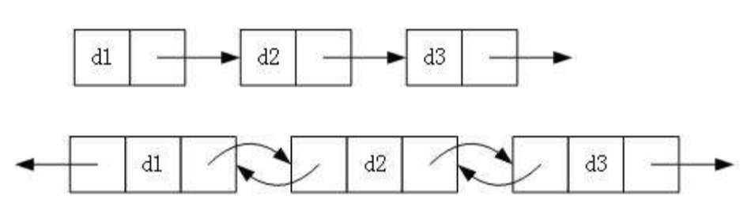
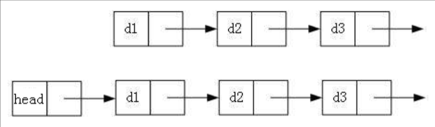
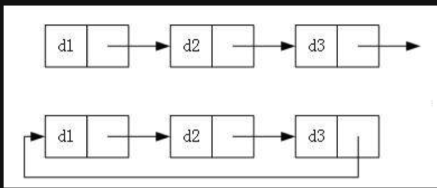
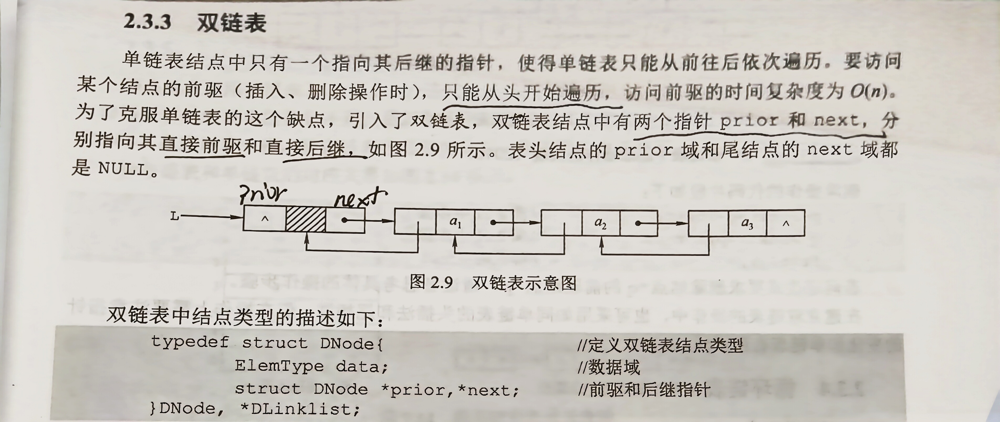

# 计算机基础

## 数据结构与算法

### 数据结构

**是一种存储和组织数据的方式，目的在便于访问和修改**

#### 1.链表

用于线性方式存储数据，**物理存储结构上非连续，非顺序**的存储结构，元素的**逻辑顺序**通过**链表上的指针链接次序**实现


**特点：**

1）动态大小

2）元素连接

3）无需连续内存

4）插入和删除操作比数组快

底层机制介绍：                      

**分类：**

1）单向与非单向



单链表：

```c
typedef struct LNode{
   ElemType data;   		//数据域
   struct LNode *next;  	//指针域
}LNode,*LinkList;
```

 双链表：

```c
typedef struct DNode{
    ElemType data;
    struct DNode *prior,*next;
}DNode ,*DLinkList;
```

2）带头与非带头

哨兵节点是一个虚拟节点，可以简化删除操作，避免空链表，统一处理逻辑



3）循环与非循环



**基本操作（接口）：**

插入

删除

搜索

遍历


**单链表的实现：**

1.初始化

```c
bool InitList (LinkList &L)
{
	L=(LNode* )malloc(sizeof(LNode)); //创建头结点
	L->next=NULL;
	return true;
}
```

2.求表长

```C
int Length(LinkList L)
{
	int len=0;
	LNode *p=L;
	while(p->next!=NULL){
        p=p->next;
        len++;
}
    return len;
}
```

3.按序号查找结点

```c
LNode  *GetElem(LinkList L,int i)
{
    	LNode *p=L;
    	int j=0;
    	while(p!=NULL&&j<i)		//循环找到第i个结点
        {
            p=p->next;
            j++;
		}
   		return p;
}
```

4.按值查找表结点

```c
LNode *LocateElem(LinkList L,ElemType e){
	LNode *p=L->next;
    while(p!=NULL&&p->data!=e)
        p=p->next;
    return p;
}
```

5.插入结点

```c
bool ListInsert(LinkList &L,int i,ElemType e) //在第i处插入数值e
{
	LNode *p=L;
    int j=0;
    while(p!=NULL&&j<i-1) //用p结点找到第i-1处
    {
        p=p->next;
        j++;
	}
    if (p==NULL)
        return false;
    
    LNode *s=(LNode *)malloc(sizeof(LNode));// 新建s结点
    s->data=e;
    
    s->next=p->next;  //尾插法，在p的后面插入s结点
    p->next=s;
    return true; 
}
```

6.删除结点：

```c
bool  ListDelete(LinkList &L ,int i,ElemType &e)
{
    LNode *p=L;
    int j=0;
    while(p->next!=NULL&&j<i-1)
    {
        p=p->next;
        j++;
	}
    if(p->next==NULL||j>i-1) //检查i值是否合法
        return false;
    LNode *q=p->next;	//用q指向被删除的结点
    e=q->data;
    p->next=q->next;
    free(q);		//释放结点的存储空间
    return true;
        
}
```

7.使用头插法创建单链表


```c
LinkList List_HeadInsert(LinkList &L){
    LNode *s;
    int x;
    L=(LNode*)malloc(sizeof(LNode));//创建头结点
    L->next=NULL;					//初始链表为空链表
    scanf("%d",&x);
    
    while(x!=9999){
        s=(LNode*)malloc(sizeof(LNode));
        s->data=x;
        
        s->next=L->next;
        L->next=s;
        scanf("%d",&x);
    }
    return L;
}
```

8.使用尾插法创建单链表


```C
LinkList List_TailInsert(LinkList &L){
    int x;
    L=(LNode*)malloc(sizeof(LNode));
    L->next=NULL;
    LNode *s,*r=L;
    scanf("%d",&x);
    while(x!=99999){
        s=(LNode*)malloc(sizeof(LNode));
        s->data=x;
        r->next=s;
        r=s;
        scanf("%d",&x);
    }
    r->next=NULL;
    return L;
}
```

**双链表的实现方法：**



1.插入操作：


```c
s->next=p->next;
p->next->prior=s;
s->prior=p;
p->next=s;
```

2.删除操作：


```c
p->next=q->next;
q->next->prior=p;
free(q);
```


#### 2.栈

是**只允许在一端**进行插入和删除操作的**线性表**

栈顶（Top)：允许进行插入和删除的一端

栈底（Bottom）：固定的，不允许插入和删除

空栈：不含任何元素的空表


**基本操作：**

```c
InitStack(&S):初始化一个空栈S
StackEmpty(S):判断栈是否为空，为空返回true ，不为空返回false
Push(&S,x):入栈，若栈S未满，将x加入成为新栈顶
Pop(&S,&x):出栈，若栈S非空，弹出栈顶元素，用x返回
GetTop(S,&x):读栈顶元素但不出栈，若栈S非空，用x返回栈顶元素
DestoryStack(&S):销毁栈，并释放栈S占用的存储空间
```

**1.顺序栈的实现：**
采用**顺序存储**的栈称为顺序栈

```c
#define MaxSize 50
typedef struct{
    Elemtype data[MaxSize];//存放栈中元素
    int top;	//栈顶指针
}SqStack;
```

栈顶指针：S.top

初始时设置S.top=-1

栈顶元素：S.data[S.top]

**2.顺序栈的基本操作：**


```c
1.初始化
    void InitStack(SqStack &S){
    S.top=-1;
}
2.判断栈空
    bool StackEmpty(SqStack S){
    if(S.top==-1)		//栈空
        return true;
    else 
        return false;
}
3.入栈
    bool Push(SqStack &S,ElemType x){
    if(S.top==MaxSize-1) //栈满，报错
        return false;
    S.data[++S.top]=x; 	 //指针先加1，再入栈
    return true;
}
4.出栈
    bool Pop(SqStack &S,ElemType &x){
    if(S.top==-1)	//栈空，报错
        return false;
    x=S.data[top];
    return true;
}
```

**3.共享栈：**


**4.栈的链式存储类型：**


```c
typedef struct Linknode{
    ElemType data;
    struct Linknode *next;
}LiStack;
```


#### 3.队列

也是一种操作受限的**线性表**，**只允许在表的一端进行插入，在另一端进行删除**，操作特性是**先进先出**

队头（Front）：允许删除的一端

队尾（Rear）：允许插入的一端


**基本操作：**

```c
InitQueue(&Q):初始化队列，构造一个空队列Q
QueueEmpty(Q):判断队列是否为空，为空返回true，不为空返回false
EnQueue(&Q,x):入队
DeQueue(&Q,&x):出队
GetHead(Q,&x):读队首元素
```

**1.队列的顺序存储结构：**


```c
#define MaxSize 50
typedef struct{
    ElemType data[MaxSize];
    int front ,rear; 	//front 指向队首元素 ，rear指向队尾元素的下一个位置
}SqQueue;
```

初始时Q.front=Q.rear=0;

**2.循环队列：**


```c
1.初始化
    void InitQueue(SqQueue &Q){
    Q.rear=Q.front=0;
}
2.判断队列是否空
    bool isEmpty(SqQueue Q){
    if(Q.rear==Q.front) 		//队空条件
        return true;
    else 
        return false;
}
3.入队
    bool EnQueue(SqQueue &Q ,ElemType x){
    if((Q.rear+1)%MaxSize==Q.front) //队满则报错
        return false;
    Q.data[Q.rear]=x;
    Q.rear=(Q.rear+1)%MaxSize; //队尾指针+1取模
    return true;
}
4.出队
    bool DeQueue(SqQueue &Q,ElemType &x){
    if(Q.rear==Q.front)
        return false;
    x=Q.data[Q.front];
    Q.front=(Q.front+1)%MaxSize;
    return true;
}
```

3.队列的链式存储：

```c
typedef struct LinkNode{
    ElemType data;
    struct LinkNode *next;
}LinkNode;
typedef struct{
    LinkNode *front ,*rear;
}LinkQueue;
```


```c
1.初始化
    void InitQueue(LinkQueue &Q){
	Q.front=Q.rear=(LinkNode*)malloc(sizeof(LinkNode));
    Q.front->next=NULL;
}
2.判队空
    bool IsEmpty(LinkQueue Q){
    if(Q.front==Q.rear)
        return true;
    else 
        return false;
    
}
3.入队
    void EnQueue(LinkQueue &Q ,ElemType x){
    LinkNode *s=(LinkNode *)malloc(sizeof(LinkNode));
    s->data=x;
    s->next=NULL;
    Q.rear->next=s;
    Q.rear=s;
}
4.出队
    bool DeQueue(LinkQueue &Q,ElemType &x){
    if(Q.front==Q.rear)
        return false;
    
}
```


#### 4.树

#### 5.堆

#### 6.图

### 算法

1.排序算法

2.查找算法

3.Leetcode刷题


## 计算机网络


### TCP IP


### Http版本区别和方法


## 操作系统（linux）

1、简单的命令

ps

cd

top

2、查看服务器的运行日志，排查异常问题

find

grep

less

3、写简单的shell脚本

## 设计模式


### 单例模式

### 工厂模式

### 策略模式

### 观察者模式


# java相关

## java基础

### 面向对象的特征与使用

### 泛型

### 常用内部集合的使用：ArrayList,HashMap

### 异常处理


## JVM


### jvm是什么，与java的关系是什么，以及jvm怎么实现的跨平台性

### 内存模型是什么，每个区域的作用是什么

### 垃圾回收机制：垃圾回收算法和垃圾回收器

### 类加载过程：加载，链接（验证，准备，解析），初始化


## java多线程

### 基本概念

理解进程，线程与cpu之间的关系，以及多线程解决的问题

线程安全的三个问题：可见性，原子性，有序性

java中线程的状态

### java中的锁

Syncronized锁

ReentrantLock

### 常见关键字和线程类的使用

Volatile,Syncronized解决了什么问题，原理是什么？

掌握Thread,Callable，Future的区别和使用

JUC中并发集合和原子类的使用以及基本原理

1.ConcurrentHashMap

2.Atomiccinteger


# 相关开发工具

## git

## postman

## intellij IDEA

## navicat

## maven


# 数据库基础

## MYSQL

### 1.基本的SQL

### 2.MySQL底层有哪些log

### 3.索引

1）Hash索引，二叉树索引，B树，B+树

2）聚集索引，非聚集索引，联合索引

### 4.锁

1）粒度划分：全局锁，表级锁，行级锁

2）性质划分：共享锁，独占锁

3）思想划分：乐观锁，悲观锁

### 5.事务

1）事务的ACID性质

2）事务的隔离级别

3）MVCC是什么，解决了什么问题

## Redis


# 基本框架和工具使用

## spring boot

1.容器的概念

2.常用注解@Autowired @Component @Service @Request 等等

3.AOP的原理，应用场景以及使用方法

4.能启动一个WEB服务，通过Http接口完成一个简单的CRUD程序

## mybatis


# 加分的框架组件

