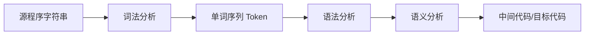
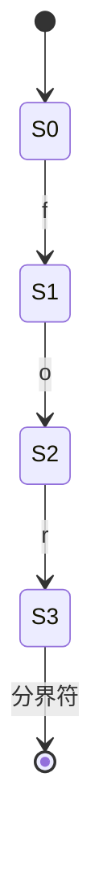
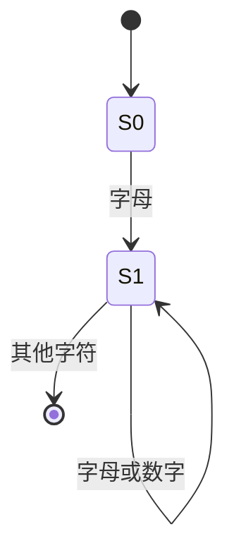
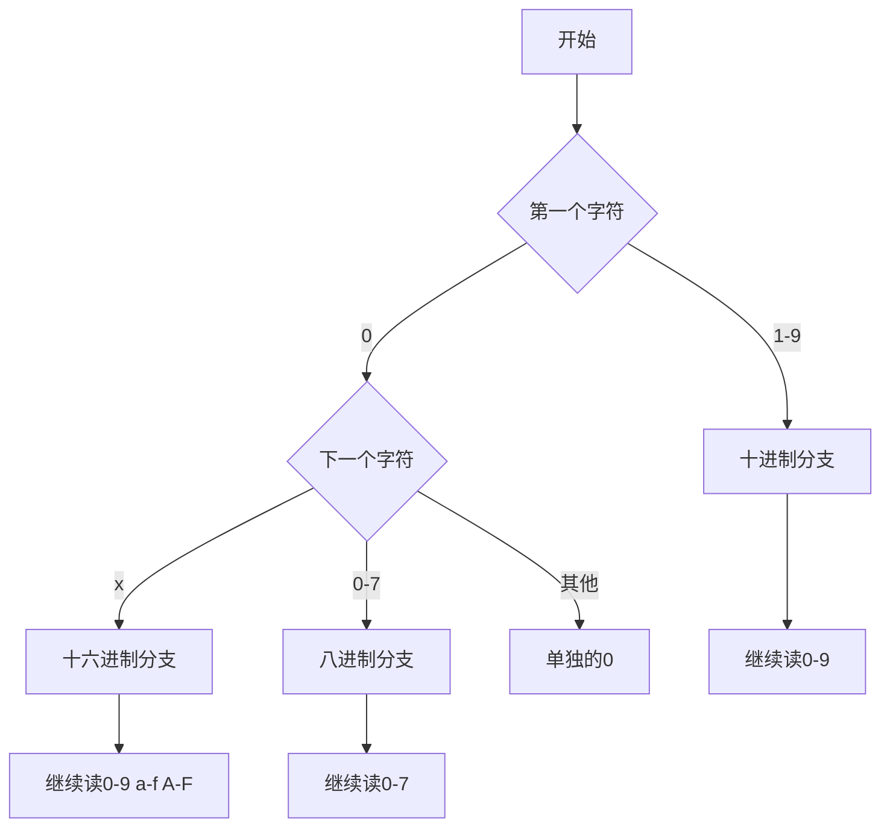
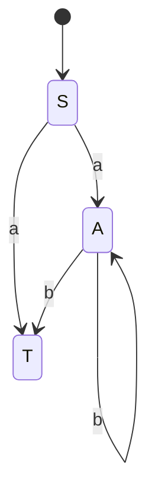
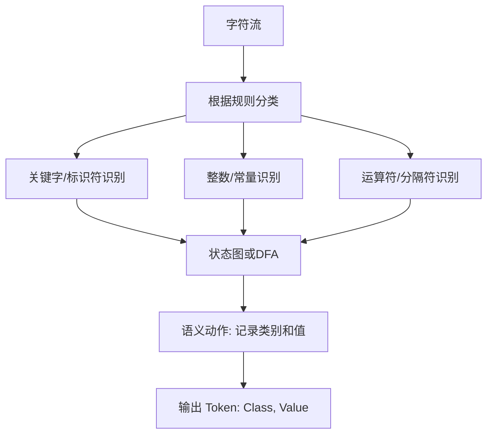

3/13日

# 一、《编译原理C1-绪论》核心知识总结

## 1. 这门课到底在研究什么

编译原理研究的是：

**如何把人写的高级语言程序，自动、准确、高效地转换成机器能执行的低级代码。**

这门课的主线非常清晰：  
从“源代码”出发，经过一系列处理阶段，最后得到“目标代码”。

课件里给出的整体链路是：

- 文法和语言
- 词法分析
- 语法分析
- 语义分析
- 中间代码生成
- 代码优化
- 目标代码生成
- 同时贯穿：**符号表管理** 和 **错误检查处理**

---

## 2. 为什么会需要编译程序

### 2.1 高级语言与机器语言的矛盾

高级语言的特点：

- 接近人类思维
- 便于阅读和维护
- 有变量名、过程名、结构化表达

机器语言/汇编语言的特点：

- 接近硬件
- 便于机器执行
- 对人非常不友好

所以就出现了一个根本矛盾：

- **人容易写的代码，机器不容易直接执行**
- **机器容易执行的代码，人又很难直接写**

### 生动比喻

可以把这件事想成：

- **高级语言像普通话**
- **机器语言像芯片专用的“电报码”**

程序员会说普通话，CPU只听得懂电报码。  
**编译器就是一个“超级专业同声传译员”**，而且它不能大概翻，必须做到：

- 语义正确
- 结构正确
- 尽量高效

只要翻错一个地方，程序就可能崩掉。

---

## 3. 解释、翻译、编译三者的关系

### 3.1 解释程序（Interpreter）

解释程序是：

- 读一句源程序
- 执行一句
- 边翻边跑

特点：

- 启动快
- 灵活
- 但运行时通常会慢一些

### 3.2 翻译程序（Translator）

翻译程序更广义，指把一种语言转换成另一种语言的程序。

### 3.3 编译程序（Compiler）

编译是特殊的翻译：

- 输入：高级语言源程序
- 输出：低级语言目标程序（汇编/机器代码）

### 生动比喻

- **解释器像口译员**：你说一句，它翻一句，当场办事。
- **编译器像笔译员**：先把整本说明书翻译好，再交给别人反复使用。

所以：

- 解释偏“边做边翻”
- 编译偏“先翻完再执行”

---

## 4. 编译系统的组成

编译系统不仅仅只有“编译器”本身，还包括：

- 预处理器
- 编译器
- 汇编器
- 装载连接程序
- 运行系统

### 重点理解

一份源程序最终变成可执行程序，往往不是一步完成，而是多步流水线：

1. **预处理**：处理宏、头文件、条件编译等
2. **编译**：把高级语言变成汇编或中间表示
3. **汇编**：把汇编变成机器目标文件
4. **链接**：把多个目标文件和库拼起来
5. **装载运行**

### 生动比喻

整个过程像“工厂流水线”：

- 预处理：备料
- 编译：粗加工
- 汇编：精加工成零件
- 链接：把零件组装成整机
- 装载：通电开机

很多新手以为“写完代码一按运行就结束了”，其实背后是一整条加工链。

---

## 5. 编译过程的核心阶段

## 5.1 词法分析（Lexical Analysis）

输入：源程序字符串  
输出：单词（Token）序列

作用：

- 从左到右扫描源程序
- 把字符流切分成一个个单词
- 去掉空格、注释等无关内容
- 检查词法错误
- 维护符号表中的基础登记信息

例如：

`position = initial + rate * 60`

会被切分成：

- 标识符 position
- 赋值符号 =
- 标识符 initial
- 加号 +
- 标识符 rate
- 乘号 *
- 整数 60

### 生动比喻

词法分析就像：

**把一整段没有停顿的语音，切分成一个个词。**

比如一句外语录音，先不管语法和意思，第一步是先听清楚：

- 哪些是单词
- 单词边界在哪里
- 哪些是标点
- 哪些是噪音

所以词法分析关心的是：  
**“这是什么词”**，还不关心“这句话合不合理”。

---

## 5.2 语法分析（Syntax Analysis）

输入：Token序列  
输出：语法树

作用：

- 根据文法规则判断句子是否合法
- 构造语法树
- 报告语法错误
- 为后续翻译提供结构基础

例如：

`position = initial + rate * 60`

在语法分析阶段，不再把它看成一串字符，而看成：

- 这是一个赋值语句
- 左边是标识符
- 右边是表达式
- 表达式由加法和乘法组合而成

### 生动比喻

词法分析像“切词”，语法分析像“组句”。

如果词法分析是把积木分拣出来，  
那么语法分析就是按照说明书把积木搭成合法结构。

所以语法分析最重要的产物是：

- **语法树**

这棵树不是装饰品，而是后续语义分析、翻译和优化的骨架。

---

## 5.3 语义分析（Semantic Analysis）

语法正确，不代表语义正确。

语义分析做的事情包括：

- 获取标识符属性（类型、作用域等）
- 检查运算是否合法
- 进行类型检查和必要转换
- 进行静态绑定（变量地址、过程信息等）

### 经典例子

如果 `rate` 是浮点型，`60` 是整型，  
那么在表达式中可能需要插入 `int2real` 转换。

### 生动比喻

语法分析像检查一句话“语法通顺不通顺”，  
语义分析像判断一句话“讲得有没有道理”。

比如：

- “我吃饭”——语法、语义都合理
- “石头吃云朵”——语法可能通顺，但语义很奇怪

在程序里也是一样：

- `3 + 5` 很正常
- “数组 + 函数名” 就可能语义不合法

---

## 5.4 中间代码生成（Intermediate Code Generation）

中间代码是编译器内部使用的“过渡语言”。

特点：

- 比源代码更规范
- 比机器码更抽象
- 与具体机器无关
- 便于优化和再翻译

常见形式：

- 逆波兰式
- 三地址码
- 四元式
- 三元式

### 生动比喻

中间代码就像：

**国际中转机场里的标准化货物托盘。**

源代码来自不同“国家”，目标机器是不同“终点站”。  
直接一个个国家对接所有终点太麻烦，所以先统一装进“标准托盘”（中间代码），再分发到各类机器上。

这就是为什么现代编译器大量依赖 IR（Intermediate Representation）。

---

## 5.5 代码优化（Optimization）

代码优化是在**不改变程序语义**的前提下，提高执行效率。

主要目标：

- 更快
- 更省空间
- 更少资源消耗

分类：

### 与机器无关的优化

- 常量合并
- 公共子表达式消除
- 强度削弱
- 循环不变代码外提

### 与机器有关的优化

- 寄存器分配
- 指令选择
- 存储访问优化
- 利用具体体系结构特性

### 生动比喻

代码优化像给出行路线做导航优化：

- 原来路线能到
- 但绕路、堵车、耗油
- 优化后：同样到达终点，但更快更省

注意：  
**优化不是“改结果”，而是“改走法”。**

---

## 5.6 目标代码生成（Code Generation）

把中间代码翻译成目标机上的机器指令或汇编代码。

这里开始强依赖具体机器：

- 指令集
- 寄存器
- 调用约定
- 地址模式

### 重点理解

前端偏“理解程序”，后端偏“适配机器”。

所以常说：

- **前端：与目标机无关**
- **后端：与目标机有关**

---

## 6. 符号表的重要性

符号表记录：

- 标识符名字
- 类型
- 作用域
- 参数个数与类型
- 返回类型
- 地址信息等

它贯穿多个阶段，不是某一阶段一次性完成的。

### 生动比喻

符号表像“学校学籍档案系统”。

学生一入学先登记姓名，  
后续不断补充：

- 班级
- 专业
- 成绩
- 学分
- 毕业状态

同样，变量刚在词法阶段出现时，只登记“这个名字存在”；  
到了语义和后续阶段，才逐步补全它的各种属性。

---

## 7. 错误处理思想

编译器遇到错误时，不是简单地“立刻崩溃停止”，而是要尽量：

- 发现错误
- 报告错误位置与原因
- 尽可能继续分析后面的部分

因为一次只报一个错，用户体验很差。

### 生动比喻

像老师批作文：

- 差的老师：看到第一个错别字就把卷子撕了
- 好的老师：尽量把所有明显问题都标出来

编译器也一样，好的错误处理能力是工程质量的重要体现。

---

## 8. 编译原理的学习价值

这门课的价值体现在三层：

### 8.1 理论层

- 形式语言
- 自动机
- 可计算性
- 复杂性理论基础

### 8.2 思维层

- 培养严谨的抽象能力
- 理解“形式化定义—算法—实现”的闭环

### 8.3 工程层

- 编译器与解释器设计
- 程序分析
- 安全验证
- 文本处理
- 数据格式转换
- DSL（领域专用语言）设计

---

## 9. 新手必须记住的重点

### 必记主线

编译器就是一条“加工流水线”：

**源程序 → 词法分析 → 语法分析 → 语义分析 → 中间代码 → 优化 → 目标代码**

### 必记三个核心产物

- 词法分析得到 **Token串**
- 语法分析得到 **语法树**
- 中间代码生成得到 **IR/三地址码**

### 必记两个贯穿系统

- **符号表管理**
- **错误处理**

### 最易混淆点

- 词法分析：识别“单词”
- 语法分析：识别“句子结构”
- 语义分析：判断“意思是否合理”

---

## 10. 本PDF的重难点总结

### 难点1：编译器不是“一个程序一步做完”

很多新手以为编译器就是黑盒子。  
其实它像医院体检流程：

- 挂号（预处理）
- 分诊（词法）
- 拍片（语法树）
- 专家会诊（语义）
- 制定方案（中间代码）
- 优化手术路径（优化）
- 实施手术（目标代码生成）

每一步职责不同，前后衔接。

### 难点2：语法对了不代表语义对

“这句话能说”不等于“这句话有意义”。  
程序里尤其常见。

### 难点3：语法树是后续一切工作的骨架

语法树不是课堂上的图示摆设，而是后面语义分析、优化、代码生成的重要依据。

---

# 二、《编译原理C2-文法new》核心知识总结

## 1. 什么是语言、语法、语义

课件强调：语言可以从三个方面看：

- **语法（Syntax）**：符号怎么组合
- **语义（Semantics）**：符号组合后的意义
- **语用（Pragmatics）**：使用场景与效果

在编译原理前期，最核心的是：

- **形式语言**
- **文法**
- **自动机**

因为编译器首先要解决的是：  
**“一个串是不是这个语言中的合法句子？”**

---

## 2. 语言的三种表示方式

课件提到语言可用三种方式表示：

1. **枚举**
2. **文法生成**
3. **自动机识别**

### 生动比喻

把“一个语言”想成一家餐厅允许出售的所有菜品。

- 枚举：把所有菜一条条写出来  
  ——适合菜少，不适合无限集合
- 文法：写出“做菜规则”
- 自动机：写个“检验员”，判断一道菜是否符合标准

编译原理里最常用的是：

- 用**文法**来定义语言
- 用**自动机/分析器**来识别语言

---

## 3. 基础概念：字母表、符号串、集合运算

这一部分是后续一切形式化定义的地基。

包括：

- 字母表（alphabet）
- 符号串
- 空串 ε
- 前缀、后缀、子串
- 联结（concatenation）
- 次幂
- 正闭包
- 闭包（Kleene闭包）

### 3.1 ε、{ε}、∅ 的区别

这是考试和理解中的经典坑点。

- `ε`：一个**空串**
- `{ε}`：一个**集合**，里面只有一个元素，这个元素是空串
- `∅`：**空集合**，里面什么都没有

### 生动比喻

把它们想成“盒子和苹果”的关系：

- `ε`：一颗“看不见的透明苹果”
- `{ε}`：一个盒子，里面放着这颗透明苹果
- `∅`：一个空盒子，里面啥也没有

所以：

- `ε` 不是集合
- `{ε}` 不是空集合
- `∅` 不含 ε

这个点新手特别容易混。

---

## 4. 文法的定义

文法形式化定义为四元组：

**G = (V_T, V_N, P, S)**

其中：

- `V_T`：终结符集合
- `V_N`：非终结符集合
- `P`：产生式集合
- `S`：开始符号

### 4.1 各部分意义

#### 终结符

真正出现在句子中的“最终字符”。

#### 非终结符

中间推导中使用的“语法类别名”。

#### 产生式

说明一个语法类别如何展开。

#### 开始符号

推导的起点。

### 生动比喻

文法就像“建筑施工蓝图”：

- 终结符：真正送到工地上的砖、钢筋、水泥
- 非终结符：图纸上的“客厅、卧室、门厅”这些抽象模块名
- 产生式：施工规则，比如“客厅 → 地板 + 墙面 + 天花板”
- 开始符号：整栋房子的总入口

最终交付给用户的是终结符串，  
非终结符只是中间设计阶段的“概念标签”。

---

## 5. 推导与归约

### 5.1 推导（Derivation）

从开始符号出发，根据产生式逐步替换非终结符，得到句子。

### 5.2 归约（Reduction）

推导的逆过程。  
从句子出发，把某些符合产生式右部的部分一步步缩回到开始符号。

### 生动比喻

- 推导像“从菜谱一步步做出成品”
- 归约像“拿到成品菜，反推它是怎么做出来的”

编译器中：

- 自顶向下分析更像推导
- 自底向上分析更像归约

---

## 6. 句型、句子、语言

### 6.1 句型（sentential form）

从开始符号出发，在推导过程中得到的任意符号串，里面可以还带非终结符。

### 6.2 句子（sentence）

完全由终结符组成的句型。

### 6.3 语言 L(G)

文法 G 所能生成的全部句子的集合。

### 生动比喻

做陶瓷时：

- 半成品泥坯：句型
- 烧制完成的成品瓷器：句子
- 这个工坊所有可能做出的成品总集合：语言

所以：

- 句子一定是句型
- 句型不一定是句子

---

## 7. Chomsky 文法分类

这是整个形式语言理论的核心框架之一。

课件给出四类文法：

- 0型文法：短语结构文法 PSG
- 1型文法：上下文有关文法 CSG
- 2型文法：上下文无关文法 CFG
- 3型文法：正规文法 RG

并且语言能力满足：

**L3 ⊂ L2 ⊂ L1 ⊂ L0**

### 7.1 0型文法

限制最少，表达能力最强。  
对应递归可枚举语言。

### 7.2 1型文法

上下文有关。  
产生式满足长度不缩短（一般意义上）。

### 7.3 2型文法

上下文无关。  
产生式左边只有一个非终结符。

这是编译原理最核心的一类，因为程序设计语言语法大多围绕 CFG 展开。

### 7.4 3型文法

正规文法。  
表达能力最弱，但识别最简单，对应有限自动机和正规表达式。

### 生动比喻

把四类文法想成四种“工具箱”：

- 3型：螺丝刀，简单高效，但能干的活少
- 2型：家用工具箱，很多常见问题都能处理
- 1型：专业维修站
- 0型：无限制工厂，什么都能造，但控制最复杂

在编译器里：

- 词法分析大量使用 3型语言/正规表达式
- 语法分析大量使用 2型语言/上下文无关文法

这是一个必须建立起来的大局观。

---

## 8. CFG的语法树

语法树（分析树、推导树）的规则：

- 根节点是开始符号
- 内部节点是非终结符
- 子节点排列对应产生式右部
- 叶子节点是终结符（或 ε）

语法树把“线性的串”还原成“层次性的结构”。

### 生动比喻

一句程序看起来是一行文字，  
但语法树告诉你：这行文字其实像一栋楼，有楼层、有房间、有从属关系。

没有语法树，你看到的是“字排成一行”；  
有了语法树，你看到的是“结构”。

---

## 9. 短语、直接短语、句柄

这一部分是自底向上分析的理解关键。

### 9.1 短语

某个子树对应的叶子串。

### 9.2 直接短语

某个节点的孩子直接组成的那段串。

### 9.3 句柄

一个句型的**最左直接短语**。

句柄是规范归约时每一步真正要“下手归约”的位置。

### 生动比喻

假设你要拆掉一栋乐高建筑，恢复成零件。

- 短语：可以看作某一块完整模块
- 直接短语：当前层直接拼起来的一块模块
- 句柄：你在“规范拆解流程”中，此刻应该先拆的那一块

句柄就像拆楼时工程师指定的“当前合法拆除点”。  
乱拆会塌，按句柄拆才安全。

---

## 10. 最左推导、最右推导、规范归约

### 最左推导

每一步都替换最左边的非终结符。

### 最右推导

每一步都替换最右边的非终结符。

### 规范归约

最右推导的逆过程，也叫最左归约。

### 为什么重要

因为不同分析方法，本质上对应不同的推导/归约策略：

- 自顶向下：常与最左推导相关
- LR分析：本质上抓的是最右推导的逆过程

---

## 11. 文法的二义性

若同一个句子对应：

- 多棵不同语法树
- 或多个不同最左推导
- 或多个不同规范归约

那么这个文法就是**二义文法**。

### 典型例子

表达式文法：

`E → E + E | E * E | (E) | id`

对 `id + id * id` 可以得到不同的语法树：

- 先算加法
- 先算乘法

于是就产生二义性。

### 生动比喻

二义文法就像导航软件同时给你两条互相矛盾的路线，而且都说“我是对的”。

程序设计语言不能容忍这种模糊，  
因为编译器必须做出唯一决定。

### 特别要点

- 二义性应尽量在语言设计中避免
- 某些二义性可通过规则消除（如 if-then-else 就近匹配）
- CFG 的二义性一般是**不可判定**的

这是理论上非常重要的结论。

---

## 12. 本PDF最重要的知识框架

新手一定要建立下面这条链：

**字母表 → 符号串 → 文法 → 推导/归约 → 句型/句子 → 语言 → 语法树 → 二义性**

这相当于语法分析之前的全部理论地基。

---

## 13. 本PDF重难点总结

### 难点1：ε、{ε}、∅ 区分不清

这是形式化语言的入门门槛，必须死磕明白。

### 难点2：句型、句子、语言混淆

要牢牢记住：

- 句型可含非终结符
- 句子不能含非终结符
- 语言是句子的集合

### 难点3：推导和归约方向容易反

推导是“展开”，归约是“收回”。

### 难点4：句柄抽象难懂

句柄不是“随便能归约的一段”，  
而是在规范归约中“当前应该归约的那一段”。

### 难点5：二义性不是小问题

它会直接导致编译器对程序含义的理解不唯一。

---

# 三、《编译原理C4-语法(1)》核心知识总结

## 1. 语法分析在编译器中的位置

语法分析位于：

**词法分析之后，语义分析之前**

它的任务是：

- 根据文法规则识别输入的 Token 串
- 构造语法树
- 发现语法错误
- 为后续翻译提供结构依据

课件先回顾了语法树和二义性，然后进入两大类语法分析方法。

---

## 2. 两类语法分析方法

按生成语法树的方向分成两大类：

### 2.1 自顶向下分析

从开始符号出发，尝试推出输入串。  
常见方法：

- 递归下降分析
- LL分析

### 2.2 自底向上分析

从输入串出发，尝试归约到开始符号。  
常见方法：

- 简单优先分析
- 算符优先分析
- LR分析

### 生动比喻

想象你在拼一座建筑模型。

- **自顶向下**：先看总设计图，从“整栋楼”一步步展开到每个零件
- **自底向上**：先拿着一堆零件，从局部模块一步步拼回整栋楼

两种思路都能到达目标，但过程不同。

---

## 3. 自顶向下分析的关键障碍：左递归

课件给出表达式文法示例：

- `E → T | EAT`
- `T → F | TMF`
- `F → (E) | I`

这里 `E → EAT` 和 `T → TMF` 都有左递归。

### 为什么左递归会出问题

对于递归下降分析器来说，如果一个非终结符一展开还立刻回到自己，就会不断自我调用，造成死循环。

### 生动比喻

这像你查字典：

- 你查 A，字典说“看 A 的扩展解释”
- 你又回到 A
- 永远出不去

所以自顶向下分析通常必须先**消除左递归**。

---

## 4. 左递归的消除

### 4.1 直接左递归的形式

`A → Aα | β`

消除后可写成：

- `A → βA'`
- `A' → αA' | ε`

更一般地：

`A → Aα1 | Aα2 | ... | β1 | β2 | ...`

改写为：

- `A → β1A' | β2A' | ...`
- `A' → α1A' | α2A' | ... | ε`

### 为什么这样改有效

原来是“先调用自己，再往后接内容”；  
改写后变成“先匹配一个合法起点 β，再循环接若干 α”。

### 生动比喻

左递归像一个人进门前非要先说：

“等我先进门以后我再进门。”

这当然会卡死。  
改写后变成：

“先找个能真正进门的入口 β，进门后再决定要不要重复追加 α。”

这样就顺了。

---

## 5. FIRST 集

## 5.1 FIRST 的定义

对于符号串 α，`FIRST(α)` 表示：

**α 能推出的串中，可能出现在最前面的终结符集合。**

如果 α 能推出 ε，则 ε 也在 FIRST(α) 中。

### 直观理解

FIRST 集回答的问题是：

> “如果我要从这个符号串开始读，第一眼最可能看到什么终结符？”

### 生动比喻

像快递箱的“开箱第一层可见物清单”。

打开一个箱子，你最先可能看到什么东西？  
FIRST 就是这个“第一眼会看到什么”的集合。

---

## 5.2 构造 FIRST 的核心规则

### 情况1：以终结符开头

若 `X → a...`，则 `a ∈ FIRST(X)`

### 情况2：能推出 ε

若 `X → ε`，则 `ε ∈ FIRST(X)`

### 情况3：以非终结符串开头

若 `X → Y1Y2...Yk`

则：

- 把 `FIRST(Y1)` 中除 ε 外的内容加入
- 如果 `Y1` 能推出 ε，再看 `Y2`
- 依次类推
- 如果所有 `Yi` 都能推出 ε，则 ε 也加入

### 重点本质

FIRST 是一个“沿着右部从左往右看，直到遇到不能空掉的位置为止”的过程。

---

## 6. FOLLOW 集

## 6.1 FOLLOW 的定义

对非终结符 X，`FOLLOW(X)` 表示：

**在某个句型中，可能紧跟在 X 后面的终结符集合。**

并且：

- 若 X 能出现在句子末尾，则 `#` 可以属于 FOLLOW(X)

其中 `#` 表示输入结束标记。

### 直观理解

FOLLOW 回答的问题是：

> “如果我刚识别完 X，那么接下来可能会看到什么？”

### 生动比喻

FIRST 是“看开头”，FOLLOW 是“看后面”。

如果把一个非终结符看成火车车厢，  
FOLLOW 就是“这节车厢后面可能挂着哪些车厢/标记”。

---

## 6.2 构造 FOLLOW 的核心规则

### 规则1：开始符号

开始符号的 FOLLOW 中一定有 `#`

### 规则2：若有 `A → αXβ`

则把 `FIRST(β) - {ε}` 加入 `FOLLOW(X)`

### 规则3：若 `β =>* ε`

则把 `FOLLOW(A)` 也加入 `FOLLOW(X)`

### 规则4：若有 `A → αX`

则 `FOLLOW(A)` 加入 `FOLLOW(X)`

### 容易混淆点

- `ε` 可以在 FIRST 中
- `ε` **不能**在 FOLLOW 中
- `#` 不会在 FIRST 中
- `#` 可能在 FOLLOW 中

这是课件中特别强调的区别。

---

## 7. LL(1) 文法

## 7.1 什么叫 LL(1)

LL(1) 中：

- 第一个 L：从左到右扫描输入（Left to right）
- 第二个 L：构造最左推导（Leftmost derivation）
- 1：只向前看 1 个符号

### 它的本质目标

让语法分析器在每一步都能：

**只靠当前非终结符 + 1 个向前看符号，就唯一决定该用哪个产生式。**

### 7.2 LL(1) 条件

对于 `A → γ1 | γ2 | ... | γm`

必须满足：

1. 各候选式的 FIRST 集两两不交
2. 若某候选式能推出 ε，则其他候选式的 FIRST 集与 FOLLOW(A) 不交

### 生动比喻

LL(1) 像“单路口交通指挥”。

车到路口时，只看眼前这个红绿灯和路牌，就必须能唯一决定往哪走。  
如果看一眼还会犹豫、要回头、要试错，那就不是 LL(1)。

---

## 8. 非 LL(1) 文法的改造方法

主要两类：

### 8.1 消除左递归

解决递归下降死循环问题。

### 8.2 提取左公因子

若多个候选式前缀相同，就把共同前缀提出来。

例如：

`A → αβ1 | αβ2 | ... | αβn`

改写为：

- `A → αA'`
- `A' → β1 | β2 | ... | βn`

### 生动比喻

这像岔路口前有一段公共道路。

如果你一开始看不出要走哪条支路，那就先把公共部分走完，  
等走到真正分叉处再决定。  
这就是“提取左公因子”。

---

## 9. 递归下降分析法

对每个非终结符写一个递归函数，  
函数体根据产生式结构去匹配输入。

### 特点

- 实现直观
- 易于手写
- 适合 LL(1) 文法
- 不适合直接处理左递归和复杂二义结构

### 生动比喻

递归下降就像每个语法单位都有一个“专属接待员”：

- 表达式来了，找 expression()
- 项来了，找 term()
- 因子来了，找 factor()

每个接待员只负责自己这一类客人，并按规则把工作转交给下一级。

---

## 10. 预测分析法与预测分析表

当不想手写复杂递归时，可以把“选产生式”这件事表格化。

### 10.1 核心组成

- 分析栈
- 输入流
- 预测分析表 M
- 总控程序

### 10.2 表项含义

`M[A, a]`

表示：

当栈顶是非终结符 A，当前输入符号是 a 时，  
应该选用哪条产生式。

构造规则：

- 若 `a ∈ FIRST(γ)`，则填入 `A → γ`
- 若 `ε ∈ FIRST(γ)` 且 `a ∈ FOLLOW(A)`，也填入 `A → γ`
- 其他填 `ERR`

### 生动比喻

预测分析表就像医院分诊台。

- 当前病人类型：A
- 当前表面症状：a

分诊台一查表，就知道应该挂哪个科室（用哪条产生式）。  
如果查不到，就是错误。

---

## 11. 预测分析机的工作原理

初始化：

- 栈中放 `#S`
- 输入串末尾加 `#`

然后循环：

### 情况1：栈顶是非终结符

查分析表，按产生式右部逆序压栈

### 情况2：栈顶是终结符

若与当前输入符号匹配，则弹栈并读下一个输入符号

### 情况3：栈顶和输入都为 #

分析成功

### 情况4：查表出错或终结符不匹配

语法错误

### 生动比喻

这像照着说明书装机器：

- 栈顶是“待完成的大步骤”时，就展开成更小步骤
- 栈顶是“具体零件”时，就拿当前输入零件去一一对照
- 全都刚好对上，说明装配成功

---

## 12. 自底向上分析：移近与归约

课件后半部分转入自底向上分析。

自底向上的核心动作只有两个：

- **移近（shift）**：把当前输入符号压栈
- **归约（reduce）**：把栈顶某段句柄替换成相应非终结符

### 生动比喻

这像砌墙：

- 移近：先把砖搬上来
- 归约：发现几块砖已经能组成一个窗框模块，就先拼成一个模块

不断重复，直到整栋结构还原成开始符号。

---

## 13. 简单优先分析与算符优先分析

这两类方法都是通过“优先关系”决定什么时候移近、什么时候归约。

### 简单优先分析

考虑相邻符号之间的优先关系。

### 算符优先分析

更多用于表达式类文法，直接研究终结符（算符）之间的优先关系。

### 重点限制

算符优先文法要求比较强，例如：

- 右部不能有两个非终结符相邻
- 终结符优先关系必须足够明确

### 生动比喻

算符优先就像数学表达式里的“运算等级制度”：

- 乘除比加减优先
- 括号优先级最高

所以在 `a + b * c` 中，  
不是随便先算哪个，而是由“优先级制度”来控制归约顺序。

---

## 14. LR 分析的思想

这是课件后半部分的重头戏。

LR 分析的核心思想是：

- 从左到右扫描输入
- 做最右推导的逆过程
- 借助“状态”记录历史
- 依据“当前状态 + 当前输入”做移近/归约决策

### 14.1 为什么需要状态

光看栈顶的几个符号，很多时候不够判断。  
因为相同的局部串，在不同上下文中意义可能不同。

所以 LR 引入“状态”，保存：

- 已经识别了什么
- 当前可能处在哪些项目位置
- 后续可能期待什么

### 生动比喻

状态就像你玩解谜游戏时的“存档信息”。

同样站在一个房间里，如果你之前拿过钥匙和没拿过钥匙，  
接下来能做的动作是不一样的。

LR 的“状态”就是这种“带历史的现在”。

---

## 15. LR(0) 项目与项目集

### 15.1 LR(0) 项目

给产生式加一个圆点 `·`，表示识别进度。

例如：

`A → α·β`

表示：

- `α` 已经识别过了
- `β` 还没识别

### 项目类型

- 归约项目：圆点在最右端
- 移近项目：圆点后是终结符
- 待约项目：圆点后是非终结符

### 15.2 闭包与 GOTO

通过闭包和 GOTO 构造项目集 DFA。

这些项目集本质上就是 LR 分析器的状态集合。

### 生动比喻

项目像快递处理单上的“进度条”：

- `·abc`：还没开始
- `a·bc`：做完第一步
- `ab·c`：做到一半
- `abc·`：处理完，可以归档

项目集就是“所有可能进度条状态的打包集合”。

---

## 16. LR(0) 分析表

分析表分成：

- ACTION：对终结符做什么（移近、归约、接受、报错）
- GOTO：对非终结符转到哪个状态

构造原则：

- 若项目 `A → α·Xβ` 在状态 i，且 `GO(Ii, X)=Ij`
  - 若 X 是终结符，则 `ACTION[i, X] = shift j`
  - 若 X 是非终结符，则 `GOTO[i, X] = j`
- 若有项目 `A → α·`
  - 则填归约动作
- 若有 `S' → S·`
  - 则对 `#` 填 `acc`

### 重点难点

LR(0) 对文法要求比较严格：

- 不允许移近/归约冲突
- 不允许归约/归约冲突

---

## 17. SLR(1)、LR(1)、LALR(1) 的关系

### 17.1 SLR(1)

在 LR(0) 的基础上，用 FOLLOW 集限制归约条件，减少冲突。

### 17.2 LR(1)

在项目中加入向前看符号，更精细地区分上下文。

项目形式：

`[A → α·β, a]`

表示后续期望看到的输入信息。

### 17.3 LALR(1)

把 LR(1) 中“核心相同”的状态合并，减少状态数量。

### 生动比喻

这三者像三级安检：

- **LR(0)**：只看当前物品，不看上下文
- **SLR(1)**：看一点通用背景信息（FOLLOW）
- **LR(1)**：看精确上下文和后续预期
- **LALR(1)**：在尽量保留准确性的同时，压缩系统规模

---

## 18. 这一讲的核心主线

这份 PDF 的真正主线不是“很多算法”，而是：

**如何让语法分析器在每一步都知道：现在该展开、移近、归约，还是报错。**

于是形成两大阵营：

### 自顶向下

- 先猜结构再匹配输入
- 代表：LL(1)、递归下降、预测分析

### 自底向上

- 先读输入再往上归约结构
- 代表：优先分析、LR 系列

---

## 19. 本PDF的重难点总结

### 难点1：左递归为什么会死循环

因为递归下降展开时立刻再次调用自己，根本没有消耗输入。

### 难点2：FIRST 和 FOLLOW 的意义容易只会背不会用

一定要记住：

- FIRST：看“开头可能是什么”
- FOLLOW：看“后面可能是什么”

### 难点3：LL(1) 条件为什么合理

本质是为了保证：  
**只看一个输入符号就能唯一选产生式，不回溯。**

### 难点4：预测分析表为什么能驱动分析

因为它把“决策规则”预先表格化了。

### 难点5：LR 状态为什么必要

因为局部串一样，不代表上下文一样。  
必须带着“历史”判断未来动作。

### 难点6：LR(0)、SLR(1)、LR(1)、LALR(1) 容易混

可以简单先记成一条升级路线：

**LR(0) → SLR(1) → LR(1) → LALR(1)**

它们都是为了更准确地处理“该移近还是该归约”的冲突问题。

---

## 四、三份PDF的整体知识地图

把三份材料串起来，可以得到一条完整学习路线：

## 第一步：先理解编译器整体流程（C1）

你要先知道编译器在干什么、分几步做、每一步产出什么。

## 第二步：再理解语言和文法基础（C2）

你要知道“合法程序的结构”如何形式化定义。

## 第三步：再学习语法分析算法（C4）

你要知道“如何自动识别这些结构”。

### 最终大图

- C1 解决：**编译器是什么**
- C2 解决：**程序语言如何定义**
- C4 解决：**如何识别程序结构**

---

3/20

# 编译原理第2周《文法》知识点总结与基本概念详解

> 依据《编译原理——文法》课件整理，内容围绕“基本概念 → 文法定义 → 推导与句子 → 语言理解 → 练习方法”展开，适合新手建立第一层完整框架。

---

## 一、这一讲到底在讲什么

这一讲的主题只有一个：**如何用“规则”精确定义一种语言**。

在编译原理里，计算机面对的不是“模糊意思”，而是**严格的符号系统**。  
所以这节课其实是在回答三个根本问题：

1. 什么叫一个“合法的串”？
2. 什么叫一种“语言”？
3. 我们怎样用有限条规则，生成无限多个合法句子？

可以把这一讲想成“程序语言的建筑学入门”。

- **字母表**：砖块和材料
- **符号串**：一排排拼起来的砖
- **文法**：施工蓝图和施工规则
- **推导**：按图施工的过程
- **句子**：最终验收合格的建筑
- **语言**：所有能按规则建成的建筑集合

所以，这一讲不是在教你“写代码”，而是在教你：  
**怎样定义‘什么样的代码才算合法’。**

---

## 二、基本概念：学习文法前必须先打牢的地基

---

### 1. 字母表（Alphabet）/ 符号集

### 定义

字母表通常记作 **Σ（Sigma）**，表示一个**有限的符号集合**。

例如：

- Σ = {0, 1}
- Σ = {a, b}
- Σ = {字母, 数字, 下划线}

### 直观理解

字母表不是“单词表”，而是**最基础的可用字符清单**。

### 生动比喻

可以把字母表理解成一盒乐高积木里允许使用的“基础零件种类”。

比如一盒乐高里只有：

- 红色方块
- 蓝色长条
- 黄色小轮子

那你以后搭出来的所有东西，都必须由这些基础零件构成。  
同理，一门语言中的所有串，也都必须由字母表中的符号组成。

### 要点

- 字母表强调的是“元素集合”
- 通常要求是**有限集**
- 是后续定义串、语言、文法的起点

---

## 2. 符号串（String）

### 定义

由字母表中符号按一定顺序排成的序列，称为**符号串**，简称**串**。

例如在 Σ = {a, b} 上：

- a
- ab
- aaab
- babb

都是符号串。

### 关键点

串最重要的不是“有什么符号”，而是**顺序**。

例如：

- `ab`
- `ba`

虽然用的符号一样，但它们是两个不同的串。

### 生动比喻

符号串就像用字母珠子串起来的一条手链。  
珠子种类可以一样，但顺序不同，手链就不同。

---

## 3. 串长与空串 ε

### 串长

串中所含符号的个数，叫做串长。

例如：

- `a` 的长度是 1
- `ab` 的长度是 2
- `0011` 的长度是 4

### 空串 ε

长度为 0 的串，称为空串，记作 **ε**。

### 特别提醒

空串不是“没有定义”，也不是“空集合”，它是一个**合法的串**，只是里面没有任何符号。

### 生动比喻

空串就像一个已经存在、但里面一张纸都没装的信封。  
它不是“没有信封”，而是“有一个空信封”。

---

## 4. 前缀、后缀、子串

设一个串为 `abcde`。

### 前缀

从左边开始截取的一段，例如：

- ε
- a
- ab
- abc
- abcde

### 后缀

从右边开始截取的一段，例如：

- ε
- e
- de
- cde
- abcde

### 子串

在原串中连续出现的一段，例如：

- bcd
- cd
- abc
- e

### 生动比喻

把一个串想成一列火车：

- **前缀**：从车头开始取几节车厢
- **后缀**：从车尾开始取几节车厢
- **子串**：从中间连续截一段车厢

注意，“连续”很关键。  
例如在 `abcde` 中，`ace` 不是子串，因为它不连续。

---

## 5. 连接（Concatenation）

### 定义

把两个串首尾相接，得到一个新串，这个运算叫**连接**。

例如：

- `ab` 连接 `cd` = `abcd`
- `1` 连接 `001` = `1001`

### 特殊性质

任意串 α 与空串 ε 连接，结果还是 α：

- αε = α
- εα = α

### 生动比喻

连接就像把两节火车直接挂在一起，形成更长的一列。

---

## 6. 方幂（String Power）

### 定义

一个串 α 的 n 次方，表示 α 自己连接 n 次，记作 αⁿ。

例如：

- `a² = aa`
- `ab³ = ababab`

并规定：

- α⁰ = ε

### 生动比喻

就像复印机把同一张标签重复贴很多次。

---

## 三、符号串集合及其相关操作

这一部分是很多同学第一次接触形式语言时最容易混的地方，因为它不再只讨论“一个串”，而开始讨论“串一类一类地组成的集合”。

---

## 1. ∅、{ε} 与 ε 的区别

这是最容易混淆、也最常考的知识点之一。

### ε

表示一个**空串**

### {ε}

表示一个集合，这个集合里面只有一个元素：空串 ε

### ∅

表示**空集合**，里面什么都没有

### 一定要分清

- ε 不是集合
- {ε} 是集合，而且不是空集合
- ∅ 是空集合，不包含任何元素

### 生动比喻

可以这样记：

- **ε**：一张空白纸
- **{ε}**：一个盒子，里面装着一张空白纸
- **∅**：一个空盒子，里面什么都没有

这三个看起来很像，但本质完全不同。

---

## 2. 串集的和（并）

设 A、B 是两个串集合：

- A ∪ B：属于 A 或属于 B 的所有串

例如：

- A = {a, ab}
- B = {b, ab}

则：

- A ∪ B = {a, ab, b}

---

## 3. 串集的积（连接）

### 定义

设 A、B 是两个串集，则：

**AB = {αβ | α ∈ A, β ∈ B}**

也就是从 A 中取一个串，从 B 中取一个串，把它们连接起来，所有结果组成的新集合。

### 例子

设：

- A = {a, b}
- B = {0, 1}

则：

- AB = {a0, a1, b0, b1}

### 生动比喻

像两个抽屉：

- 第一个抽屉放前半截标签
- 第二个抽屉放后半截标签

每次各拿一张拼起来，所有可能结果放成一个新集合。

---

## 4. 串集的幂

### 定义

A² = AA  
A³ = AAA  
A⁰ = {ε}

### 直观理解

不是“一个串重复”，而是“集合中任取元素，做多次连接”。

### 例子

设 A = {a, b}：

- A² = {aa, ab, ba, bb}

---

## 5. 闭包：A* 与 A+

这一部分非常关键，因为以后学正规表达式、自动机、词法分析时会大量出现。

### Kleene 闭包：A*

表示 A 中元素重复任意次（包括 0 次）连接得到的所有串。

即：

A* = A⁰ ∪ A¹ ∪ A² ∪ A³ ∪ ...

因为 A⁰ = {ε}，所以 **A\*** 一定包含 ε。

### 正闭包：A+

表示 A 中元素重复一次或多次连接得到的所有串。

即：

A+ = A¹ ∪ A² ∪ A³ ∪ ...

所以：

- A+ 不一定包含 ε
- A* = A+ ∪ {ε}

### 生动比喻

把 A 看成一个印章图案：

- **A\***：可以不盖，也可以盖 1 次、2 次、3 次……
- **A+**：至少要盖 1 次，不能一次都不盖

---

## 四、语言的三种表示方式

课件指出，一种语言可以有三种常见表示方式。

---

## 1. 枚举法

### 思想

把语言中的所有句子一个个列出来。

### 适用场景

只适合**有限语言**。

### 例子

L = {a, ab, abb}

### 缺点

如果语言是无限的，就列不完。

### 生动比喻

就像列菜单：

- 如果菜只有 5 道，当然能一条条写出来
- 如果菜可以无限组合，就不可能全部枚举

---

## 2. 文法（Grammar）

### 思想

用有限条规则，生成语言中的所有句子。

### 优点

- 表达能力强
- 适合无限语言
- 在编译原理中最常用

### 生动比喻

如果枚举法是“把所有菜都列出来”，  
那文法就是“写做菜规则”。  
规则有限，但能做出的菜可能无限。

---

## 3. 自动机（Automaton）

### 思想

设计一种判定机制，判断一个串是否属于该语言。

### 生动比喻

文法像“生产车间”，负责生成合格产品；  
自动机像“质检员”，负责检查一个产品是否合格。

---

## 五、文法的直观概念

课件用自然语言句子举例，非常适合理解“文法到底是什么”。

例如：

- `<句子> ::= <主语><谓语>`
- `<主语> ::= <代词> | <名词>`
- `<代词> ::= 我 | 你`
- `<名词> ::= 大学生 | 编译原理`
- `<谓语> ::= <动词><直接宾语>`
- `<动词> ::= 是 | 学习`
- `<直接宾语> ::= <代词> | <名词>`

通过这些规则，可以生成：

- 我是大学生
- 你学习编译原理
- 你是你

等等。

---

## 文法到底在做什么

文法做的事，本质上是：

> 用一套“可重复执行的替换规则”，从一个起点逐步展开，最后生成一个完整句子。

### 生动比喻

这特别像玩角色扮演式拼句游戏：

- 先给你一个“句子”
- 再把“句子”拆成“主语 + 谓语”
- 再把“主语”替换成“代词”
- 再把“代词”替换成“你”
- 最后一步步拼出完整结果

文法就是这套“拆分和替换说明书”。

---

## 六、文法的四个核心组成部分

课件把文法形式化定义为四元组：

**G = (V_N, V_T, P, S)**

这是整节课最核心的定义之一。

---

## 1. 非终结符集 V_N

### 定义

非终结符是文法中用于表示“语法类别”的符号。

例如：

- `<句子>`
- `<主语>`
- `<谓语>`
- `<动词>`

### 特点

- 它们不是最终结果
- 它们是“中间结构标签”
- 可以继续被替换

### 生动比喻

非终结符就像建筑图纸上的房间名：

- 客厅
- 卧室
- 厨房

它们不是最后的砖块，而是“待展开的结构模块”。

---

## 2. 终结符集 V_T

### 定义

终结符是最终出现在句子中的实际符号，不能再继续替换。

例如：

- 我
- 你
- 是
- 学习
- 大学生

### 生动比喻

终结符就像真正运到工地上的砖、水泥、钢筋。  
最后交付给用户的建筑，真正看得见的就是这些材料构成的实体。

---

## 3. 产生式集 P

### 定义

产生式是形如：

**α → β**

的规则，表示可以把 α 替换成 β。

在上下文无关文法里，常见形式是：

**A → β**

其中 A 是一个非终结符。

### 生动比喻

产生式就像施工规则：

- 客厅 → 地板 + 墙 + 天花板
- 主语 → 代词 | 名词

它规定了“某个模块可以展开成什么”。

---

## 4. 开始符号 S

### 定义

开始符号是整个文法推导的起点。

例如自然语言例子中：

- S = `<句子>`

### 生动比喻

开始符号就像建房子的总入口，  
所有施工都从“整栋房子”这个总目标开始，然后逐层展开。

---

## 七、文法的形式化定义怎么理解

课件中还给出了更严格的定义：

- G = (V_N, V_T, P, S)
- V_N、V_T、P 都是非空有限集
- S ∈ V_N
- V_N ∩ V_T = ∅
- V = V_N ∪ V_T
- 产生式 α → β 中，α ∈ V⁺，且 α 中至少有一个非终结符，β ∈ V\*

---

## 重点解释

### 1. 为什么 V_N 与 V_T 不能相交

因为一个符号不能既是“中间结构”，又是“最终结果”，否则身份混乱。

### 2. 为什么 α 中至少要有一个非终结符

因为如果左边全是终结符，就没有可替换的意义了，规则没法推动推导继续进行。

### 3. V\* 和 V⁺

- V\*：由 V 中符号组成的所有串，包括 ε
- V⁺：由 V 中符号组成的所有非空串

---

## 八、推导（Derivation）

推导是这节课的第二核心概念。

---

## 1. 直接推导

### 定义

如果能直接用某一条产生式，把符号串 α 变成符号串 β，称 α **直接推导**出 β。

记作：

**α ⇒ β**

### 生动比喻

直接推导就像说明书上的“一步操作”。

---

## 2. 推导

### 定义

如果经过若干步直接推导，α 可以变成 β，就称 α **推导**出 β。

通常记作：

**α ⇒* β**

### 生动比喻

如果直接推导是一阶台阶，  
那么推导就是沿着很多级台阶一路走到目标。

---

## 3. 推导长度

### 定义

推导过程中使用产生式的次数，叫推导长度。

### 作用

它反映“从起点到结果一共走了多少步”。

---

## 4. 课件中的推导例子解释

从 `<句子>` 开始：

`<句子> ⇒ <主语><谓语> ⇒ <代词><谓语> ⇒ 你<谓语> ⇒ 你<动词><直接宾语> ⇒ 你是<直接宾语> ⇒ 你是<名词> ⇒ 你是大学生`

这表示：

1. 先把句子拆成主语和谓语
2. 再把主语替换成代词
3. 再把代词替换成“你”
4. 再把谓语替换成“动词+直接宾语”
5. 再把动词替换成“是”
6. 再把直接宾语替换成“名词”
7. 再把名词替换成“大学生”

最终得到一个完整句子：**你是大学生**

### 生动比喻

这像从一张总装图逐步拆解成零件清单，再一项一项落实到具体零件。

---

## 九、句型与句子

这两个概念极易混淆。

---

## 1. 句型（Sentential Form）

### 定义

从开始符号 S 出发，经过若干步推导所得到的任意符号串，叫句型。

### 特点

句型中可以同时含有：

- 非终结符
- 终结符

### 例如

在上面的推导中：

- `<主语><谓语>`
- `你<谓语>`
- `你是<直接宾语>`

这些都属于句型。

### 生动比喻

句型像半成品。

建筑已经开始建了，但还没完全封顶交付。

---

## 2. 句子（Sentence）

### 定义

只由终结符组成的句型，叫句子。

### 例如

- 你是大学生
- 我学习编译原理

### 特点

- 不能再继续替换
- 已经是最终产品

### 生动比喻

句子就是已经竣工验收的成品建筑。

---

## 3. 两者关系

- 所有句子都是句型
- 但不是所有句型都是句子

### 记忆口诀

**句型是过程态，句子是完成态。**

---

## 十、语言（Language）

### 定义

由某个文法生成的**所有句子组成的集合**，称为该文法定义的语言。

记作：

**L(G)**

---

## 例子理解

课件给出文法：

- S → aS
- S → b

从 S 出发，可以得到：

- b
- ab
- aab
- aaab
- ...

所以该文法生成的语言是：

**L(G) = { aⁿb | n ≥ 0 }**

### 直观解释

意思是：

- 前面可以有任意多个 a
- 最后必须接一个 b

### 生动比喻

这像一台贴纸机器：

- 每次可以继续贴一个 a
- 但最后必须按一次结束按钮，贴上 b

所以每个合法产品都长成：

“若干个 a + 一个 b”

---

## 十一、把整节课串起来：从符号到语言的完整逻辑链

这一讲最重要的，不是死记某个定义，而是建立下面这条完整链条：

**字母表 → 符号串 → 规则（产生式）→ 文法 → 推导 → 句型 → 句子 → 语言**

---

## 用一句话概括这条链

### 第一步：先规定材料

字母表决定“可以用哪些符号”。

### 第二步：再规定怎么拼

文法规定“这些符号能怎样合法组合”。

### 第三步：按规则一步步展开

这就是推导。

### 第四步：展开到不能再替换

就得到句子。

### 第五步：把所有句子收集起来

就形成语言。

---

## 十二、这节课最容易混淆的概念总表

| 概念     | 含义                 | 关键区别         |
| -------- | -------------------- | ---------------- |
| 字母表 Σ | 基础符号集合         | 是“原材料表”     |
| 符号串   | 按顺序组成的符号序列 | 强调顺序         |
| ε        | 空串                 | 长度为0的串      |
| ∅        | 空集合               | 什么都没有       |
| {ε}      | 仅含空串的集合       | 不是空集合       |
| 非终结符 | 中间语法类别         | 还能继续替换     |
| 终结符   | 最终实际符号         | 不能再替换       |
| 产生式   | 替换规则             | 文法的核心规则   |
| 开始符号 | 推导起点             | 整个文法入口     |
| 句型     | 推导过程中得到的串   | 可含非终结符     |
| 句子     | 全由终结符组成的句型 | 最终产品         |
| 语言     | 所有句子的集合       | 文法最终定义对象 |

---

## 十三、课件练习题透露出的学习重点

课件后面给出的练习，其实在暗示你必须具备两种能力。

---

## 1. 从“语言结构”反推“文法”

比如：

- {0ⁿ1ⁿ | n ≥ 1}
- {0ⁿ1ᵐ | n,m ≥ 1}
- {0ⁿ1ⁿ0ⁿ | n ≥ 1}

这些题的目的不是让你死写答案，而是训练你看出：

- 哪部分要成对增长
- 哪部分是独立重复
- 哪部分有镜像结构

### 生动比喻

这像看到一种花纹，要反推织布机的编织规则。

---

## 2. 从“文法规则”反推出“语言描述”

比如给你一组产生式，让你用自然语言说出它定义了什么样的串。

这训练的是：

- 观察规则模式
- 提炼整体规律
- 从递归中看出结构

### 生动比喻

这像看到一台机器的齿轮结构，反推出它最终会压出什么形状的产品。

---

## 十四、结合编程经验，怎样理解“变量名”的文法

课件提示可以尝试写“变量名”的文法。

这是非常好的训练，因为它让你把抽象文法和真实编程联系起来。

例如一个简单的变量名规则可以理解为：

- 第一个字符必须是字母或下划线
- 后面可以接字母、数字、下划线若干个

如果用自然语言表达：

> 变量名 = 一个合法开头 + 若干个合法后续字符

### 生动比喻

变量名就像车牌号：

- 第一位通常有更严格要求
- 后面的位数更灵活一些

这正体现了文法擅长描述“结构规则”。

---

## 十五、学习这节课的正确方法

---

## 1. 不要把文法当成死记公式

文法不是为了考试而背的符号，而是为了**精确定义结构**。

---

## 2. 一定要反复问自己三个问题

### 这个符号是什么身份？

是终结符，还是非终结符？

### 这个串现在处于什么阶段？

是句型，还是已经成为句子？

### 这个规则在推动什么结构出现？

是在生成重复？配对？嵌套？还是结束？

---

## 3. 学会“把抽象符号翻译成人话”

比如：

- S → aS | b

你不要只看成公式，  
要马上翻译成：

> 可以先来很多个 a，最后必须用一个 b 结束。

这一步非常重要。谁能把规则读成人话，谁才是真正懂了文法。

---

## 十六、本讲核心结论总结

这一讲最重要的结论，可以压缩成下面几条：

---

## 结论1：语言不是“随便一堆串”，而是“按规则生成的合法串集合”

---

## 结论2：文法是定义语言最常用、最灵活的方法

---

## 结论3：文法由四部分组成

**非终结符、终结符、产生式、开始符号**

---

## 结论4：推导是“按规则一步步生成句子”的过程

---

## 结论5：句型是过程中的结构，句子是最终成品

---

## 结论6：语言就是一个文法能生成的所有句子的总和


> **程序语言的合法结构，是可以被严格定义、逐步生成、形式化分析的。**

这正是编译原理后续词法分析、语法分析、自动机构造等内容的理论起点。

# 《编译原理第3周：文法》详细学习总结

> 适合初学者的版本：尽量不用“只会背定义”的方式，而是用“搭积木、走地图、拼句子、画树”的方式，帮助你真正理解这份讲义。

---

## 一、这份文档到底在讲什么？

这份讲义的核心主题只有一个：**文法（Grammar）**。  
但它并不只是告诉你“文法是什么”，而是在一步步回答下面这些问题：

1. **语言是怎么被形式化描述的？**
2. **一个句子是怎么一步步生成出来的？**
3. **为什么有些文法强，有些文法弱？**
4. **编译器为什么这么关注语法树、推导、归约、句柄？**
5. **为什么一个表达式会有歧义？又该怎么消除？**

你可以把整份讲义理解成：  
**“教你如何给一门语言制定规则，并教计算机按规则理解句子。”**

这就像：

- **自然语言里有语法规则**，比如“主语 + 谓语 + 宾语”；
- **程序设计语言里也有语法规则**，比如“表达式可以由项和运算符组成”；
- 编译原理研究的，就是**如何精确描述这些规则，并让机器自动识别它们**。

---

## 二、最基础的几个概念：文法、推导、句型、句子、语言

讲义一开始先给出了一组最基础、最容易混淆的概念。这一部分一定要先吃透。

### 1. 文法是什么？

文法可以看成一套“造句规则”。

它通常由若干部分组成（课上提到文法四元组）：

- 非终结符：表示“还可以继续展开”的符号
- 终结符：最终出现在句子里的符号
- 产生式规则：规定如何替换、展开
- 开始符号：推导的起点

### 2. 直接推导与推导

- **直接推导**：只使用一条产生式进行一次变换
- **推导**：连续使用若干条产生式进行多步变换

可以把它想成：

- 直接推导：走一步
- 推导：走完整条路线

### 3. 句型与句子

这两个特别容易混。

#### 句型

从开始符号出发，经过若干步推导得到的符号串，都叫句型。  
句型中**可以还含有非终结符**。

#### 句子

如果一个句型已经**全部由终结符构成**，那它就是句子。

你可以把它们类比成：

- **句型**：半成品
- **句子**：成品

比如做蛋糕：

- 面糊、奶油、未烘烤的组合 —— 像句型
- 最终能端上桌的蛋糕 —— 像句子

### 4. 语言

一个文法能够生成的**所有句子的集合**，就叫这个文法定义的语言。

这就像：

- 文法是工厂的生产规则
- 句子是工厂生产出来的一件件产品
- 语言是所有产品组成的总仓库

---

## 三、乔姆斯基层次：文法的“四个等级”

讲义的重要主体内容，是介绍**乔姆斯基（Chomsky）文法分类**。  
这是编译原理里的骨架知识。

文法分为 4 类：

- 0 型文法
- 1 型文法
- 2 型文法
- 3 型文法

它们不是彼此平行，而是**一层套一层**的包含关系：

```text
L3 ⊂ L2 ⊂ L1 ⊂ L0
```

也就是说：

- 3 型语言一定是 2 型语言
- 2 型语言一定是 1 型语言
- 1 型语言一定是 0 型语言

你可以把这四类文法想成四种“工具箱”：

- **0 型**：什么工具都能用，最自由，能力最强
- **1 型**：有一些限制
- **2 型**：限制更多，但更实用
- **3 型**：限制最严格，但最好处理、最容易自动识别

这像什么呢？

就像交通工具：

- 0 型：什么地形都能走的全地形车
- 1 型：能走复杂路线但受一些约束
- 2 型：城市公路车
- 3 型：只能在固定轨道上跑的列车

越自由，越强大，但通常也越复杂；  
越受限制，越容易被机器高效处理。

---

## 四、0 型文法：最一般、最强大的文法

### 1. 定义直觉

0 型文法又叫：

- **短语结构文法（PSG）**
- 它定义的语言叫：**递归可枚举语言**

它的特点是：**产生式几乎没有什么限制**。  
只要左边包含至少一个非终结符，就可以替换成右边的任意符号串。

这意味着：

- 规则非常自由
- 描述能力非常强
- 但分析和处理也最复杂

### 2. 识别它的机器

0 型语言可由**图灵机（Turing Machine）**识别。

这件事很重要，因为它说明：

> 0 型文法的能力，基本对应“可计算”的上界之一。

### 3. 初学者怎么理解？

你可以把 0 型文法想成一个“几乎不设限的魔法工坊”。

在这个工坊里：

- 你可以很自由地改写符号串
- 规则几乎不受长度、位置等约束
- 所以它最有表现力，但也最难管理

这类文法在编译器的实际语法分析阶段并不常直接使用，  
因为太强，也就意味着**太难高效分析**。

---

## 五、1 型文法：前后文有关文法（CSG）

### 1. 名字的含义

1 型文法叫**前后文有关文法（Context-Sensitive Grammar, CSG）**。

“前后文有关”的意思是：

> 某个符号能不能替换、替换成什么，不只取决于它自己，还可能取决于它左右两边是什么。

这和自然语言有点像：

- 同一个词，在不同上下文里，含义可能不同
- 同一个结构，在不同邻居包围下，处理规则不同

### 2. 形式特征

讲义给了两种定义方式，本质上都体现一个核心思想：

> **替换不能让串变短**（一般情况下）

也就是长度满足：

```text
|α| ≤ |β|
```

通常还允许某些特例，比如 `A → ε`。

### 3. 识别它的机器

1 型语言由**线性有界自动机**识别。

这说明它比图灵机弱一些，但仍然很强。

### 4. 怎么直观理解？

可以把 1 型文法想成“有上下文门禁的规则系统”。

例如：

- 你不是想改就改
- 要看左右邻居是谁
- 而且改写一般不能缩水

这像拼图：  
某块拼图能否换位置，不只看它自己，还要看旁边两块能不能对上。

---

## 六、2 型文法：前后文无关文法（CFG）

### 1. 这是编译原理里最重要的一类

2 型文法叫**前后文无关文法（Context-Free Grammar, CFG）**。

它的产生式形式很整齐：

```text
A → β
```

左边**只能是一个非终结符**。

### 2. 为什么叫“前后文无关”？

因为一个非终结符只要出现，就能按自己的规则展开，  
**不需要看左右邻居是谁**。

比如：

- `<表达式> → <表达式> + <项>`
- `<项> → <项> * <因子>`
- `<因子> → id | (表达式)`

这里 `<因子>` 看到自己就展开，完全不关心前后文。

### 3. 识别它的机器

CFG 对应的自动机是：**下推自动机（PDA）**。

这里的“下推”可以简单理解为：  
机器多了一个“栈”，于是它能处理括号嵌套、表达式层次这类结构。

### 4. 为什么 CFG 如此关键？

因为**大多数程序设计语言的语法结构，都可以用 CFG 描述**。

讲义里也强调：

> 凡是能用 BNF 定义的语言，都是前后文无关语言。

而 BNF 正是很多语言语法规范常用的描述方式。

### 5. 初学者的类比

CFG 很像“乐高说明书”：

- 每个零件类型都有自己固定的拼装规则
- 不需要看整屋子的上下文
- 只要看到这个零件，就知道该怎么展开

这使它：

- 表达能力足够强
- 分析方法成熟
- 非常适合编译器实现

所以语法分析阶段，CFG 是绝对核心。

---

## 七、3 型文法：正规文法（RG）

### 1. 定义特点

3 型文法叫**正规文法（Regular Grammar, RG）**。

它的规则更加严格，通常只有两类形式：

- `A → wB`
- `A → w`

其中 `w` 是终结符串。  
如果非终结符出现在右边末尾，叫**右线性文法**；  
如果出现在左边开头，叫**左线性文法**。

### 2. 对应的语言与机器

- 3 型文法定义的语言叫：**正规语言**
- 它可由**有限自动机（FA）**识别
- 正规语言还可以用**正规表达式**表示

### 3. 为什么它最简单？

因为它几乎不支持复杂嵌套结构。

你可以把正规文法理解成：

> 机器只需要“记住当前状态”，不需要像栈那样保存很深的历史。

所以它擅长处理：

- 标识符
- 数字常量
- 关键字
- 简单模式匹配

这正是**词法分析**最需要的能力。

### 4. 一个非常重要的认识

在编译器中：

- **词法分析**常用正规文法 / 正规表达式
- **语法分析**常用上下文无关文法

这就像分工合作：

- 正规文法负责“认单词”
- CFG 负责“组句子”

---

## 八、四类文法与四类自动机的对应关系

这份讲义给出了非常经典的对应表：

| 文法类型 | 名称           | 语言类型       | 识别机器       |
| -------- | -------------- | -------------- | -------------- |
| 0 型     | 短语结构文法   | 递归可枚举语言 | 图灵机         |
| 1 型     | 前后文有关文法 | 前后文有关语言 | 线性有界自动机 |
| 2 型     | 前后文无关文法 | 前后文无关语言 | 下推自动机     |
| 3 型     | 正规文法       | 正规语言       | 有限自动机     |

这一张表建议背下来，因为它是后续很多知识的索引地图。

你可以把它理解为“四种语言复杂度”和“四种识别能力”的配套关系：

- 语言越复杂，识别机器越强
- 文法越受限，机器越简单

---

## 九、递归文法：为什么有限规则能生成无限语言？

讲义接着讨论**递归文法**。

### 1. 核心思想

文法规则的数量是有限的，  
但通过递归，文法可以生成无限多个句子。

例如：

- 一个标识符可以由字母接字母接字母……
- 一个表达式可以嵌套另一个表达式
- 一个括号里还能套括号

### 2. 递归的几种形式

讲义提到了：

- 直接递归
- 间接递归
- 直接左递归 / 左递归
- 直接右递归 / 右递归

### 3. 如何直观理解？

递归就像“镜子里照镜子”。

规则里又出现了自己，  
于是理论上可以不断展开下去。

例如：

```text
A → aA | a
```

它可以推出：

- a
- aa
- aaa
- aaaa
- …

### 4. 为什么递归重要？

因为程序设计语言里大量结构都依赖递归：

- 表达式嵌套
- 语句块嵌套
- 条件语句嵌套
- 函数调用嵌套

没有递归，语言的表达能力会非常有限。

---

## 十、等价文法：不同规则，也能生成同一种语言

讲义指出：

> 文法与语言并不是一一对应的。

也就是说：

- 一个文法只对应一个语言
- 但一个语言可能对应多个不同文法

如果两个文法生成的语言相同，即：

```text
L(G1) = L(G2)
```

那么这两个文法就是**等价文法**。

### 1. 这意味着什么？

这意味着我们在设计文法时，  
并不只有一种写法。

只要最终生成的语言一样，  
就可以通过改造规则，让文法更适合分析、实现、消歧义。

### 2. 类比

这像“去同一个地方的不同路线”：

- 有的路线最短
- 有的路线风景好
- 有的路线更不容易堵车

虽然走法不同，终点是一样的。

编译器设计中，我们常常会把原始文法改写成更适合解析器处理的形式。  
这本质上就是在寻找“更好用的等价文法”。

---

## 十一、句型分析：自顶向下与自底向上

这是从“静态定义”走向“动态识别”的关键一步。

讲义提到，判断一个符号串是否为某文法的句型（或句子），  
可以从两个方向做。

### 1. 自顶向下分析

方向：

```text
开始符号 → 给定串
```

也就是从根出发，不断展开。

这叫：

- 推导
- 产生

### 2. 自底向上分析

方向：

```text
给定串 → 开始符号
```

也就是从输入串出发，不断往回折叠。

这叫：

- 归约
- 识别

### 3. 最形象的类比

你可以把它想成两种拼装方式：

#### 自顶向下

像看说明书搭积木。  
先从总模型出发，再一步步拆成部件。

#### 自底向上

像把一堆零件重新拼回成整件作品。  
看到局部像什么，就先拼起来，最后拼成整体。

### 4. 编译中的意义

- 自顶向下分析：常见于 LL 分析
- 自底向上分析：常见于 LR 分析

这是后续学习语法分析器时的核心基础。

---

## 十二、规范推导：最左推导与最右推导

同一个句子，往往不只一种推导顺序。  
于是讲义引入了“规范”的概念。

### 1. 最左推导

每一步都优先替换**最左边的非终结符**。

得到的中间结果叫**左句型**。

### 2. 最右推导

每一步都优先替换**最右边的非终结符**。

最右推导又常被叫作**规范推导**，  
相应中间结果叫**右句型**或规范句型。

### 3. 为什么要规定“左”或“右”？

因为如果不规定，推导过程可能有很多条路径。  
规定之后，分析过程更统一，也更方便算法实现。

这就像整理房间：

- 你可以随便收拾
- 也可以规定“永远先收左边，再收右边”

一旦规则固定，整个过程就更可重复、可程序化。

### 4. 一个细节

讲义特别指出：

- **句子**一定有最左推导和最右推导
- **句型**不一定

这说明“最终成品”比较稳定，  
而“半成品”未必都能规范地描述。

---

## 十三、规范归约：推导的逆过程

### 1. 什么是归约？

归约就是推导的反方向。

如果推导是“展开”，  
那么归约就是“折叠”。

### 2. 什么是规范归约？

讲义指出：

> **最左归约 = 最右推导**

这句话很经典。

意思是：

- 如果一个句子是按最右推导生成出来的
- 那么从这个句子往回做最左归约，就能对应地还原回去

### 3. 怎么理解？

假设你把一个纸盒一步步展开，最后变成一张平面纸样；  
那么你要把它折回去，就得按相反顺序操作。

规范归约本质上就是“按正确顺序倒放施工过程”。

### 4. 为什么重要？

因为很多自底向上分析方法，  
就是在寻找“当前该归约哪里”。

而这个“该归约的部分”，就和后面的**句柄**密切相关。

---

## 十四、语法树：把推导过程画出来

语法树是这份讲义里最具“可视化力量”的部分。

### 1. 什么是语法树？

语法树又叫：

- 分析树
- 推导树

它把一个句子的生成结构画成一棵树。

### 2. 语法树的基本规则

讲义给出的关键点：

- 根结点是开始符号 `S`
- 内部结点通常是非终结符
- 叶子结点可以是终结符
- 如果某结点标记为 `A`，它的孩子依次是 `X1 X2 ... Xk`
- 那么必然存在产生式：

```text
A → X1X2...Xk
```

### 3. 为什么语法树这么重要？

因为它把“线性的字符串”变成了“层次化结构”。

例如表达式：

```text
id + id * id
```

表面看是一串字符，  
但语法树能告诉你：

- 谁和谁先结合
- 哪部分是一个完整子表达式
- 运算优先级如何体现
- 括号和嵌套关系在哪里

### 4. 一个形象比喻

字符串像一串排队的人。  
语法树像他们的家谱。

排队只能看见先后，  
家谱才能看见层次、父子、从属关系。

编译器真正理解程序，不是只看字符排队，  
而是要看“家谱结构”。

---

## 十五、为什么表达式文法要引入 E、T、F？

讲义给出了经典表达式文法：

```text
E → E + T | T
T → T * F | F
F → (E) | id
```

### 1. 这三个符号分别像什么？

- `E`：表达式（Expression）
- `T`：项（Term）
- `F`：因子（Factor）

### 2. 为什么不能只写成一个 E？

如果只写：

```text
E → E + E | E * E | id
```

那会很容易产生歧义。

例如：

```text
id + id * id
```

到底是：

```text
(id + id) * id
```

还是：

```text
id + (id * id)
```

都能画出树，这就麻烦了。

### 3. 引入 T 和 F 的本质作用

它们不是为了“好看”，  
而是为了**把运算优先级编码进文法结构里**：

- `F` 最底层，表示最紧密的单位
- `T` 处理中间优先级，如乘除
- `E` 处理较低优先级，如加减

这就像楼房分层：

- F 是地基和房间
- T 是一层楼
- E 是整栋楼

分层之后，谁先算、谁后算，就自然清楚了。

---

## 十六、文法二义性：一个句子为什么会有多棵树？

### 1. 什么是二义性？

如果一个句子对应**不止一棵语法树**，  
那这个文法就是**二义的**。

### 2. 为什么二义性危险？

因为这意味着：

> 同一串输入，机器可能有不止一种理解方式。

对于程序设计语言，这是非常危险的。  
同一程序不能有两种含义，否则编译结果就不可靠。

### 3. 讲义中的两个典型例子

#### 例子一：表达式文法

如果写成：

```text
E → E + E | E * E | (E) | id
```

那么 `id+id*id` 可能有不同语法树。

#### 例子二：if-then-else 嵌套

例如：

```text
if B1 then if B2 then S1 else S2
```

这里 `else` 到底归前一个 `if`，还是归后一个 `if`？  
这就是经典的“悬空 else”问题。

### 4. 如何消除一些二义性？

讲义提到：

- 有些二义性可通过**等价变换**消除
- 如 `if then else` 的**就近原则**
- 也有些语言是**先天二义性**，无法通过改写彻底消除

### 5. 初学者怎么记？

二义性就像一句模棱两可的话：

> “我看见拿望远镜的人”

到底是我拿着望远镜，  
还是那个人拿着望远镜？

如果语言规则不能唯一决定解释，  
就会产生二义性。

编程语言设计的目标之一，就是尽量避免这种情况。

---

## 十七、短语、直接短语、句柄：自底向上分析的抓手

这是很多初学者第一次学时最抽象的一部分。  
但只要抓住“树上的一块子树”就会容易很多。

### 1. 短语

非形式化理解：

> 一棵子树所有叶子从左到右排成的串，就是这棵子树根对应的短语。

也就是说，语法树上任何一个完整子结构，  
它覆盖的那段叶子串，就是一个短语。

### 2. 直接短语

如果是“只有两层”的那个局部子树，  
它对应的叶子串就是**直接短语**。

你可以把它理解成“可以一步归约的局部”。

### 3. 句柄

句型中**最左边的直接短语**，叫做该句型的**句柄**。

### 4. 为什么句柄这么重要？

因为在自底向上分析中，  
归约不是随便找一段来缩。  
你必须找到“当前最应该先缩回去的那一段”。

这段正确的位置，就是句柄。

### 5. 一个比喻

想象你在拆一座乐高模型：

- 短语：模型上的任意完整模块
- 直接短语：可以一步拆下来的小模块
- 句柄：当前最左边、最应该拆的那个小模块

如果文法无二义性，句柄通常是唯一的。  
这也是自底向上分析得以可靠进行的基础。

---

## 十八、这份讲义内部的知识主线

很多同学学完一节课会觉得“知识点很多但散”。  
其实这份讲义的逻辑线非常清楚，可以总结成下面这条主线：

### 第 1 步：认识语言的生成方式

先理解：

- 文法
- 推导
- 句型
- 句子
- 语言

这是在回答：**语言是怎么被“定义出来”的？**

### 第 2 步：理解文法强弱的层次

学习 0/1/2/3 型文法与自动机对应关系。

这是在回答：**不同复杂度的语言，需要多强的规则与机器来处理？**

### 第 3 步：理解无限生成能力

通过递归文法，明白有限规则也能生成无限语言。

这是在回答：**为什么语言可以非常丰富？**

### 第 4 步：研究分析路径

通过自顶向下、自底向上、最左推导、最右推导、规范归约，理解句子怎么被生成、怎么被识别。

这是在回答：**计算机如何“走进”一个句子内部？**

### 第 5 步：借助语法树理解结构

通过语法树、短语、直接短语、句柄，理解“字符串背后的层次结构”。

这是在回答：**计算机不是只看表面字符，而是在看结构。**

### 第 6 步：解决歧义

通过二义性与等价变换，理解为什么语言设计必须尽量做到唯一解释。

这是在回答：**怎样让程序只有一种可靠含义？**

---

## 十九、从编译器角度看，这节课到底有什么用？

这节内容不是单纯理论，它直接服务于编译器前端。

### 1. 词法分析阶段

更偏向正规文法 / 正规表达式 / 有限自动机。

负责把字符流切成：

- 标识符
- 关键字
- 常数
- 运算符
- 分隔符

### 2. 语法分析阶段

更偏向上下文无关文法 / 下推自动机。

负责把记号流组织成：

- 表达式
- 语句
- 代码块
- 程序结构

### 3. 抽象语法树与语义处理

语法树会成为后续：

- 语义分析
- 中间代码生成
- 优化
- 目标代码生成

的重要基础。

也就是说，这一讲学的不是“死概念”，  
而是在给整个编译器搭地基。

---

## 二十、初学者最容易混淆的点

下面是最值得特别提醒的几个误区。

### 1. 句型不等于句子

- 句型可以含非终结符
- 句子必须全是终结符

### 2. 文法不等于语言

- 文法是规则
- 语言是规则生成出的句子集合

### 3. 推导不等于归约

- 推导：从开始符号往外展开
- 归约：从输入串往回折叠

### 4. 最左推导不等于语法树唯一

最左 / 最右推导只是规范方式，  
但若文法本身二义，仍可能对应不同树。

### 5. 语法树不是装饰图

它不是为了好看，而是为了表示程序结构。

### 6. 句柄不是“随便一个短语”

它是**当前句型最左边的直接短语**，  
在归约中具有特殊地位。

---

## 二十一、给初学者的一套记忆口诀

你可以用下面这套顺口的方式记忆：

### 1. 基本概念

- 文法定规则
- 推导做展开
- 句型是半成品
- 句子是终成品
- 语言是成品集

### 2. 四类文法

- 0 型最自由，图灵来识别
- 1 型看上下文，长度不变短
- 2 型最常用，左边单非终结
- 3 型最规整，自动机最轻便

### 3. 分析方式

- 自顶向下：从根往叶
- 自底向上：从叶往根
- 最左推导先动左
- 最右推导先动右
- 最左归约对最右推导

### 4. 树与归约

- 子树叶串叫短语
- 两层叶串叫直接短语
- 最左直接短语叫句柄

---

## 二十二、学完这份文档后，你应该掌握什么？

如果你真正掌握了这份讲义，你应该能做到下面这些事：

### 1. 概念层面

你能清楚说出：

- 文法、句型、句子、语言分别是什么
- 推导和归约的差别
- 最左推导与最右推导的含义
- 短语、句柄、语法树是什么

### 2. 分类层面

你能分清：

- 0 型、1 型、2 型、3 型文法的特征
- 它们对应的语言和自动机
- 为什么 `L3 ⊂ L2 ⊂ L1 ⊂ L0`

### 3. 应用层面

你能：

- 看一个简单文法，判断它更像哪一类
- 为一个简单句子写出推导
- 画出简单表达式的语法树
- 理解表达式优先级为什么能由文法结构体现
- 识别简单的二义性来源

---

## 二十三、一句话总结整份讲义

如果只用一句话概括这份文档，我会这样说：

> **这份讲义是在教你：如何用形式化规则“制造并理解句子”，并进一步让计算机能够可靠地分析程序语言。**

再形象一点说：

> **文法是设计图，推导是施工过程，归约是逆向拆解，语法树是建筑剖面图，而编译器就是那个既会照图施工、也会逆向验收的工程师。**

---

## 二十四、给你的学习建议（非常实用）

学这部分内容，不建议死背定义，建议按下面顺序练习：

### 第一步：先画小例子

拿最简单的表达式文法，反复练：

- `id+id`
- `id+id*id`
- `(id+id)*id`

练推导、画树、找句柄。

### 第二步：把“树”看懂

一旦看懂语法树，很多抽象概念都会突然变具体。

### 第三步：把四类文法做成表格记忆

把“文法类型—语言类型—自动机”对应关系背熟。

### 第四步：重点理解 CFG

因为后续语法分析几乎都围绕它展开。

### 第五步：把二义性和优先级连起来

真正理解为什么表达式文法要分成 E/T/F 三层。

---

## 二十五、最终总结

这份《编译原理第3周：文法》讲义，完整建立了“形式语言与语法分析”的入门框架：

- 从文法、推导、句型、句子、语言这些基本概念出发；
- 介绍乔姆斯基四类文法及其与自动机的对应关系；
- 说明递归文法如何用有限规则生成无限语言；
- 讨论等价文法、自顶向下与自底向上的分析思想；
- 引入最左推导、最右推导、规范归约；
- 用语法树揭示句子的层次结构；
- 分析文法二义性及其消除思路；
- 最后用短语、直接短语、句柄把语法树和归约过程连接起来。

对于初学者来说，这一讲最重要的不是记住每一个形式化符号，  
而是先建立下面这个总认识：

> **程序不是一串随便排在一起的字符，而是有层次、有规则、有结构的语言对象；文法，就是描述这种结构的核心工具。**

当你真正明白这一点，后面的：

- LL / LR 分析
- FIRST / FOLLOW 集
- 消除左递归
- 提取左公因子
- 构造分析表

都会顺着这条线自然展开。

---

**文件说明**：本总结依据用户提供的《编译原理第3周.pdf》整理撰写，内容面向初学者做了扩展解释、结构重组和比喻化表达，便于快速掌握核心知识。

# 编译原理第4周：词法分析入门讲义（新手友好版）

> 面向完全初学者的解释版  
> 主题：**词法分析、正则表达式、DFA、NFA，以及它们之间的关系**  
> 风格：尽量用“生活比喻 + 小例子 + 小图示”的方式来讲清楚

---

## 1. 先说一句人话：这节课到底在学什么？

如果把“编译器”想象成一个**会审稿、会翻译、还特别严格的机器人老师**，那么它在真正理解程序之前，第一步不会立刻看懂整段代码，而是会先做一件事：

**把一长串程序字符，切分成一个个有意义的小块。**

这一步就叫：

## 词法分析（Lexical Analysis）

比如下面这段代码：

```c
int sum = a + 10;
```

对人来说，看一眼就知道这里有：

- `int`：关键字
- `sum`：标识符
- `=`：赋值符号
- `a`：标识符
- `+`：运算符
- `10`：数字常量
- `;`：分隔符

但对编译器来说，它面对的原始输入其实只是一个字符流：

```text
i n t 空格 s u m 空格 = 空格 a 空格 + 空格 1 0 ;
```

于是它要先做“拆词”工作，把这些字符识别成一个个“单词”。

这就是词法分析器的核心任务。课件中也指出：词法分析器的作用，是把**源程序字符串变成单词序列**，并处理常数和空白等内容。

---

## 2. 词法分析器到底在干嘛？

你可以把词法分析器想成一个：

> **代码分拣员 + 安检员**

它站在程序入口处，一边扫描字符，一边判断：

- 这串字符是不是一个合法单词？
- 这个单词属于哪一类？
- 它的值是什么？

课件里提到，一个单词通常表示成一个二元组：

```text
(Class, Value)
```

也就是：

- **Class**：类别
- **Value**：值

例如：

```text
(int, -)
(identifier, sum)
(operator, =)
(identifier, a)
(operator, +)
(number, 10)
(separator, ;)
```

课件还列出了常见单词种类：**关键字、分隔符、运算符、标识符、常量**。

---

## 3. 什么是“单词”？

这里的“单词”不是英语单词，而是程序中的**最小有意义单位**，通常也叫 **token（记号）**。

你可以把一行代码想成一句中文：

> “我今天去图书馆学习”

自然语言里可以切分成“我 / 今天 / 去 / 图书馆 / 学习”。

程序语言也一样：

```c
while (count < 10) count = count + 1;
```

可以切成：

```text
while
(
count
<
10
)
count
=
count
+
1
;
```

每一块就是一个 token。

---

## 4. 最常见的几类 token 是什么？

下面用最朴素的话解释：

### 4.1 关键字（Keyword）

语言自己规定好的、**带固定含义**的词。

例如：

```c
if  while  int  return
```

它们就像交通标志里的“红灯”“禁止通行”，不是你随便起的名字。

---

### 4.2 标识符（Identifier）

程序员自己起的名字，比如变量名、函数名。

例如：

```c
sum
count
studentName
```

但不是乱起都行，通常要满足某种规则。

课件中给出了标识符的典型特点：

> **由字母开头，后接 0 个或多个字母或数字**。

这句话其实非常重要。

比如这些通常是合法的：

```text
a
abc
x1
sum2024
```

而这些通常不合法：

```text
1abc      // 不能数字开头
+name     // 不能有这种符号
```

---

### 4.3 常量（Constant）

固定不变的值，比如：

- 数字常量：`10`、`3.14`
- 字符串常量：`"hello"`

---

### 4.4 运算符（Operator）

表示某种操作的符号，例如：

```text
+  -  *  /  =  <  >
```

---

### 4.5 分隔符（Delimiter）

用于分隔结构，例如：

```text
;  ,  (  )  {  }
```

---

## 5. 词法规则怎么描述？——引出正则表达式

这时就会遇到一个关键问题：

> 编译器凭什么知道“什么样的字符串算标识符”？

总得给它一套规则。

这套规则，课件说得很清楚：  
可以先用**文法**来描述，也可以更方便地用**正则表达式（Regular Expression）**来描述。

---

## 6. 正则表达式是什么？先别怕，它没那么可怕

很多新手一看到“正则表达式”四个字就紧张，觉得特别玄学。

其实你可以把它理解成：

> **描述字符串长什么样的一种“模式语言”**

就像你告诉门卫：

- “凡是穿校服的能进”
- “凡是有工牌的能进”
- “凡是戴帽子的不能进”

正则表达式就是在描述：“哪些字符串符合要求”。

---

## 7. 用最简单的比喻理解正则表达式

假设你在挑水果：

- `a` 表示“苹果”
- `b` 表示“香蕉”

那么：

- `a|b` 表示：苹果 **或者** 香蕉
- `ab` 表示：先拿苹果，再拿香蕉
- `a*` 表示：苹果拿 **0个、1个、2个、很多个都可以**
- `a+` 表示：苹果拿 **至少1个**
- `a?` 表示：苹果拿 **0个或1个**

课件第 5 页列出了这些常见形式：连接、并（`|`）、闭包（`*`）、正闭包（`+`）、可选（`?`）等。

---

## 8. 标识符为什么能写成“字母(字母|数字)*”？

课件中专门强调了这个表达式：**字母(字母|数字)\***。

我们拆开看：

### 第一步：`字母`

表示第一个字符必须是字母。

### 第二步：`(字母|数字)`

表示后面每一位都可以是“字母或数字”。

### 第三步：`*`

表示这样的“后续字符”可以有 0 个、1 个、多个。

合起来就是：

> **第一个必须是字母，后面可以跟任意多个字母或数字**

这不就是标识符的规则吗？

---

## 9. 用例子彻底看懂这个式子

正则式：

```text
字母(字母|数字)*
```

它可以匹配：

```text
a
ab
a1
abc123
x2024
```

它不能匹配：

```text
1abc
_abc    （如果该语言不允许下划线开头）
+abc
```

---

## 10. 正则表达式里几个非常重要的符号

下面用一张小表快速记忆：

| 符号  | 含义       | 你可以怎么理解             |
| ----- | ---------- | -------------------------- |
| `a`   | 字符 a     | 就是一个具体字符           |
| `rs`  | 连接       | 先匹配 r，再匹配 s         |
| `r|s` | 或         | 二选一                     |
| `r*`  | 零次或多次 | 可以没有，也可以重复很多次 |
| `r+`  | 一次或多次 | 至少来一次                 |
| `r?`  | 零次或一次 | 可有可无                   |
| `( )` | 分组       | 把一部分当整体             |

课件还给出了 `[]` 这种简写，例如 `[abc]` 等价于 `a|b|c`。

---

## 11. 正则表达式像“拼积木”

你可以把正则表达式看成一套积木规则：

- `a` 是一个小积木
- `b` 是一个小积木
- `a|b` 是“二选一积木”
- `ab` 是“顺序拼接积木”
- `a*` 是“重复积木”

于是复杂规则就是一步步拼出来的。

比如：

```text
(a|b)c*
```

表示：

- 先来一个 `a` 或 `b`
- 后面跟 0 个或多个 `c`

所以它能匹配：

```text
a
ac
accc
b
bc
bccc
```

---

## 12. 只有规则还不够，还得“识别”——这就轮到自动机了

课件在讲完正则式后，马上抛出一个问题：

> 规则能写出来了，那怎么真正识别一个字符串是不是符合规则？

答案就是：

## 自动机（Automata）

课件第 7 页明确说：  
先用正则式描述词法规则，然后用**自动机**来识别单词。

---

## 13. 自动机可以怎么理解？

把自动机想象成一个**闯关游戏地图**：

- 你站在一个起点
- 每读到一个字符，就沿着对应边走一步
- 如果最后能走到“接受状态”（终态），说明这个字符串合法
- 如果走不过去，说明不合法

这就是状态机最朴素的理解。

---

## 14. DFA：确定的自动机

课件给出的第一个核心模型是：

## DFA（Deterministic Finite Automata）

**确定有穷自动机**。

“确定”是什么意思？

就是：

> **在任意一个状态下，读到某个字符时，下一步去哪儿，是唯一确定的。**

没有“也许走左边，也许走右边”这种事。

---

## 15. 用岔路口的比喻理解 DFA

把 DFA 想成一个非常守规矩的导航系统：

- 你现在在某个路口（状态）
- 看到路牌 `a`
- 只能走唯一一条路
- 不会有“走哪条都行”的情况

所以它特别适合计算机执行，因为它不犹豫、不试探、不回头。

---

## 16. DFA 的五元组是什么意思？

课件里给出 DFA 的形式定义：

```text
M = (K, Σ, f, S0, Z)
```

分别表示：

- `K`：状态集合
- `Σ`：输入字母表（允许出现的字符集合）
- `f`：状态转移函数
- `S0`：初态（起点）
- `Z`：终态集合（接受状态）

可以用下面这个表来记：

| 符号 | 含义         | 比喻             |
| ---- | ------------ | ---------------- |
| `K`  | 所有状态     | 所有路口         |
| `Σ`  | 输入字符集合 | 你可能看到的路牌 |
| `f`  | 转移规则     | 路牌决定往哪走   |
| `S0` | 初态         | 出发点           |
| `Z`  | 终态集合     | 过关终点         |

---

## 17. 状态转换图怎么看？

课件第 9 页介绍了状态转换图：  

- 结点表示状态  
- 初态通常有一个外来的箭头  
- 终态用双圆圈表示  
- 边上的字符表示在什么输入下发生转移。

可以画成这种抽象样子：

```text
        a
   --> (0) ----> (1)
                 |
                 | b
                 v
               ((2))
```

含义是：

- 从状态 `0` 出发
- 读到 `a` 去状态 `1`
- 再读到 `b` 去状态 `2`
- `2` 是终态（双圈）

所以字符串 `ab` 会被接受。

---

## 18. 怎样判断一个串是否被 DFA 接受？

规则非常朴素：

1. 从初态出发
2. 按字符串的字符顺序一个个读
3. 每读一个字符，就按边走一次
4. 字符全部读完后：
   - 如果停在终态：接受
   - 否则：拒绝

课件第 13 页把它形式化地写成：  
若从初态读入串 `x` 后到达终态集合 `Z` 中的某个状态，那么 `x` 属于该 DFA 识别的语言。

---

## 19. 课件里的 DFA 例子怎么理解？

课件第 10～12 页给了一个 DFA 例子，并演示了字符串 `adb` 的识别过程。最终从状态 `0` 出发，读完 `adb` 到达状态 `3`，而 `3` 是终态，所以 `adb` 被识别。

把这种过程想成：

> 你拿着字符串 `adb` 作为“路线指令”  
> 每读一个字符，就在图上走一步  
> 走完以后，如果落在“通过终点”，就算合法

---

## 20. 什么叫“语言被自动机识别”？

这里“语言”不是中文英文，而是：

> **某种规则下，所有合法字符串组成的集合**

例如：

- 所有合法标识符组成一个集合
- 所有合法整数常量组成一个集合
- 所有匹配某个正则式的串组成一个集合

课件指出：某个 DFA 所识别的语言记为 `L(M)`。

这个概念特别重要，因为编译原理经常研究的不是“某一个字符串”，而是“某一类字符串的整体”。

---

## 21. NFA：不确定的自动机

接下来课件引出另一个模型：

## NFA（Nondeterministic Finite Automata）

**不确定有穷自动机**。

它和 DFA 最大的区别是：

> 在某个状态读到某个字符时，**下一步可能不止一个选择**。

也就是说，它会出现“岔路”。

---

## 22. 用迷宫分身术理解 NFA

如果 DFA 是“你只能走一条路”，  
那么 NFA 就像：

> 你遇到岔路时，可以“分身”同时去试多条路。

只要其中**有一条路**最终到达终态，就算这个字符串被接受。

这就是“不确定”的本质。

---

## 23. NFA 的转移为什么是“状态集合”？

课件中 NFA 的转移函数写成：

```text
f : K × Σ -> P(K)
```

也就是：  
从“某状态 + 某字符”出发，得到的不是一个状态，而可能是一组状态

比如：

```text
f(p, a) = {q, m}
```

表示：

- 在状态 `p` 读到 `a`
- 可以去 `q`
- 也可以去 `m`

---

## 24. 为什么 NFA 听起来更灵活？

因为有些规则写成 NFA 非常自然。

就像课件的 NFA 例子中，一个状态在输入同一个字符时，可以跳向多个目的状态。

这意味着：

- 描述规则时更方便
- 画图时更自然
- 但真正执行时可能会“试来试去”

---

## 25. NFA 的缺点：识别时可能会绕弯

课件第 18 页特别提醒：

> NFA 识别输入串时有一个试探过程，为了走到终态，往往要走许多弯路（带回溯），这会影响效率。

你可以把它想成：

> 你进了迷宫，每遇到路口就试一条  
> 走不通了再回来  
> 再试另一条

这当然比 DFA 慢。

---

## 26. 那为什么还要学 NFA？

因为：

> **它好构造，好理解，好从正则表达式转过去。**

在理论上和实现上，NFA 经常作为中间桥梁。

通常流程是：

```text
正则表达式  ->  NFA  ->  DFA
```

也就是：

1. 先用正则表达式描述规则
2. 再把正则式变成 NFA
3. 再把 NFA 变成更高效的 DFA
4. 最后用 DFA 做词法识别

---

## 27. DFA 和 NFA 到底谁更强？

从“表达能力”来说：

> **它们一样强。**

课件明确给出结论：

- NFA 识别的语言
- DFA 识别的语言
- 正则文法生成的语言

这三者是等价的。

也就是说：

- 能用正则式描述的语言
- 就能用 NFA 识别
- 也能用 DFA 识别

区别主要不在“能不能表达”，**而在“写起来方不方便、跑起来快不快”**。

---

## 28. 一张总览图：这几个概念之间的关系

```text
        正则表达式
             |
             v
            NFA
             |
             v
            DFA
             |
             v
         词法分析器识别输入串
```

你可以理解成：

- **正则表达式**：写规则
- **NFA**：把规则翻译成状态图（比较自然）
- **DFA**：把状态图优化成更适合高效执行的版本

---

## 29. 为什么说“正则式”和“自动机”可以互相转换？

课件第 24 页的图标题就是：

> **正则式与状态转换图的互相转换**

并用 `a|bc*` 这样的例子展示了一个正则式如何对应到状态图。图中能直观看到：  

- `a|bc*` 表示“要么是 `a`，要么是 `b` 后接若干个 `c`”
- 它可以拆成更基础的自动机构件再组合起来。

这页图对理解特别有帮助，因为它说明：

> 正则表达式不是空想出来的符号，它真的可以落成状态机。

---

## 30. Thompson 方法：把正则式一步步搭成自动机

课件第 20～23 页介绍了一个很经典的方法：

## Thompson 构造法

它的思想很像“搭乐高”：

- 一个简单字符 `a`，先搭成最基础的小自动机
- 如果是 `r1|r2`，就把两个小自动机并联起来
- 如果是连接 `rs`，就把两个自动机首尾接起来
- 如果是 `r*`，就加上回路和空边

课件中就是按这种“递归构造”的思路展开的。


---

## 31. 为什么 Thompson 法很值得记？

因为它告诉你：

> 一个复杂正则式，并不是突然蹦出来一个复杂图  
> 而是由很多“小图块”拼出来的

这对初学者特别重要。  
你不用一上来就会画特别复杂的自动机，先学会：

- 单字符怎么画
- 或怎么画
- 连接怎么画
- 星闭包怎么画

再一点点组合。

---

## 32. 用一个简单例子串起来：`a|bc*`

课件第 24 页给了 `a|bc*` 的转换图示。

我们先从含义理解：

```text
a|bc*
```

等价于：

- 要么是 `a`
- 要么是 `b` 后面跟 0 个或多个 `c`

所以它能匹配：

```text
a
b
bc
bcc
bccc
```

不能匹配：

```text
ac
ab
c
```

你会发现这条规则非常适合画成状态图，因为它本身就带“分叉”和“循环”：

- 分叉：`a` 或 `b...`
- 循环：`c*`

---

## 33. 词法分析和这些理论到底怎么接上？

很多新手学到这里会问：

> 我学正则式、DFA、NFA，到底和“写编译器”有什么关系？

关系非常直接。

### 词法分析器的典型实现思想就是：

1. 先规定每类 token 的词法规则（常用正则式描述）
2. 把这些规则转换成自动机
3. 扫描输入字符串
4. 每识别出一个合法单词，就输出一个 token

也就是说，这一整套理论不是摆设，而是**词法分析器实现的核心基础**。  
课件也是按这条线讲的：  
**词法规则 -> 正则式 -> 自动机 -> 识别单词**。

---

## 34. 一个非常直观的“词法扫描”例子

假设输入是：

```c
count=10;
```

词法分析器会从左到右扫描：

### 第 1 步：看到 `c`

可能是标识符开头，于是继续读：

```text
c -> co -> cou -> coun -> count
```

下一个字符是 `=`，不是字母或数字，于是停止。

识别出：

```text
(identifier, count)
```

### 第 2 步：看到 `=`

识别出：

```text
(operator, =)
```

### 第 3 步：看到 `1`

可能是数字常量，继续读：

```text
1 -> 10
```

下一个字符是 `;`，停止。

识别出：

```text
(number, 10)
```

### 第 4 步：看到 `;`

识别出：

```text
(separator, ;)
```

最终结果：

```text
(identifier, count)
(operator, =)
(number, 10)
(separator, ;)
```

---

## 35. 初学者最容易糊涂的几个点

### 35.1 正则表达式是在“描述规则”，不是在“执行程序”

它像设计图纸，不是施工队。

---

### 35.2 自动机是在“按规则识别字符串”

它像真正干活的机器。

---

### 35.3 DFA 和 NFA 的差别主要在“转移是否唯一”

- DFA：每一步只有一种走法
- NFA：每一步可能有多种走法

---

### 35.4 它们识别的语言范围并没有高低之分

表达能力上是等价的。

---

## 36. 一张“厨房比喻图”帮你记忆全流程

把整个过程想成做菜：

```text
食谱（正则表达式）
      ↓
备菜流程图（NFA）
      ↓
优化后的流水线（DFA）
      ↓
正式做菜（词法分析识别）
```

解释：

- **正则表达式**：告诉你菜应该长什么样
- **NFA**：做法灵活，但有些步骤会试来试去
- **DFA**：把流程固定成高效流水线
- **词法分析器**：正式处理输入代码

---

## 37. 课件中的练习题说明了什么？

课件最后两页给了很多练习：

- 解释正则表达式表示的语言
- 为某种语言写正则表达式
- 画出自动机状态转换图。

这说明本章真正要掌握的不是死记定义，而是三种能力：

1. **看懂规则**
2. **把规则写出来**
3. **把规则画成状态机**

这三步会了，你对词法分析这一章就真的入门了。

---

## 38. 给初学者的学习路线（非常建议这样学）

### 第一层：先搞懂“词法分析在干嘛”

不要一上来钻公式，先知道它是在“拆 token”。

### 第二层：学会几种 token 的词法规则

例如：

- 标识符
- 整数
- 运算符
- 分隔符

### 第三层：熟悉正则表达式基本符号

尤其是：

- `|`
- 连接
- `*`
- `+`
- `?`

### 第四层：理解 DFA / NFA 的状态迁移

会看图，会沿着图走字符串。

### 第五层：理解相互转换

知道为什么“正则式最终能变成自动机”。

---

## 39. 一个迷你总结：你现在应该记住什么？

如果只保留最核心的 8 句话，请记住这些：

1. **词法分析**就是把源程序字符流切分成 token 序列。  
2. token 常见类别有：关键字、标识符、常量、运算符、分隔符。fileciteturn0file0L5-L10  
3. **正则表达式**是描述字符串规则的工具。  
4. 标识符常可描述为：**字母(字母|数字)\***。fileciteturn0file0L15-L19  
5. **自动机**是按规则识别字符串的模型。  
6. **DFA** 每一步转移唯一，执行高效。fileciteturn0file0L35-L40  
7. **NFA** 允许一条输入对应多个后续状态，但表达能力与 DFA 等价。fileciteturn0file0L62-L67 fileciteturn0file0L86-L89  
8. 词法分析器通常基于：**正则式 -> 自动机 -> 扫描识别** 的思路实现。fileciteturn0file0L32-L34  

---

## 40. 最后，用一句比喻收尾

如果把程序比作一整段没有标点的长句子，  
那么词法分析器就是一个特别认真、特别严格的“断句老师”。

它先把句子切成一个个词，  
后面的语法分析、语义分析，才能继续往下做。

所以：

> **词法分析是编译器理解程序的第一道门。**  
> **正则表达式是门口的规则牌。**  
> **自动机是守门执行规则的机器。**

---

## 41. 你接下来可以怎么继续学？

建议你马上做三件小事巩固：

### 任务 1

自己写出“标识符”和“无符号整数”的正则表达式。

### 任务 2

拿一个短字符串，手工模拟一个 DFA 的走法。

### 任务 3

试着把 `a|bc*`、`ab|c*`、`a(b|aa)*b` 这种式子解释成普通话。

只要你能把“符号语言”翻译成“自然语言”，就说明你真的开始懂了。

---

## 42. 附：一个超短术语表

| 术语       | 通俗解释                     |
| ---------- | ---------------------------- |
| 词法分析   | 给代码拆词                   |
| token      | 拆出来的一个单词             |
| 正则表达式 | 描述字符串模式的规则         |
| 状态       | 当前走到哪一步               |
| 初态       | 起点                         |
| 终态       | 合法结束点                   |
| DFA        | 每一步只有一个去处的自动机   |
| NFA        | 每一步可能有多个去处的自动机 |

---

## 43. 结束语

如果你是第一次接触编译原理，这一章最重要的不是“背定义”，而是建立直觉：

- 为什么要拆词？
- 什么叫字符串规则？
- 为什么规则能变成状态图？
- 为什么状态图能拿来识别单词？

一旦这条线通了，后面你学语法分析时也会轻松很多。

祝你把编译原理从“天书”学成“说明书”。

# 编译原理第5周学习笔记（初学者友好版）

## 主题：词法分析 —— 编译器如何“把一长串字符切成有意义的单词”

> 这份笔记是给零基础同学准备的。  
> 目标不是“背定义”，而是让你真正明白：**词法分析器到底在干什么、为什么这样做、代码怎么写出来、状态图和正则式为什么有用。**

---

## 1. 先用一句大白话理解：什么是词法分析？

可以把编译器想象成一个**特别严格的语文老师**。

你交上去的程序，比如：

```c
if (count == 10) sum = sum + count;
```

在计算机眼里，它最开始其实只是一长串字符：

```text
i f 空格 ( c o u n t 空格 = = 空格 1 0 ) ...
```

编译器不会一上来就理解“这是条件判断”。  
它第一步要做的是：

**把这一长串字符切分成一个个有意义的小块（token，单词）**。

比如上面的程序会被切成：

| 原始片段 | 类型   |
| -------- | ------ |
| `if`     | 关键字 |
| `(`      | 分隔符 |
| `count`  | 标识符 |
| `==`     | 运算符 |
| `10`     | 常量   |
| `)`      | 分隔符 |
| `sum`    | 标识符 |
| `=`      | 运算符 |
| `sum`    | 标识符 |
| `+`      | 运算符 |
| `count`  | 标识符 |
| `;`      | 分隔符 |

这一步，就叫 **词法分析（Lexical Analysis）**。

---

## 2. 词法分析到底在整个编译过程里处于什么位置？

编译器像工厂流水线，词法分析是第一道“分拣工序”。



### 可以这样理解：

- **源程序**：像一整段没有拆封的快递
- **词法分析器**：像快递分拣员
- **语法分析器**：像装配工，检查这些零件能不能拼成合法结构
- **后面的阶段**：进一步理解含义并生成最终机器代码

所以：

**词法分析不负责“理解整句话的意思”，它只负责“把字串切成词”。**

---

## 3. 什么是字符？什么是单词？它们的区别与联系是什么？

这是很基础但很重要的问题。

---

### 3.1 字符（Character）

字符就是最小单位，比如：

- `a`
- `b`
- `3`
- `+`
- `(`
- 空格

字符像一块一块的“积木砖”。

---

### 3.2 单词（Token）

单词是由一个或多个字符组成的、在程序里有独立意义的单位，比如：

- `if`
- `while`
- `sum`
- `123`
- `>=`
- `;`

单词像“已经拼好的积木小零件”。

---

### 3.3 字符和单词的关系

可以用“拼字”来比喻：

- **字符**像字母
- **单词**像英文单词
- **程序**像一篇文章

比如：

```c
count=10;
```

它是字符流：

```text
c o u n t = 1 0 ;
```

经过词法分析后变成单词流：

```text
count    =    10    ;
```

所以：

- **字符是原材料**
- **单词是加工后的结果**
- **词法分析器就是把字符加工成单词的机器**

---

## 4. 词法分析器的功能有哪些？

根据课件内容，词法分析器的核心功能包括：

1. 把**源程序字符串**转换成**单词序列**
2. 处理**常数**
3. 处理**空白符**
4. 识别每个单词的类别和值
5. 为后续语法分析提供规范输入

课件提到，单词通常可表示成一个二元组：

```text
(Class, Value)
```

也就是：

- **Class**：这个单词属于哪一类
- **Value**：这个单词的具体值是什么

---

### 4.1 举例理解 `(Class, Value)`

#### 例1：标识符

```c
sum
```

可以表示成：

```text
(ID, "sum")
```

意思是：

- 它的类别是标识符 `ID`
- 它的值是 `"sum"`

---

#### 例2：整数常量

```c
123
```

可以表示成：

```text
(INT, 123)
```

意思是：

- 它的类别是整数常量
- 它的值就是数值 `123`

---

#### 例3：关键字

```c
if
```

可以表示成：

```text
(IF, _)
```

或者简单理解为：

```text
(KEYWORD, "if")
```

关键字通常类别本身已经足够说明意义，所以 value 有时不重要。

---

## 5. 程序里的单词通常分哪些种类？

课件列出了几类常见单词：

- 关键字
- 分隔符
- 运算符
- 标识符
- 常量

下面逐个说。

---

### 5.1 关键字（Keyword）

关键字是语言里**事先规定好**、有固定用途的词，比如：

- `if`
- `else`
- `while`
- `for`
- `int`
- `return`

它们像“保留座位”，普通变量不能占用。

例如：

```c
int if = 3;
```

这是错的，因为 `if` 是关键字，不能再拿来当变量名。

---

### 5.2 分隔符（Delimiter）

用来分开结构、标记边界的符号，比如：

- `(`
- `)`
- `{`
- `}`
- `,`
- `;`

它们像文章里的标点符号。

例如：

```c
a, b, c;
```

这里逗号和分号都属于分隔符。

---

### 5.3 运算符（Operator）

表示某种运算动作的符号，比如：

- `+`
- `-`
- `*`
- `/`
- `=`
- `==`
- `>=`

它们像“动作指令”。

例如：

```c
a + b
```

这里 `+` 表示加法。

---

### 5.4 标识符（Identifier）

标识符通常是程序员自己起的名字，比如：

- `sum`
- `count`
- `studentName`

它们用于表示：

- 变量名
- 函数名
- 数组名
- 类型名（某些语言里）

---

### 5.5 常量（Constant）

常量就是固定值，比如：

- `10`
- `3.14`
- `'a'`
- `"hello"`

课件特别提到了：

- 数字常量
- 字符串常量

---

## 6. 关键字和保留字有什么区别？

这两个词很容易混。

### 简单理解：

- **关键字**：当前语言中真正有语法用途的词
- **保留字**：虽然现在可能没用到，但语言规定你不能拿来当标识符

很多教材里这两个概念有时混着说。对初学者来说，你先这样记：

> **反正它们都不能拿来随便当变量名。**

例如在某些语言里：

- `if` 一定是关键字
- 某些未来扩展用的词可能被保留，但当前版本还没真正用上

---

## 7. 词法分析器是怎么识别单词的？

这才是本节的重点。

课件里介绍了一个核心工具：

- **状态图**
- 进一步说就是 **DFA（确定有限自动机）**

---

## 8. 用生活比喻理解“状态图”

你可以把状态图想成一个“闯关地图”。

你从起点出发，每读入一个字符，就根据这个字符走到下一个房间（状态）。

如果最后走到了“合法结束房间”，说明这个字符串是合法单词。  
如果走着走着没路了，就说明出错。

---

### 8.1 状态图的四个关键要素

一个状态图通常包含：

1. **初态**：开始识别时所在的位置
2. **状态**：识别过程中所处的阶段
3. **边/转移**：读到某类字符后怎么走
4. **终态**：表示一个单词已经合法识别完成

---

### 8.2 课件给出的识别流程

课件中“利用状态图识别单词”的步骤可以概括为：

1. 从初始状态出发
2. 读入一个字符
3. 根据字符转入下一状态
4. 重复，直到：
   - 成功识别出一个单词
   - 或者发现错误

还特别强调了一点：

> 当遇到 token 的分界符时，如果当前进入的是终止状态，说明前面识别出了一个合法单词；否则输入不符合词法规则。

这个思想非常重要。

---

## 9. 什么叫“分界符”？

分界符可以理解成“单词之间的停顿点”，例如：

- 空格
- 换行
- 分号
- 括号
- 逗号
- 其他不能继续拼成当前单词的字符

比如识别数字：

```c
123;
```

当你读到 `;` 时，就知道：

- `123` 结束了
- `;` 不属于这个数字
- 应该把 `123` 返回为一个 token

---

## 10. 单个关键字如何识别？

例如识别关键字 `for`。

我们可以设计这样的状态图：



意思是：

- 先读到 `f`
- 再读到 `o`
- 再读到 `r`
- 如果后面遇到分界符，就识别出关键字 `for`

---

### 10.1 为什么后面还要看“分界符”？

因为：

- `for` 是关键字
- 但 `fork` 不是关键字 `for`

如果你刚看到 `for` 就立刻认定结束，就错了。  
所以必须继续看下一个字符：

- 如果下一个字符是空格、括号、分号等，说明 `for` 真的是一个完整关键字
- 如果后面还有字母数字，比如 `fork`，那它更像标识符

---

## 11. 多个关键字如何识别？

如果你要同时识别：

- `for`
- `if`
- `or`

那就不能给每个词单独写一套完全分离的逻辑，否则会很重复。

这时可以把它们合并成一张状态图。  
课件第3页就展示了多个关键字（或运算符）识别的状态图。

### 思想是什么？

**公共前缀共享路径。**

比如：

- `if`
- `int`

都以 `i` 开头，那么状态图的前一段可以共用。

这和“字典树”的思想很像。

---

## 12. 标识符怎么识别？

课件第5页给了标识符识别的状态图。它表达的规则本质上很常见：

- 第一个字符必须是字母
- 后续字符可以是字母或数字

可以写成更直观的规则：

```text
标识符 = 字母 (字母 | 数字)*
```

其中 `*` 表示“重复 0 次或多次”。

---

### 12.1 用例子理解

合法标识符：

- `a`
- `abc`
- `a1`
- `sum2`

不合法标识符：

- `1abc`（不能以数字开头）
- `+abc`（不能以运算符开头）

---

### 12.2 对应状态图



解释：

- 开始时必须先读到一个字母
- 进入状态 S1 后，可以不断读字母或数字
- 一旦读到“其他字符”，标识符结束

课件第5页的图正是表达这个思想：  
前面一部分用于区分像 `for` 这样的关键字，最后再并到一个“标识符”接受思路中。fileciteturn0file0L21-L31

---

## 13. 为什么关键字和标识符常常一起处理？

因为很多关键字看起来也符合“标识符形式”。

比如：

- `if`
- `for`
- `while`

它们都满足“字母开头，后面跟字母数字”的模式。

所以实现时常见做法是：

### 方法A：先按关键字的状态图识别

复杂一些，但可以直接区分。

### 方法B：先统一识别成“标识符样子”

再去关键字表里查：

- 如果在关键字表里，说明它其实是关键字
- 否则就是普通标识符

这在实际编译器里很常见，也很好写。

---

### 13.1 一个形象比喻

你可以把“标识符规则”理解成：

> “只要长得像名字，就先收进来。”

然后再去查名单：

- 如果名单上有它（例如 `if`、`for`），它就是“官方保留名”
- 如果名单上没有，它就是“普通自定义名字”

---

## 14. 代码框架为什么长得像 `switch(state)`？

课件第6页给了一个非常经典的词法分析代码框架。fileciteturn0file0L32-L35

它的核心结构是：

```c
int state = 0;
while (1) {
    char ch = getchar();
    switch (state) {
        case ...
    }
}
```

---

### 14.1 这个框架在干什么？

本质上是在模拟状态图：

- `state` 表示“当前在哪个状态”
- `ch` 表示“当前读到了什么字符”
- `switch(state)` 表示“根据当前状态做不同判断”
- `if` / `else` 表示“根据字符类别选择转移方向”

也就是说：

> **状态图是“设计图”，代码框架是“施工图”。**

---

### 14.2 一个极简例子：识别十进制整数

```c
int state = 0;
int value = 0;

while (1) {
    char ch = getchar();

    switch (state) {
        case 0:
            if (isdigit(ch)) {
                value = ch - '0';
                state = 1;
            } else {
                error();
            }
            break;

        case 1:
            if (isdigit(ch)) {
                value = value * 10 + (ch - '0');
            } else {
                return value;
            }
            break;
    }
}
```

---

### 14.3 为什么 `value = value * 10 + 当前位`？

这是很多初学者第一次看到会疑惑的地方。

假设你已经读到了：

```text
12
```

当前 `value = 12`

又读到一个字符 `'3'`，你要变成 `123`

怎么算？

```text
12 × 10 + 3 = 123
```

所以每读进一位数字，都是：

```text
原来的值左移一位 + 新读入的一位
```

---

### 14.4 用表格演示

识别字符串 `348`：

| 读入字符 | 计算      | value |
| -------- | --------- | ----: |
| `3`      | 0*10 + 3  |     3 |
| `4`      | 3*10 + 4  |    34 |
| `8`      | 34*10 + 8 |   348 |

这就是整数求值的核心思想。

---

## 15. 正则式是什么？为什么它能描述单词？

课件第7页给出了八进制、十进制、十六进制整数的正则式描述。fileciteturn0file0L36-L43

正则式（Regular Expression）可以理解为：

> **描述“什么样的字符串才合法”的规则语言。**

它像“筛子”，规定哪些串能通过，哪些不能通过。

---

### 15.1 常见符号含义

| 符号 | 含义            |
| ---- | --------------- |
| `|`  | 或              |
| `*`  | 重复 0 次或多次 |
| `()` | 分组            |

例如：

```text
(a|b)*
```

表示：

- 由 `a` 或 `b` 组成
- 可以重复任意次
- 包括空串

所以合法串有：

- 空串
- `a`
- `b`
- `ab`
- `abba`
- `aaabbb`

---

## 16. 无符号整数如何识别？

课件重点讲了三类无符号整数：

1. 八进制数
2. 十进制数
3. 十六进制数

---

### 16.1 十进制数

课件写法大意是：

```text
dec -> (1|...|9)(0|...|9)* | 0
```

意思是：

- 要么就是 `0`
- 要么第一位是 `1~9`
- 后面跟任意多个 `0~9`

#### 合法例子

- `0`
- `7`
- `18`
- `2024`

#### 不合法例子

- `09`（按很多语言规则，这可能不作为普通十进制写法）
- `00a`

---

### 16.2 八进制数

课件给出的形式是以 `0` 开头，后面只能出现 `0~7`。fileciteturn0file0L36-L43

例如：

- `012`
- `077`

如果出现 `8` 或 `9`，就不再是合法八进制数。

---

### 16.3 十六进制数

课件中的规则形如：

```text
0x(0|...|9|a|...|f|A|...|F)...
```

意思是：

- 先有前缀 `0x`
- 后面跟十六进制数字

合法例子：

- `0x1`
- `0x2A`
- `0xFF`
- `0x7b`

---

## 17. 三种整数为什么要分开识别？

因为它们的“合法字符集合”不同。

| 类型     | 开头特征         | 后续字符范围  |
| -------- | ---------------- | ------------- |
| 十进制   | `1~9` 或单独 `0` | `0~9`         |
| 八进制   | `0` 开头         | `0~7`         |
| 十六进制 | `0x` 开头        | `0~9 a~f A~F` |

所以词法分析器必须根据前面读到的字符，判断自己进入了哪条识别路线。

这正适合用状态图来做。

---

## 18. 课件中的整数状态图怎么理解？

课件第8页和第9页展示了无符号整数识别的状态图。fileciteturn0file0L44-L52

你可以把它理解成三条分支：



---

### 18.1 为什么单独的 `0` 也要单独处理？

因为 `0` 很特别：

- 它本身可以是一个合法十进制数
- 它也可能是八进制的开头
- 还可能是十六进制前缀 `0x` 的开头

所以当读到第一个字符是 `0` 时，不能马上下结论，要再看后面一个字符。

这就是状态机擅长处理的“走一步再判断”。

---

## 19. 识别不只是“认出来”，还要“求值”

课件第10页和第11页进一步讲了：

> 如何在识别无符号数的同时，把它的数值也算出来。fileciteturn0file0L53-L65

这很重要。因为词法分析器不仅要知道：

- “这是个数字”

还要知道：

- “这个数字到底是多少”

---

## 20. 整数求值怎么做？

### 十进制整数

每读一位：

```text
w = w * 10 + d
```

其中：

- `w` 是当前累计值
- `d` 是新读到的数字

---

### 八进制整数

每读一位：

```text
w = w * 8 + d
```

因为八进制是逢 8 进一。

---

### 十六进制整数

每读一位：

```text
w = w * 16 + d
```

因为十六进制是逢 16 进一。

---

### 20.1 举例：十六进制 `0x2A`

- 读到 `2`：`w = 0 * 16 + 2 = 2`
- 读到 `A`：`A` 对应十进制 10  
  所以 `w = 2 * 16 + 10 = 42`

最后得到值 `42`。

---

## 21. 浮点数识别为什么更复杂？

因为浮点数比整数多了两个要素：

1. **小数点**
2. **指数部分（E 或 e）**

例如：

- `3.14`
- `0.5`
- `12E3`
- `1.23E-4`

课件第10页的状态图展示了这类识别思路，第11页则给出了状态矩阵。fileciteturn0file0L53-L65

---

## 22. 如何理解浮点数的状态设计？

以 `12.34E-2` 为例：

### 识别过程可以拆成几段：

1. `12` —— 整数部分
2. `.` —— 小数点
3. `34` —— 小数部分
4. `E` —— 指数标志
5. `-2` —— 指数值

所以状态图要能区分：

- 现在是在读整数部分？
- 还是在读小数部分？
- 还是已经进入指数部分？

这就是为什么状态数会比整数更多。

---

## 23. 课件里的几个变量是什么意思？

在第11页状态矩阵里，出现了：

- `w`
- `n`
- `p`
- `e`

它们可以这样理解：

| 变量 | 含义                           |
| ---- | ------------------------------ |
| `w`  | 把所有有效数字拼起来后的整数值 |
| `n`  | 小数部分位数                   |
| `p`  | 指数值                         |
| `e`  | 指数符号（+1 或 -1）           |

---

### 23.1 为什么这样设计很聪明？

比如数字：

```text
12.34E-2
```

可以看成：

```text
1234 × 10^(-2 - 2)
```

这里：

- `1234` 是把整数和小数部分去掉小数点后拼起来的结果
- `n = 2`（因为小数部分有两位）
- `p = 2`
- `e = -1`

所以最终值就是：

```text
w * 10^(e*p - n)
= 1234 * 10^(-2 - 2)
= 1234 * 10^-4
= 0.1234
```

这正对应课件状态矩阵中的返回公式。fileciteturn0file0L58-L65

---

## 24. 状态矩阵是什么？和状态图有什么关系？

### 状态图

是“画出来”的版本，适合人理解。

### 状态矩阵

是“表格化”的版本，适合程序实现。

课件第11页把每种情况写成一张表：

- 当前状态
- 扫描字符
- 语义处理动作
- 后继状态

这本质上就是：

> “现在在什么状态 + 读到什么字符 -> 应该做什么 + 转到哪里”

---

### 24.1 它像什么？

像“地铁换乘表”：

- 你现在在哪一站（当前状态）
- 看到什么标志（扫描字符）
- 应该去哪条线（后继状态）
- 同时要不要做点事情（语义动作）

---

## 25. 从正则文法如何构造状态图？

课件第12页和第13页讲了从正则文法构造状态图的方法。fileciteturn0file0L66-L75

这是理论味稍重的一部分，但其实规则很机械。

---

### 25.1 核心规则

如果有文法规则：

```text
A -> aB
```

就画一条：

- 从状态 `A`
- 到状态 `B`
- 标记为 `a`

如果有规则：

```text
A -> a
```

就画一条：

- 从状态 `A`
- 到终态 `T`
- 标记为 `a`

---

### 25.2 为什么这样画？

因为文法规则表达的就是：

> 当前还在“非终结符 A”的阶段，若读到字符 `a`，就进入下一阶段 `B`。

而状态图本来就是在表达：

> 当前在状态 A，若读到字符 a，就转去 B。

所以它们本质上是在用两种不同形式表达同一件事。

---

## 26. 一个简单示例：从规则到状态图

假设有文法：

```text
S -> aA | a
A -> bA | b
```

含义是：

- 先来一个 `a`
- 后面跟若干个 `b`

可以接受的串有：

- `a`
- `ab`
- `abb`
- `abbb`

对应状态图大致如下：



---

## 27. 初学者最容易混淆的几个点

---

### 27.1 “字符合法”不等于“单词合法”

例如：

- `1`
- `a`

都是合法字符，但：

```text
1abc
```

不一定是合法标识符。

所以词法分析不是检查单个字符，而是检查**字符序列是否符合某类单词规则**。

---

### 27.2 “识别出来”不等于“直接结束”

例如识别 `=` 时，要看看后面是不是 `==`

比如：

- `=` 是赋值运算符
- `==` 是关系运算符

所以常常需要“多看一个字符”才能决定。

---

### 27.3 状态图不是画着玩的，它最终会变成代码

很多同学一看到状态图就觉得“这只是理论题”。  
其实不是。

状态图非常实用，因为它直接对应代码里的：

- 状态变量
- 条件判断
- 循环扫描
- 返回 token

---

## 28. 一个完整小例子：手写一个简单词法分析器思路

假设我们只识别四类 token：

- 关键字：`if`
- 标识符
- 整数
- 加号 `+`

输入：

```c
if a1 + 23
```

输出应是：

```text
(IF, _)
(ID, "a1")
(PLUS, _)
(INT, 23)
```

---

### 28.1 扫描思路

#### 情况1：遇到空白符

跳过

#### 情况2：遇到字母

进入“标识符/关键字”分支

#### 情况3：遇到数字

进入“整数”分支

#### 情况4：遇到 `+`

直接返回 PLUS

#### 情况5：其他字符

报错

---

### 28.2 伪代码

```text
while 还没到输入末尾:
    ch = 当前字符

    if ch 是空白:
        跳过

    else if ch 是字母:
        读取完整的 字母/数字 串
        如果它在关键字表中:
            返回关键字 token
        否则:
            返回标识符 token

    else if ch 是数字:
        读取完整数字串
        一边读一边求值
        返回整数 token

    else if ch == '+':
        返回 PLUS token

    else:
        报错
```

---

## 29. 初学者实现时的常见技巧

---

### 29.1 “先分类，再细分”

先判断字符大类：

- 字母？
- 数字？
- 空白？
- 特殊符号？

再进入各自识别流程。

这样程序结构最清晰。

---

### 29.2 “最长匹配”思想

例如：

- `=` 和 `==`
- `<` 和 `<=`

通常应该优先识别更长的那个。

这就叫**最长匹配**。

形象比喻：

> 不要刚看到“北”就停下来，要看看是不是“北京”。

---

### 29.3 用表驱动会更整齐

状态图可以写成大量 `if-else`，也可以写成表驱动形式：

```text
状态 × 输入类别 -> 下一状态 / 动作
```

优点是：

- 结构统一
- 易于维护
- 理论和实现对应更清楚

---

## 30. 学这一讲时你真正要掌握的“核心三件事”

### 第一件：知道词法分析在做什么

它是把字符流切成 token 流。

### 第二件：会用正则式或规则描述一个单词

比如标识符、整数、关键字。

### 第三件：会把“识别规则”变成“状态图/代码”

这才是从理论到实现的关键。

---

## 31. 一张总图：把本讲内容串起来



---

## 32. 用一句最直白的话总结 DFA 思想

> **每读一个字符，就根据“我现在在哪个状态”决定下一步怎么走。**

这就是 DFA 最朴素也最有力量的地方。

---

## 33. 小练习（带答案思路）

---

### 练习1：`abc123` 是不是合法标识符？

根据“字母开头，后面可跟字母或数字”的规则：

- `a`：合法开头
- `b c 1 2 3`：都合法继续

所以它是合法标识符。

---

### 练习2：`123abc` 是不是整数？

不是。

因为整数识别到 `123` 后，遇到 `a` 说明整数结束了。  
后面的 `abc` 不能继续属于同一个整数 token。

实际词法分析时通常会拆成：

- `123`
- `abc`

但若语法不允许它们连在一起，后面阶段可能报错。

---

### 练习3：为什么 `for` 不能直接全按标识符处理？

其实**可以先按标识符形式读出来**，但读完后必须查关键字表。  
如果它在关键字表里，最终就不能作为普通标识符返回。

---

### 练习4：识别十进制整数 `507` 时，value 怎么变化？

- 读 `5`：`value = 5`
- 读 `0`：`value = 5*10+0 = 50`
- 读 `7`：`value = 50*10+7 = 507`

---

## 34. 你现在应该形成的脑内画面

学习完这一讲，你脑子里最好有这样一幅图：

1. 输入是一长串字符
2. 词法分析器像扫描器，从左到右读
3. 每一类单词都有自己的规则
4. 规则可以写成正则式
5. 正则式可以变成状态图
6. 状态图可以变成代码
7. 最终输出 `(Class, Value)` 形式的 token

如果这条链路你顺了，说明你已经真正入门了。

---

## 35. 最后用一个超级形象的比喻收尾

把词法分析想成**切水果**：

- 原始程序是一整盘混在一起的水果
- 词法分析器像一个认真分拣的人
- 它把苹果、香蕉、葡萄一类一类挑出来
- 每拿起一个，还会贴标签：
  - 这是什么类别？
  - 它具体是什么？

它不负责做成果盘摆盘（那是后面的语法分析）  
它先负责把东西**分清楚、贴好标签、准备好材料**。

这就是词法分析。

---

## 36. 复习清单（考前速看）

你至少要会回答这些问题：

- 什么是字符？什么是单词？
- 词法分析器的功能是什么？
- token 的 `(Class, Value)` 是什么含义？
- 关键字、标识符、常量、运算符、分隔符分别是什么？
- 标识符如何识别？
- 十进制/八进制/十六进制整数如何识别？
- 为什么状态图能做词法分析？
- `value = value * 10 + d` 为什么成立？
- 正则式、状态图、代码实现三者是什么关系？
- 什么是状态矩阵？

---

## 37. 给初学者的一句建议

第一次学这部分，不要怕“状态图”和“DFA”这些名字看起来很吓人。  
它们其实只是把一句非常朴素的话说得正式一点：

> “读一个字符，看情况走一步。”

当你把这个朴素想法抓住以后，后面的图、表、代码都会越来越顺。

---

## 38. 参考来源

本笔记依据你上传的课程讲义《编译原理——词法分析》整理而成，重点参考了：

- 词法分析器功能与 token 表示

- 状态图识别单词

- 标识符识别

- 无符号整数识别

- 状态矩阵

- 从正则文法构造状态图

  # 编译原理第 6 周：语法分析新手友好学习笔记

  > 适合第一次接触“语法分析”的同学阅读。  
  > 风格：尽量少术语、少绕弯，多比喻、多例子。  
  > 内容依据你上传的课件《编译原理第6周》整理扩写而成。

  ---

  ## 1. 先说人话：语法分析到底是在干什么？

  把“编译器”想象成一家**快递分拣中心**。

  - **词法分析**：像门口保安，先检查进来的东西是不是一个个合法包裹。比如把程序切成 `if`、`id`、`+`、`*`、`(`、`)` 这些“小零件”。
  - **语法分析**：像总调度员，检查这些包裹**摆放顺序对不对**，能不能拼成合法结构。
  - **语义分析**：像质检员，检查“看起来合法”的东西在意义上是否合理。

  例如：

  ```txt
  id + id * id
  ```

  词法分析会说：

  - 嗯，这些都像合法单词。

  语法分析会继续问：

  - 它们能不能按某种规则组成一个“表达式”？
  - 先乘后加，结构应该怎么理解？

  所以：

  > **语法分析的核心任务，就是根据文法规则，判断一个记号串是否结构合法，并构造出它的结构。**

  课件中也展示了编译程序整体流程：源程序会依次经过词法分析、语法分析、语义分析、中间代码生成、代码优化、目标代码生成等阶段，而语法分析处在非常关键的位置。它承上启下：前面接收词法分析器送来的记号，后面把结构信息交给语义分析等模块。

  ---

  ## 2. 编译器整体结构：你现在学到哪里了？

  可以把整个编译过程想成“把中文菜谱翻译成机器人能执行的操作步骤”：

  ```mermaid
  flowchart LR
  A[源程序] --> B[词法分析]
  B --> C[语法分析]
  C --> D[语义分析]
  D --> E[中间代码生成]
  E --> F[代码优化]
  F --> G[目标代码生成]
  ```

  ### 语法分析在中间扮演什么角色？

  它像是一个**拼装结构图的人**。

  - 词法分析只知道“这些零件分别是什么”。
  - 语法分析要知道“这些零件怎么拼”。

  比如：

  ```txt
  (a + b) * c
  ```

  语法分析不能只看到 `(`、`a`、`+`、`b`、`)`、`*`、`c`，它还得知道：

  - 括号里的 `a + b` 是一个整体
  - 然后这个整体再与 `c` 相乘

  这就是“结构信息”。

  ---

  ## 3. 语法树是什么？为什么它很重要？

  语法树（也叫分析树、推导树）可以理解成一句话的“骨架图”。

  如果把程序比作一句长句子，那语法树就是这句话的**句法结构图**。

  例如表达式：

  ```txt
  i + i * i
  ```

  一种典型结构可以画成：

  ```txt
          E
        / | \
       E  +  T
       |     /|\
       T    T * F
       |    |   |
       F    F   i
       |    |
       i    i
  ```

  这个树告诉我们：

  - 整体是一个表达式 `E`
  - 左边是一个 `i`
  - 右边是一个乘法 `i * i`
  - 最后再做加法

  ### 语法树有什么用？

  它至少有三个作用：

  1. **判断结构是否合法**  
     如果树根本建不出来，说明程序语法有问题。

  2. **帮助理解运算优先级**  
     比如 `i + i * i` 中，乘法在树里更“靠下、更紧密”，这就体现了乘法优先于加法。

  3. **为后续阶段提供依据**  
     语义分析、代码生成都会参考这棵树。

  ---

  ## 4. 二义性：一句话有两种理解，会出什么问题？

  我们在自然语言中很常见：

  > “我看见拿望远镜的人。”

  到底是：

  - 我拿着望远镜看见别人
  - 还是我看见了一个拿望远镜的人

  这就叫**二义性**。

  在文法里，如果一个句子可以对应**多棵不同的语法树**，这个文法就是二义的。

  ### 为什么二义性危险？

  因为编译器会懵：

  - 到底先算哪一步？
  - 到底该生成哪种代码？
  - 到底该按哪种含义执行？

  例如：

  ```txt
  i + i * i
  ```

  如果文法没有把优先级规定清楚，可能会被理解成：

  ```txt
  (i + i) * i
  ```

  也可能被理解成：

  ```txt
  i + (i * i)
  ```

  两种结果通常不一样。

  所以：

  > **一个好的语法分析过程，往往依赖一个尽量无二义性的文法。**

  ---

  ## 5. 两大类语法分析方法：自顶向下 vs 自底向上

  课件里把语法分析方法分成两大类。

  ## 5.1 自顶向下

  它像什么？

  像你在拼一个乐高城堡时，先看最终效果图，再一步步拆成：

  - 城堡
  - 塔楼
  - 墙体
  - 门
  - 小砖块

  也就是：

  > **从开始符号出发，逐步往下展开，看看能不能得到输入串。**

  常见方法：

  - 递归下降法
  - LL 分析法

  ## 5.2 自底向上

  它像什么？

  像你面前已经摆了一堆零件，你反过来往上拼：

  - 先拼出小部件
  - 再拼成大部件
  - 最后拼出完整城堡

  也就是：

  > **从输入串出发，逐步归约成开始符号。**

  常见方法：

  - 算符优先法
  - LR 分析法

  ### 对新手怎么理解最简单？

  你可以先记一句：

  - **自顶向下**：从“目标结构”往“具体单词”推
  - **自底向上**：从“具体单词”往“目标结构”拼

  ---

  ## 6. 自顶向下分析的核心思想

  课件中的表达式文法（原始形式）大意是：

  ```txt
  E → T | E A T
  T → F | T M F
  F → (E) | i
  A → + | -
  M → * | /
  ```

  这里：

  - `E` 表示表达式（Expression）
  - `T` 表示项（Term）
  - `F` 表示因子（Factor）
  - `A` 表示加减运算符
  - `M` 表示乘除运算符
  - `i` 表示标识符/数字这类最基本单元

  ### 它想做什么？

  例如要识别：

  ```txt
  i + i * i
  ```

  自顶向下的想法是：

  1. 先假设整体是 `E`
  2. 把 `E` 展开成可能的形式
  3. 再继续展开里面的非终结符
  4. 最终看能否匹配整个输入串

  ### 为什么新手会觉得绕？

  因为它是在“猜结构”。

  就像老师给你一句英语长句，你先猜：

  - 这整体是个主句
  - 里面有宾语从句
  - 从句里还有短语

  猜对了就一路走通，猜错了可能回退。

  这就引出一个很重要的问题：

  > 能不能让这种“猜”更聪明，最好不回溯？

  这就是后面 LL(1) 文法要解决的事。

  ---

  ## 7. 什么是左递归？为什么会死循环？

  课件特别强调：

  > 在自顶向下分析中，左递归必须消除。

  ### 7.1 左递归长什么样？

  最典型的是：

  ```txt
  A → Aα
  ```

  也就是：

  - 左边是 `A`
  - 右边一上来还是 `A`

  比如：

  ```txt
  E → E + T | T
  ```

  ### 7.2 为什么会出事？

  如果你做递归下降分析，调用 `parseE()` 时：

  - 它发现 `E → E + T`
  - 于是为了分析 `E`，先去分析 `E`
  - 而新的 `E` 又先去分析 `E`
  - 无限套娃

  就像一个人想完成任务，但第一步永远是：

  > “先把这个任务再做一遍。”

  于是永远开始不了，直接卡死。

  ### 7.3 一个生动比喻

  你去办事，窗口阿姨告诉你：

  > “想办 A，请先办 A。”

  那你当然永远办不完。

  这就是左递归对自顶向下分析器造成的灾难。

  ---

  ## 8. 如何消除直接左递归？

  课件给出了标准方法。

  原形：

  ```txt
  A → Aα | β
  ```

  其中：

  - `Aα` 是左递归部分
  - `β` 是不左递归的部分（通常 β 不能以 A 开头）

  改写成：

  ```txt
  A  → βA'
  A' → αA' | ε
  ```

  这里 `A'` 是新引入的非终结符，`ε` 表示空串。

  ### 8.1 这一步到底在想什么？

  原来：

  ```txt
  A → Aα | β
  ```

  意思其实是：

  - 先来一个 `β`
  - 然后后面可以反复接若干个 `α`

  那不如直接写成：

  - `A` 先负责“开头那一下”——`β`
  - `A'` 负责“后面重复若干次 α”

  这和把“死循环式定义”改成“先起步，再循环追加”是一个思想。

  ### 8.2 具体例子

  原文法：

  ```txt
  E → E + T | T
  ```

  消除左递归后：

  ```txt
  E  → T E'
  E' → + T E' | ε
  ```

  ### 8.3 这样为什么就不死了？

  因为现在分析 `E` 时：

  1. 先分析 `T`
  2. 再分析 `E'`
  3. `E'` 再决定是否继续接 `+ T`

  这样就不再是一开始就调用自己了。

  ### 8.4 直观图示

  ```txt
  原来：
  E 想展开时，第一步又是 E
  E -> E + T
       ^
       一上来就绕回自己
  
  改造后：
  E  -> T E'
  E' -> + T E' | ε
  
  先走出第一步 T，
  后面再由 E' 决定要不要继续加。
  ```

  ---

  ## 9. 课件中的表达式文法改造

  课件中的表达式文法经过改造后是：

  ```txt
  E  → T E'
  E' → A T E' | ε
  T  → F T'
  T' → M F T' | ε
  F  → (E) | i
  A  → + | -
  M  → * | /
  ```

  这是一个非常经典的表达式文法。

  ### 它的结构逻辑是什么？

  可以这样理解：

  - `E`：表达式 = 一个项 `T` + 若干个“加减项”
  - `T`：项 = 一个因子 `F` + 若干个“乘除因子”
  - `F`：因子 = 括号表达式或基本单元 `i`

  ### 为什么这样设计很聪明？

  因为它天然体现了优先级：

  - `F` 最基础
  - `T` 在 `F` 之上，处理乘除
  - `E` 在 `T` 之上，处理加减

  所以乘除优先于加减，就自然体现在结构里了。

  ---

  ## 10. FIRST 集：一个符号串“最先可能看到什么”

  这是新手最容易被定义吓到的地方。

  先别背公式，先记住一句话：

  > **FIRST 集，就是“某个符号串开头最可能出现哪些终结符”。**

  ### 10.1 生活化比喻

  把一个文法符号串想象成一个“盲盒流水线”。

  你站在最前面，只看第一眼，最先可能从机器里出来什么？

  这就是 FIRST。

  ### 10.2 例如

  ```txt
  F → (E) | i
  ```

  那么：

  ```txt
  FIRST(F) = { (, i }
  ```

  因为 `F` 开头只可能是：

  - `(`
  - `i`

  ### 10.3 再看一个含空串的例子

  ```txt
  E' → + T E' | ε
  ```

  则：

  ```txt
  FIRST(E') = { +, ε }
  ```

  意思是：

  - `E'` 有可能以 `+` 开头
  - 也有可能什么都不产生，直接空掉

  ---

  ## 11. FIRST 集怎么求？一步一步来

  课件给出了求 FIRST 的构造思想。新手可以按下面规则理解。

  ## 11.1 基本规则

  ### 规则 1：如果是终结符本身

  ```txt
  FIRST(a) = { a }
  ```

  比如：

  ```txt
  FIRST(+) = { + }
  FIRST(i) = { i }
  ```

  ### 规则 2：如果有产生式 `X → a...`

  只要右边是以终结符 `a` 开头，那么 `a` 就属于 `FIRST(X)`。

  ### 规则 3：如果有产生式 `X → ε`

  那么 `ε` 属于 `FIRST(X)`。

  ### 规则 4：如果 `X → Y1 Y2 ... Yk`

  那就从左往右看：

  1. 先看 `Y1` 的 FIRST
  2. 如果 `Y1` 能推出空串，再继续看 `Y2`
  3. 如果 `Y1、Y2、...、Yk` 都能推出空串，那 `ε` 也属于 `FIRST(X)`

  ---

  ## 11.2 用课件文法计算 FIRST

  文法：

  ```txt
  E  → T E'
  E' → A T E' | ε
  T  → F T'
  T' → M F T' | ε
  F  → (E) | i
  A  → + | -
  M  → * | /
  ```

  ### 先算最简单的

  ```txt
  FIRST(A) = { +, - }
  FIRST(M) = { *, / }
  FIRST(F) = { (, i }
  ```

  ### 再算 `T'`

  ```txt
  T' → M F T' | ε
  ```

  所以：

  ```txt
  FIRST(T') = { *, /, ε }
  ```

  ### 再算 `E'`

  ```txt
  E' → A T E' | ε
  ```

  因为 `FIRST(A) = { +, - }`

  所以：

  ```txt
  FIRST(E') = { +, -, ε }
  ```

  ### 再算 `T`

  ```txt
  T → F T'
  ```

  因为 `F` 开头不可能是空，而且：

  ```txt
  FIRST(F) = { (, i }
  ```

  所以：

  ```txt
  FIRST(T) = { (, i }
  ```

  ### 再算 `E`

  ```txt
  E → T E'
  ```

  `T` 的 FIRST 是 `{ (, i }`

  所以：

  ```txt
  FIRST(E) = { (, i }
  ```

  ---

  ## 11.3 本例 FIRST 总表

  | 非终结符 | FIRST 集          |
  | -------- | ----------------- |
  | E        | { `(`, `i` }      |
  | E'       | { `+`, `-`, `ε` } |
  | T        | { `(`, `i` }      |
  | T'       | { `*`, `/`, `ε` } |
  | F        | { `(`, `i` }      |
  | A        | { `+`, `-` }      |
  | M        | { `*`, `/` }      |

  ---

  ## 12. FOLLOW 集：某个非终结符后面可能跟什么

  还是先别背定义，直接记一句：

  > **FOLLOW(X) = 在某种句型里，X 后面紧跟着可能出现哪些终结符。**

  另外，开始符号的 FOLLOW 集里通常有结束标记 `#`。

  ### 12.1 生活化比喻

  如果 FIRST 是问：

  > “一个人出门时，第一步可能迈向哪里？”

  那 FOLLOW 就是在问：

  > “这个人出现后，他后面通常会跟着谁？”

  ### 12.2 一个简单感觉例子

  如果有：

  ```txt
  A → α X b
  ```

  那说明 `X` 后面可能出现 `b`，因此：

  ```txt
  b ∈ FOLLOW(X)
  ```

  ---

  ## 13. FOLLOW 集怎么求？

  课件里的规则可以用更朴素的话总结成下面几条。

  ## 13.1 规则 1：开始符号加 `#`

  如果 `S` 是开始符号，那么：

  ```txt
  # ∈ FOLLOW(S)
  ```

  因为整个输入读完时，会看到结束符。

  ## 13.2 规则 2：如果有 `A → α X β`

  那么把 `FIRST(β)` 中除 `ε` 以外的符号加入 `FOLLOW(X)`。

  意思是：

  - 在 `X` 后面还有一串 `β`
  - 那么 `β` 开头可能出现的东西，就可能紧跟在 `X` 后面

  ## 13.3 规则 3：如果 `β` 能推出空串

  也就是：

  - `A → α X β`
  - 且 `β ⇒* ε`

  那么 `FOLLOW(A)` 也要加入 `FOLLOW(X)`。

  因为 `β` 可能“消失”，这时 `X` 后面就直接接上 `A` 后面的东西了。

  ## 13.4 规则 4：如果有 `A → α X`

  也就是说 `X` 在产生式最右边，
  那么直接把 `FOLLOW(A)` 加入 `FOLLOW(X)`。

  因为 `X` 后面没别的了，`A` 后面能跟什么，`X` 后面就也能跟什么。

  ---

  ## 14. 用课件文法计算 FOLLOW

  继续用这套文法：

  ```txt
  E  → T E'
  E' → A T E' | ε
  T  → F T'
  T' → M F T' | ε
  F  → (E) | i
  A  → + | -
  M  → * | /
  ```

  ## 14.1 先给开始符号

  `E` 是开始符号，所以：

  ```txt
  FOLLOW(E) = { # }
  ```

  但还不够，因为在 `F → (E)` 中，`E` 后面还有 `)`，所以：

  ```txt
  FOLLOW(E) = { ), # }
  ```

  ## 14.2 求 `FOLLOW(E')`

  在：

  ```txt
  E → T E'
  ```

  中，`E'` 位于最右边，所以：

  ```txt
  FOLLOW(E') ⊇ FOLLOW(E)
  ```

  因此：

  ```txt
  FOLLOW(E') = { ), # }
  ```

  ## 14.3 求 `FOLLOW(T)`

  在：

  ```txt
  E → T E'
  ```

  中，`T` 后面是 `E'`。

  所以要把 `FIRST(E') - {ε}` 加进去：

  ```txt
  { +, - }
  ```

  又因为 `E'` 能推出 `ε`，所以还要把 `FOLLOW(E)` 加进去：

  ```txt
  { ), # }
  ```

  因此：

  ```txt
  FOLLOW(T) = { +, -, ), # }
  ```

  ## 14.4 求 `FOLLOW(T')`

  在：

  ```txt
  T → F T'
  ```

  中，`T'` 位于最右边，所以：

  ```txt
  FOLLOW(T') ⊇ FOLLOW(T)
  ```

  因此：

  ```txt
  FOLLOW(T') = { +, -, ), # }
  ```

  ## 14.5 求 `FOLLOW(F)`

  在：

  ```txt
  T → F T'
  ```

  中，`F` 后面是 `T'`。

  所以先加：

  ```txt
  FIRST(T') - {ε} = { *, / }
  ```

  又因为 `T'` 能推出 `ε`，所以再加 `FOLLOW(T)`：

  ```txt
  { +, -, ), # }
  ```

  所以：

  ```txt
  FOLLOW(F) = { *, /, +, -, ), # }
  ```

  ## 14.6 求 `FOLLOW(A)`

  在：

  ```txt
  E' → A T E'
  ```

  中，`A` 后面是 `T E'`。

  而 `T` 的 FIRST 是：

  ```txt
  { (, i }
  ```

  所以：

  ```txt
  FOLLOW(A) = { (, i }
  ```

  ## 14.7 求 `FOLLOW(M)`

  在：

  ```txt
  T' → M F T'
  ```

  中，`M` 后面是 `F T'`。

  而 `F` 的 FIRST 是：

  ```txt
  { (, i }
  ```

  所以：

  ```txt
  FOLLOW(M) = { (, i }
  ```

  ---

  ## 14.8 本例 FOLLOW 总表

  | 非终结符 | FOLLOW 集                        |
  | -------- | -------------------------------- |
  | E        | { `)`, `#` }                     |
  | E'       | { `)`, `#` }                     |
  | T        | { `+`, `-`, `)`, `#` }           |
  | T'       | { `+`, `-`, `)`, `#` }           |
  | F        | { `*`, `/`, `+`, `-`, `)`, `#` } |
  | A        | { `(`, `i` }                     |
  | M        | { `(`, `i` }                     |

  ---

  ## 15. FIRST 和 FOLLOW 到底有什么区别？

  很多初学者一开始会把这两个弄混。

  你可以这样区分：

  ### FIRST：看“自己开头可能是谁”

  比如一个人准备出场：

  - 先迈左脚还是右脚？
  - 先说“你好”还是先咳嗽？

  FIRST 是“开头信息”。

  ### FOLLOW：看“自己后面可能跟谁”

  比如一个人出场以后：

  - 后面跟着主持人？
  - 跟着括号？
  - 跟着加号？

  FOLLOW 是“后续信息”。

  ### 一句秒懂版

  - **FIRST：我能以什么开头**
  - **FOLLOW：我后面能接什么**

  ---

  ## 16. LL(1) 文法是什么？

  这是这节课的关键目标之一。

  先拆开名字：

  - **L**：从左到右扫描输入（Left to right）
  - **L**：构造最左推导（Leftmost derivation）
  - **1**：向前看 1 个符号

  所以，LL(1) 文法的意思大致是：

  > **只看当前输入的下一个符号，就能唯一决定该用哪条产生式。**

  ### 16.1 一个比喻

  想象你在地铁站分流乘客。

  如果你只看乘客手里的 1 张票，就知道他应该去哪条通道，说明规则设计得很好。

  如果你必须：

  - 看两三张票
  - 问他从哪来
  - 甚至先让他走一半再退回来

  那规则就不够“干净”。

  LL(1) 追求的就是：

  - **少看**
  - **不回溯**
  - **快速决定**

  ---

  ## 17. LL(1) 文法的判定思想

  课件给出的条件，本质上是在保证：

  > 对同一个非终结符的不同候选式，不能让分析器“看一眼还分不清该选谁”。

  ### 条件 1：不同候选式的 FIRST 集不能重叠

  如果：

  ```txt
  A → γ1 | γ2 | ... | γm
  ```

  那么对于不同的 `γi` 和 `γj`，要满足：

  ```txt
  FIRST(γi) ∩ FIRST(γj) = ∅
  ```

  意思是：

  - 如果某个候选式可能以 `+` 开头
  - 另一个候选式也可能以 `+` 开头

  那只看一个符号时就分不清了。

  ### 条件 2：若某候选式能推出 ε，还要看 FOLLOW

  如果某个候选式可以推出空串，比如：

  ```txt
  A → γ1 | ε
  ```

  那么另一个候选式的 FIRST 集不能和 `FOLLOW(A)` 冲突。

  因为：

  - 当看到某个符号时
  - 你得知道是该“选 ε 结束掉”
  - 还是“继续走别的产生式”

  如果两边都说得通，就歧义了。

  ---

  ## 18. 为什么要消除左递归、提取左公因子？

  这是把文法改造成 LL(1) 的常见操作。

  ## 18.1 消除左递归

  原因前面已经讲了：

  - 自顶向下分析会死循环
  - 也不利于预测分析

  ## 18.2 提取左公因子

  ### 什么叫左公因子？

  比如：

  ```txt
  A → αβ1 | αβ2 | αβ3
  ```

  这几条右边都以同样的 `α` 开头。

  那么分析器只看开头时，暂时分不清到底选哪一条。

  于是要改写成：

  ```txt
  A  → αA'
  A' → β1 | β2 | β3
  ```

  ### 生活化比喻

  就像三条路的前 100 米完全一样：

  - 路 1：先走直道，再左转
  - 路 2：先走直道，再右转
  - 路 3：先走直道，再直行

  那你不如先统一说：

  > “先走直道，到岔口再决定。”

  这就是提取左公因子。

  ---

  ## 19. 一个完整的小实例：分析 `i + i * i`

  下面我们用改造后的文法来体会它的思路：

  ```txt
  E  → T E'
  E' → + T E' | - T E' | ε
  T  → F T'
  T' → * F T' | / F T' | ε
  F  → (E) | i
  ```

  输入串：

  ```txt
  i + i * i #
  ```

  ### 第 1 步：从 `E` 开始

  ```txt
  E ⇒ T E'
  ```

  ### 第 2 步：当前输入以 `i` 开头

  因为：

  ```txt
  FIRST(T) = { (, i }
  ```

  所以 `T ⇒ F T'`，而 `F ⇒ i`

  于是：

  ```txt
  E ⇒ T E' ⇒ F T' E' ⇒ i T' E'
  ```

  ### 第 3 步：此时输入下一个符号是 `+`

  `T'` 可选：

  - `* F T'`
  - `/ F T'`
  - `ε`

  但当前看到 `+`，说明不能选乘除，只能：

  ```txt
  T' ⇒ ε
  ```

  ### 第 4 步：处理 `E'`

  当前看到 `+`，于是：

  ```txt
  E' ⇒ + T E'
  ```

  继续匹配后面的 `i * i`

  ### 第 5 步：处理中间那段 `i * i`

  第二个 `i` 先归到 `F`

  接着看到 `*`，所以：

  ```txt
  T' ⇒ * F T'
  ```

  然后再匹配最后一个 `i`

  ### 第 6 步：最后收尾

  输入读完后，`T'` 和 `E'` 都选 `ε`。

  这样整个串就被成功分析。

  ### 它说明了什么？

  说明只要文法设计得好，分析器很多时候只看当前一个输入符号，就能知道下一步该走哪条产生式。

  这就是预测分析的魅力。

  ---

  ## 20. 给初学者的图表总结

  ## 20.1 这节课核心概念关系图

  ```mermaid
  flowchart TD
      A[语法分析] --> B[语法树]
      A --> C[自顶向下分析]
      A --> D[自底向上分析]
  
      C --> E[左递归]
      E --> F[消除左递归]
  
      C --> G[FIRST 集]
      C --> H[FOLLOW 集]
  
      G --> I["LL(1) 判定"]
      H --> I
  
      I --> J[预测分析]
  
      C --> K[提取左公因子]
      K --> I
  
  ```

  ## 20.2 FIRST 与 FOLLOW 对比表

  | 项目           | FIRST            | FOLLOW                  |
  | -------------- | ---------------- | ----------------------- |
  | 关注点         | 开头可能出现什么 | 后面可能跟什么          |
  | 研究对象       | 符号串/非终结符  | 非终结符                |
  | 是否可能含 `ε` | 可能             | 一般不讨论把 `ε` 放进去 |
  | 是否可能含 `#` | 不会             | 开始符号可能有          |
  | 用途           | 预测候选式开头   | 处理空串、构造分析表    |

  ## 20.3 文法改造思路图

  ```txt
  原文法不适合预测分析
          │
          ├── 有左递归？── 是 ──> 消除左递归
          │
          ├── 候选式前缀相同？── 是 ──> 提取左公因子
          │
          └── 再检查 FIRST/FOLLOW 是否冲突
                           │
                           └── 若不冲突，可望成为 LL(1)
  ```

  ---

  ## 21. 初学者最容易踩的坑

  ## 21.1 把 FIRST 和 FOLLOW 混了

  记忆口诀：

  - **FIRST 看开头**
  - **FOLLOW 看后头**

  ## 21.2 看到 ε 就慌

  其实 `ε` 只表示：

  - 这一段可以“什么都不写”
  - 不是“报错”
  - 不是“没有意义”

  它常常是为了描述“可有可无”或“可重复结束”的结构。

  ## 21.3 左递归消除时忘了保留重复含义

  比如：

  ```txt
  E → E + T | T
  ```

  改成：

  ```txt
  E → T
  ```

  这当然不对，因为你把“继续加”的能力删没了。

  正确写法必须保留“反复追加”的思想：

  ```txt
  E  → T E'
  E' → + T E' | ε
  ```

  ## 21.4 计算 FOLLOW 时忘记“后面能空”的情况

  这是最常见错误之一。

  只要后面的那串能推出 `ε`，就一定要想：

  > 要不要把左边非终结符的 FOLLOW 也传给当前符号？

  ---

  ## 22. 学习这部分最推荐的做题顺序

  你可以按下面顺序练：

  ### 第 1 步：先认清符号角色

  分清：

  - 非终结符
  - 终结符
  - 开始符号
  - ε
  - #

  ### 第 2 步：判断有没有左递归

  尤其注意：

  - 直接左递归：`A → Aα`
  - 间接左递归：绕一圈又回到自己

  ### 第 3 步：先改文法

  - 消除左递归
  - 提取左公因子

  ### 第 4 步：求 FIRST

  从简单到复杂、从底层往上算。

  ### 第 5 步：求 FOLLOW

  尤其盯住：

  - 谁在谁后面
  - 后面那串能不能空
  - 谁是开始符号

  ### 第 6 步：检查是不是 LL(1)

  看：

  - 候选式 FIRST 是否冲突
  - 含 ε 的候选式是否与 FOLLOW 冲突

  ---

  ## 23. 一个很适合背下来的总口诀

  ### 语法分析总目标

  > 判断结构是否合法，并建立结构树。

  ### 自顶向下的特点

  > 从开始符号往下展开，像“从设计图往零件分解”。

  ### 左递归的危害

  > 一上来就调自己，递归下降会死循环。

  ### FIRST 的口诀

  > 看开头，谁先来；能空就继续往后猜。

  ### FOLLOW 的口诀

  > 看后头，谁能跟；后面能空看左边人。

  ### LL(1) 的口诀

  > 看一眼就能选，不冲突才好办。

  ---

  ## 24. 最后，用一句大白话串起来

  这节课其实在讲一件事：

  > **怎样把“程序的结构规则”整理成一种让编译器容易理解、容易快速判断的形式。**

  为了做到这一点，我们需要：

  1. 先知道语法分析要干什么
  2. 明白自顶向下分析如何工作
  3. 避开左递归这种“套娃陷阱”
  4. 用 FIRST 和 FOLLOW 预测该选哪条产生式
  5. 把文法改造成 LL(1) 这种更适合高效分析的样子

  你可以把它理解成：

  - **文法**是交通规则
  - **语法分析器**是交警
  - **FIRST/FOLLOW**是路口提示牌
  - **LL(1)** 是把路修得足够清晰，让交警看一眼就知道该怎么指挥

  这时，编译器就能更快、更稳地工作。

  ---

  ## 25. 建议你接下来这样复习

  ### 先做 3 件事

  1. 把 `E / T / F` 这套表达式文法自己手写一遍
  2. 自己再算一遍 FIRST 和 FOLLOW
  3. 用 `i+i*i` 手推一次分析过程

  ### 再做 2 件事

  1. 练习把 `E → E+T | T` 改写为无左递归形式
  2. 练习把有共同前缀的产生式提取左公因子

  当你能把上面这些不看答案自己做出来，这一章就已经入门了。

  ---

  ## 26. 附：本节核心知识速查表

  ```txt
  1. 语法分析：判断 token 串是否符合文法，并构造语法树
  2. 语法树：描述句子结构
  3. 二义性：一个句子对应多棵语法树
  4. 自顶向下：从开始符号往下推
  5. 左递归：A → Aα，会导致递归下降死循环
  6. 消除左递归：A → Aα | β  改为  A → βA'，A' → αA' | ε
  7. FIRST：一个符号串开头可能出现的终结符集合
  8. FOLLOW：某非终结符后面可能出现的终结符集合
  9. LL(1)：看 1 个输入符号就能决定产生式
  10. 非 LL(1) 常见改造：消除左递归、提取左公因子
  ```

  ---

  如果你把这份笔记从头到尾顺一遍，再配合课件中的例题做一遍，你对“语法分析”这一节的主干内容就会清楚很多。
