1.面广，量大22个题（复习三遍，循序渐进）

2.客观题比例大（80分）：

1）10个选择题（50分）：概念和理论

2）6个填空题（30分）：计算

# 一、函数与极限

## 1.绪论

核心内容：《微积分》微分+积分

1）主要内容：

事物运动中的**数量变化规律**

两种变化：均匀和非均匀变化

两个侧面：微观（局部）和宏观（整体）

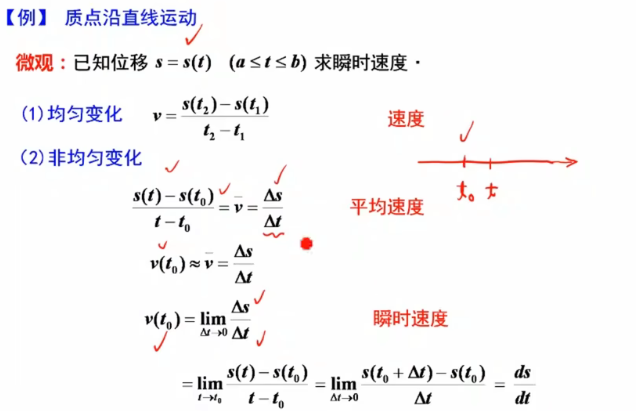

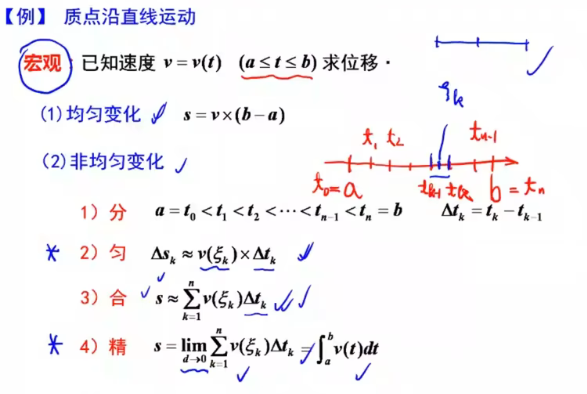

2）主要对象：

y=f(x) （a<=x<=b）的变化规律：微观（变化率） 宏观（改变量）

**思想方法：  用已知求未知    用均匀来求非均匀**

导数和积分的本质：在用均匀求非均匀的阶段出现的辅助工具，导数是**商**（除法），积分是**积**（乘法）

发展的关键：极限的思想——微积分的基础

微积分的特征：对象的抽象性 ：  **从个别到一般      从具体到抽象**

   			推理的严密性：

​			  应用的广泛性：

# 第一节：映射与函数

一、映射

二、函数

1.函数概念：

y=f(x):称x是y的函数，x为**自变量**，y为**因变量**，x∈D，D为**定义域**，f为**一定的法则**

定义域：x的范围

值域：y的范围

 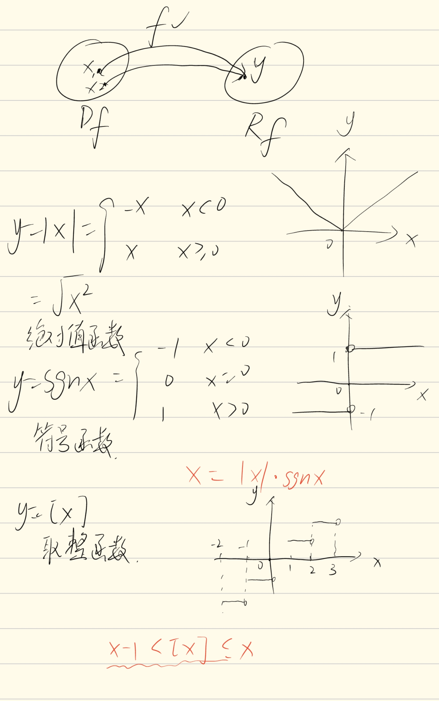

2.函数的几种特性

1）有界性：（在定义域内）

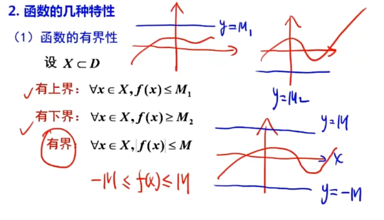

有界<=>有上界且有下界

无界：

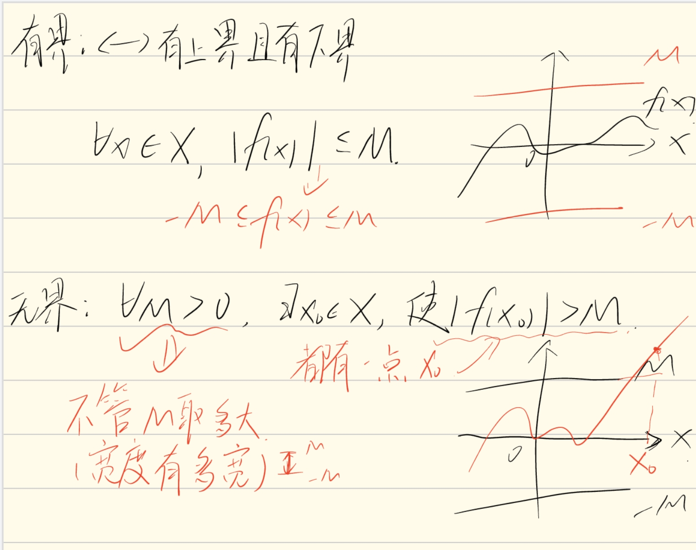

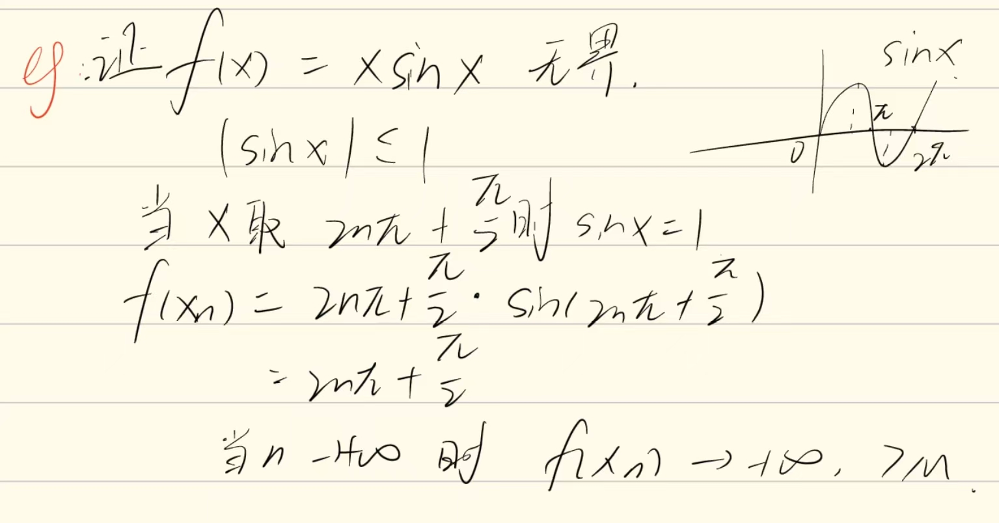

2）单调性：（在区间上）

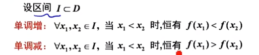

3）奇偶性：（定义域关于原点对称）

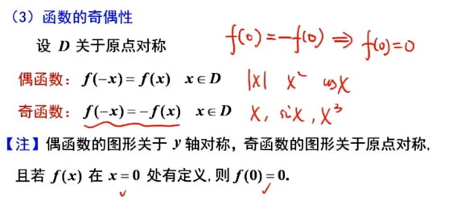

4）周期性：

对于任意x，恒有f(x+T)=f(x)，则称y=f(x)为周期函数，成立的最小正数T称为最小正周期，简称为f(x)的周期

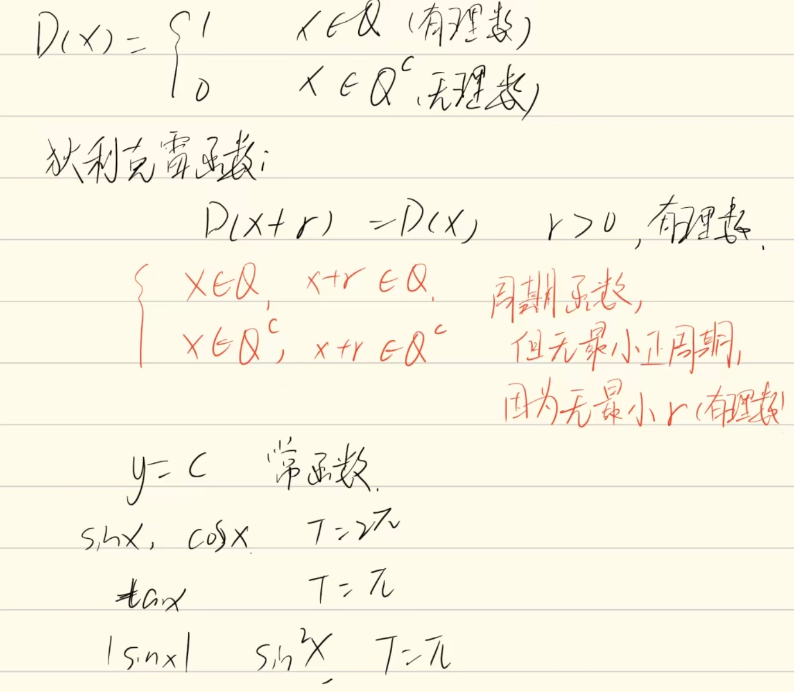

**不是所有的周期函数都有最小正周期**

3.反函数与复合函数

1）反函数

不是所有函数都有反函数，要求一个x对应一个y（定义域到值域的一一映射）

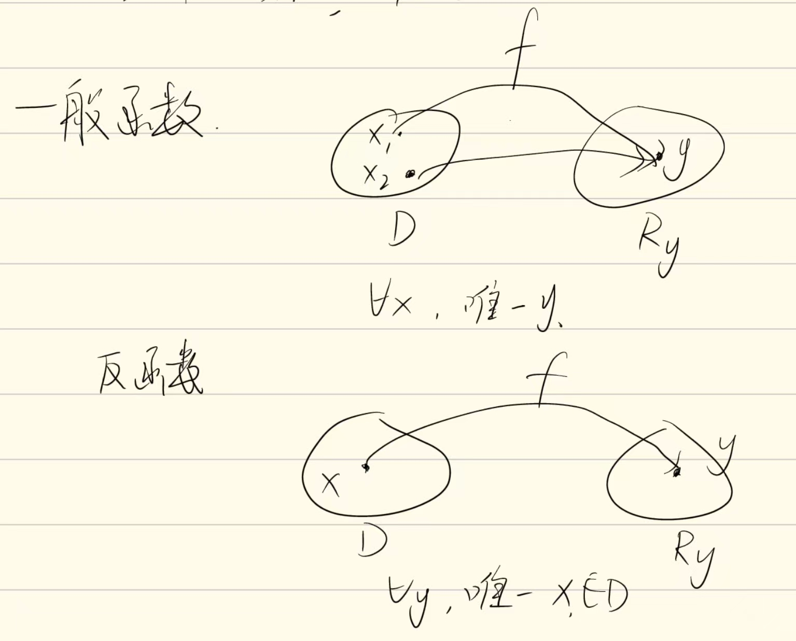

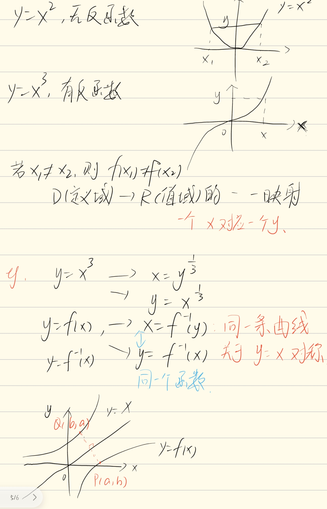

2）复合函数

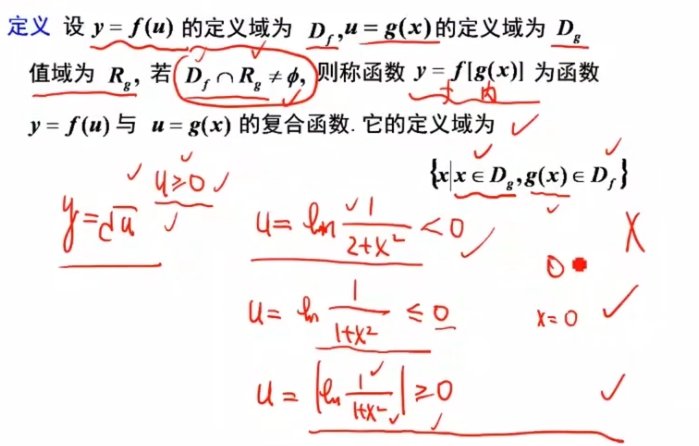

4.函数的运算

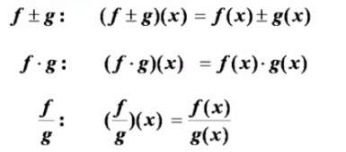

 

5.初等函数

基本初等函数：幂函数，指数，对数，三角，反三角 

# 第二节：数列的极限

一、数列极限的定义

圆的面积--割圆术

二、收敛数列的性质

1）唯一性

2）有界性

3）保号性

4）收敛数列与其子列关系

# 第三节：函数的极限

一、定义

1.自变量趋向于有限值时函数的极限

左极限

右极限

2.自变量趋向于无穷大时函数的极限

二、函数极限的性质

1）唯一性

2）局部保号性

3）局部有界性

4）函数极限与数列极限

# 第四节：无穷大和无穷小

一、无穷小

定义一：

定理一：

极限和无穷小之间的关系

二、无穷大

定义二：

无穷大的几何意义：

# 第五节：极限运算法则

定理一：两个无穷小之和为无穷小-->有限个无穷小之和为无穷小

定理二：有界函数与无穷小的乘积为无穷小

推论一：常数与无穷小的乘积为无穷小

推论二：有限个无穷小的积仍为无穷小

定理三：

存在+不存在=不存在

推论一：

推论二：

定理四：

## 抓大头

定理五：

定理六：

# 第六节：极限存在法则，两个重要极限

1.夹逼准则

准则1（数列）：

准则2（函数）：

2.单调有界准则：

准则1（数列）：单调有界数列必有极限

准则2（）

重要极限1：

重要极限2：

# 第七节：无穷小的比较

定义1（无穷小量）：

定义2（无穷小的比较）：

定理1：

定理2：

# 第八节：函数的连续性和断点

一、函数的连续性

二、函数的间断点

间断点分类：

1.第一类间断点：（左右极限都存在）

1）可去间断点

2）跳跃间断点

2.第二类间断点（左右极限至少有一个不存在）

1）振荡

2）无穷

# 第九节：连续函数的运算与初等函数的连续性

