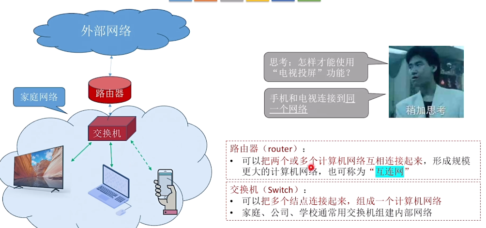
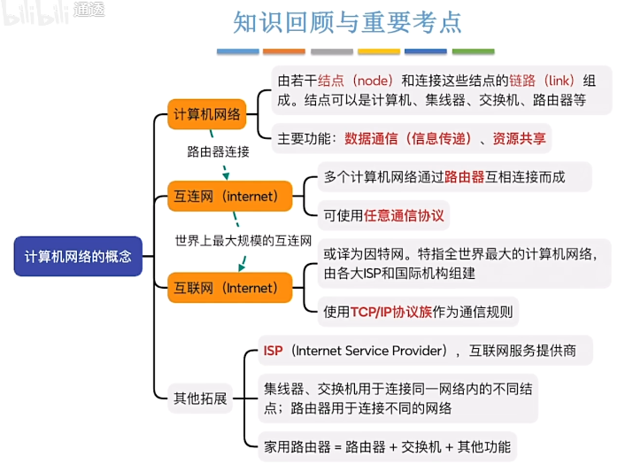
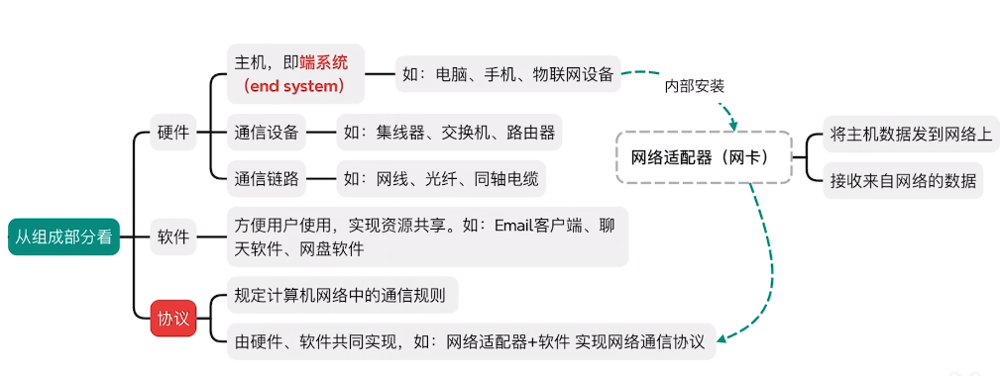
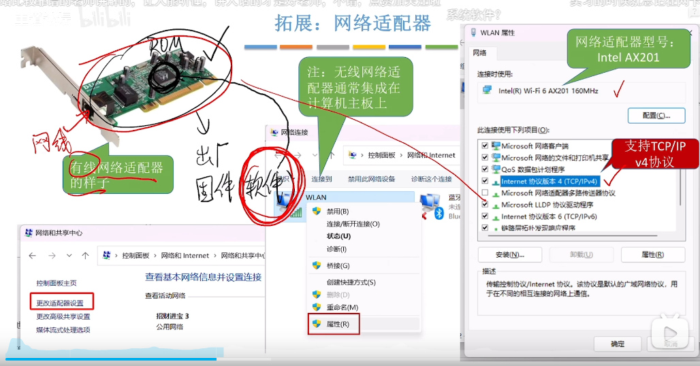
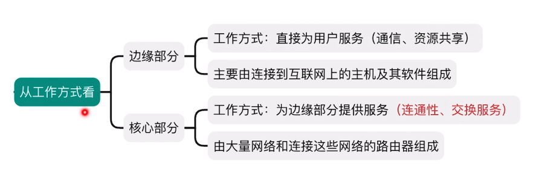
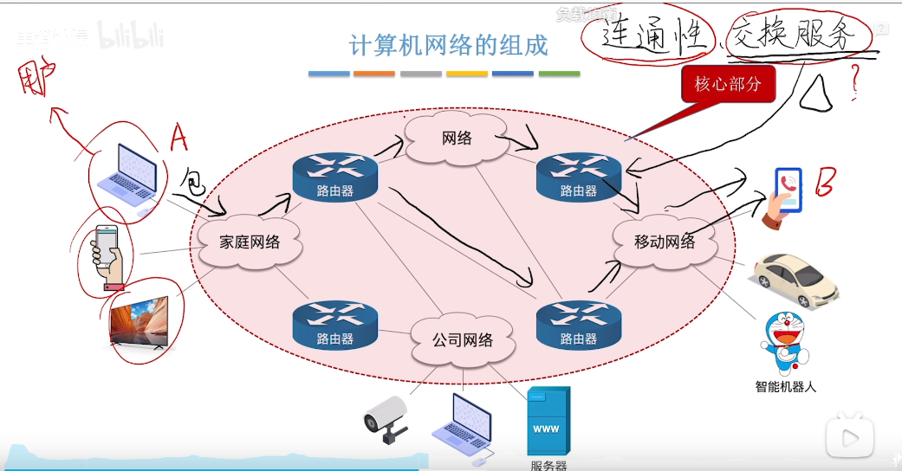
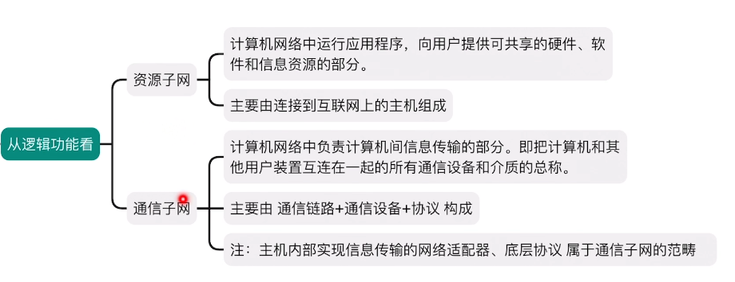
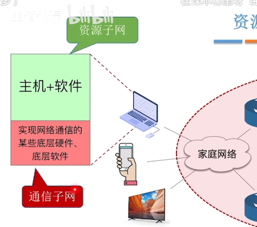
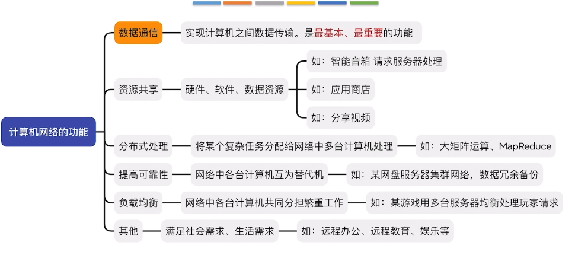

# 1.1-1 计算机网络的概念

## 1.什么是计算机网络？

将众多**分散的、自治的**计算机系统，通过通**信设备与线路**连接起来，由功能完善的**软件**实现**资源共享和信息传递**的系统

## 2.计算机网络，互联网，互连网的区别

### **计算机网络（computer networking）：**

简称网络，由若干**结点**（node）和连接这些结点的**链路（**link）组成

集线器（Hub）：可以把多个结点连接起来，组成一个计算机网络**（物理层）**

交换机（switch）：家庭，公司常用**（数据链路层）**

路由器（router）：可以把两个或多个计算机网络连接起来，形成规模更大的计算机网络，也可称为“互连网” **（网络层）**

家用路由器=路由器+交换机+其他功能 



### **互联网（因特网，Internet）**

由各大ISP（internet service provider  互联网服务提供商 如中国电信、移动、联通等）和国际机构组建的，覆盖全球范围的互连网（internet）

必须使用**TCP/IP协议**来进行通信

### **互连网（internet）**

例如：某银行的内网

可以使用任意协议通信



# 1.1-2计算机网络的组成和功能

## 1.组成部分





## 2.从工作方式来看

边缘部分和核心部分





## 3.从逻辑功能来看





## 4.计算机网络的功能



# 1.1-3电路交换，报文交换，分组交换

## 1.电路交换--用于电话网络


## 2.报文交换--用于电报网络


## 3.分组交换--用于现代计算机网络


# 2. 分组交换怎么计算

### 特点

先把大报文拆成很多个小分组。

每个分组到达路由器后：

- 路由器只要收完这一个分组
- 就能立刻把这个分组转发出去

不必等整个文件传完。

所以分组交换可以形成**流水线**。

------

### 设

- 原始数据总长度为 Mbit

- 每个分组长度为 L bit

- 分成 P 个分组，则
  $$
  P=\frac{M}{L}
  $$
  （若不能整除要向上取整）

- 共 k 段链路

- 每段速率为 R

则一个分组在一段链路上的发送时间：
$$
t_0=\frac{L}{R}
$$
总时间公式：
$$
T_{\text{分组}}=(P+k-1)\frac{L}{R}
$$

------

## 3. 这个公式为什么是 P+k-1

这是最关键的地方。

### 先看第1个分组

它要经过 k 段链路，所以要：
$$
k\frac{L}{R}
$$

### 再看后面的分组

由于已经形成流水线，后面每多一个分组，只需再增加一个分组发送时间：
$$
\frac{L}{R}
$$
后面还有 **P-1** 个分组，所以增加：
$$
(P-1)\frac{L}{R}
$$
总共：
$$
k\frac{L}{R}+(P-1)\frac{L}{R}
=(P+k-1)\frac{L}{R}
$$

------

## 4. 和报文交换相比，差别到底在哪

### 报文交换

每一跳都传的是**整个报文**：
$$
T_{\text{报文}}=k\frac{M}{R}
$$

### 分组交换

每一跳传的是**小分组**，并且可以流水线：
$$
T_{\text{分组}}=(P+k-1)\frac{L}{R}
$$
区别本质上是：

- 报文交换：**下一跳必须等整个大报文到齐**
- 分组交换：**下一跳只需等一个小分组到齐**

所以有路由器时，分组交换通常更快。

------

## 5. 为什么“有路由器”时区别特别明显

因为路由器就是“中间站”。

### 对报文交换

每过一个路由器，都要完整重复一次：

> 收完整个报文 → 再发送整个报文

所以路由器越多，延时累积越大。

### 对分组交换

每过一个路由器，只是对每个分组做：

> 收完一个分组 → 马上转发这个分组

虽然也有等待，但由于分组很小，而且各分组能重叠传输，所以效率高得多。

# 海明码

# 一、先用一个故事理解：为什么需要海明码？

想象你在仓库里打包货物（数据），然后发货（传输）。

问题来了：
 👉 运输途中可能会出错（某一位数据翻转，比如 0 变 1）

你需要一个方法：

> 📦 “不用重新发货，也能发现并修复错误”

这就是 **海明码的作用：
 👉 能自动发现并纠正 1 位错误**

------

# 二、核心思想（最重要的一句话）

👉 **在数据中插入一些“检查员”（校验位），让每一位数据都被多个检查员监督**

这样一旦出错：

- 哪些检查员报警 → 就能定位错误位置

------

# 三、编码过程（一步一步来）

我们用一个简单例子：

👉 原始数据：

```
1011
```

------

## 第一步：确定需要几个“检查员”（校验位）

规则：

👉 找 r，使得：

```
2^r ≥ m + r + 1
```

- m = 数据位数（这里是 4）

试一下：

- r=2 → 4 < 7 ❌
- r=3 → 8 ≥ 8 ✅

👉 所以需要 **3 个校验位**

------

## 第二步：安排位置（关键！）

规则：

👉 **2的幂位置放校验位**

```
位置：1 2 3 4 5 6 7
内容：P1 P2 D1 P3 D2 D3 D4
```

填入数据（从左到右）：

```
位置：1 2 3 4 5 6 7
内容：P1 P2 1 P3 0 1 1
```

------

## 第三步：每个“检查员”负责哪些位置？

规则：

👉 用二进制编号位置：

| 位置 | 二进制 |
| ---- | ------ |
| 1    | 001    |
| 2    | 010    |
| 3    | 011    |
| 4    | 100    |
| 5    | 101    |
| 6    | 110    |
| 7    | 111    |

------

### 👮 P1（第1位）

负责：所有 **最低位是1** 的位置
 👉 1,3,5,7

检查：

```
P1 ⊕ 1 ⊕ 0 ⊕ 1 = 0（偶校验）
```

👉 P1 = 0

------

### 👮 P2（第2位）

负责：第二位是1
 👉 2,3,6,7

```
P2 ⊕ 1 ⊕ 1 ⊕ 1 = 0
```

👉 P2 = 1

------

### 👮 P3（第4位）

负责：第三位是1
 👉 4,5,6,7

```
P3 ⊕ 0 ⊕ 1 ⊕ 1 = 0
```

👉 P3 = 0

------

## 第四步：最终编码结果

```
0 1 1 0 0 1 1
```

👉 这就是海明码！

------

# 四、再用“检查员报警”理解纠错

假设运输中出错：

```
收到：0 1 1 0 1 1 1
```

（第5位错了）

------

## 检查员开始检查：

- P1 检查 → ❌
- P2 检查 → ✅
- P3 检查 → ❌

👉 把结果写成二进制（从 P3 P2 P1）：

```
101 = 5
```

🎯 **错误在第5位！**

👉 直接修正即可

------

# 五、总结（用一句话记住）

👉 **海明码 = 数据 + 多个交叉检查的“监督员”**

- 每个校验位负责一部分数据
- 出错时 → 哪些校验位异常 → 组合起来定位错误位置

------

# 六、超简单记忆口诀

```
2的幂位放校验
二进制位来分管
异或校验保偶数
出错组合找位置
```
