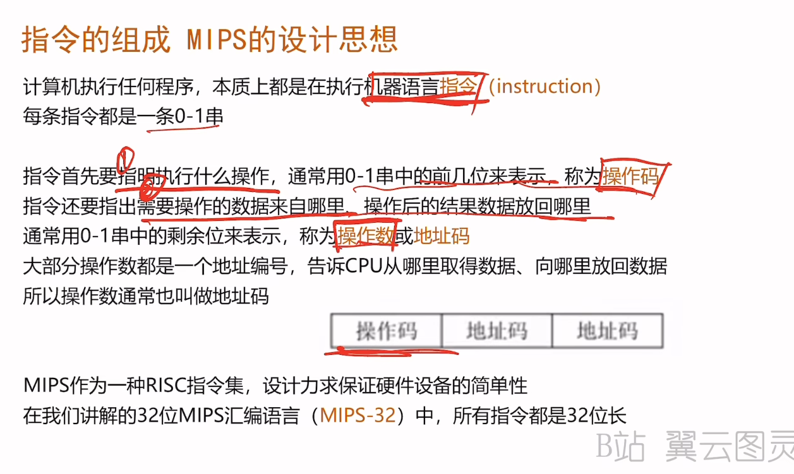
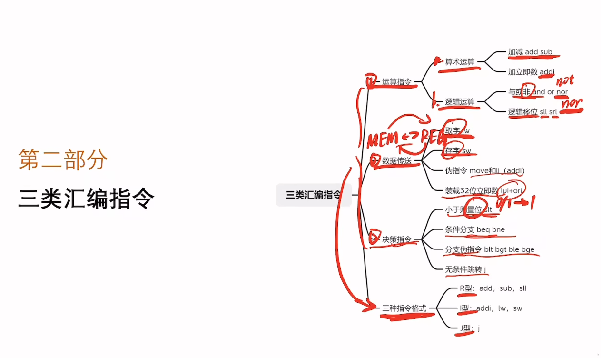
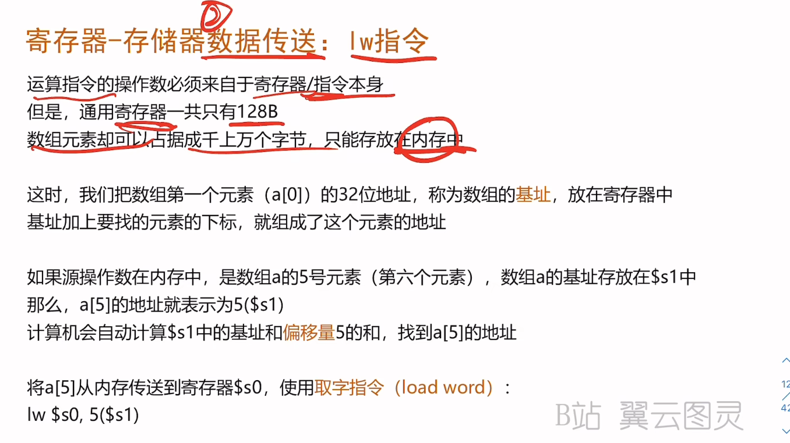
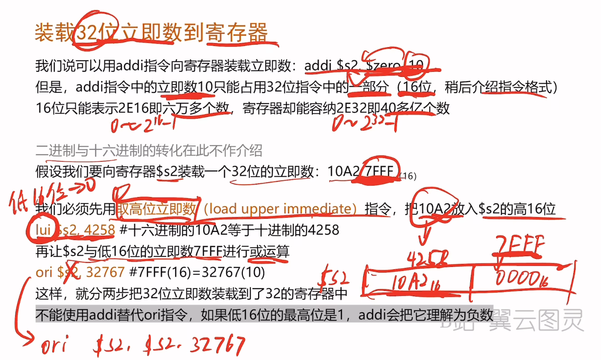
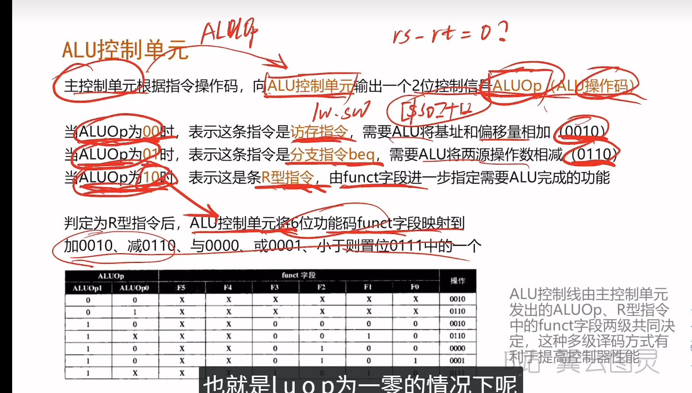
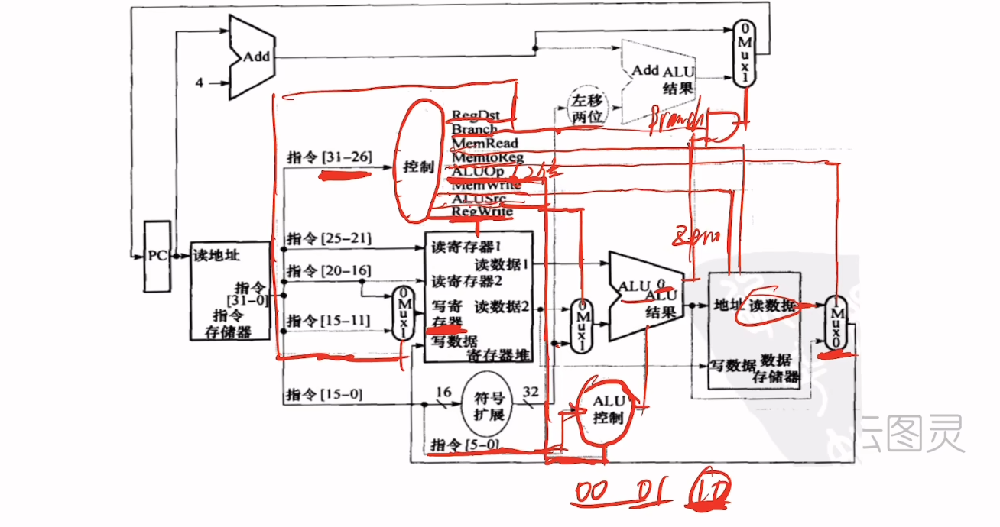
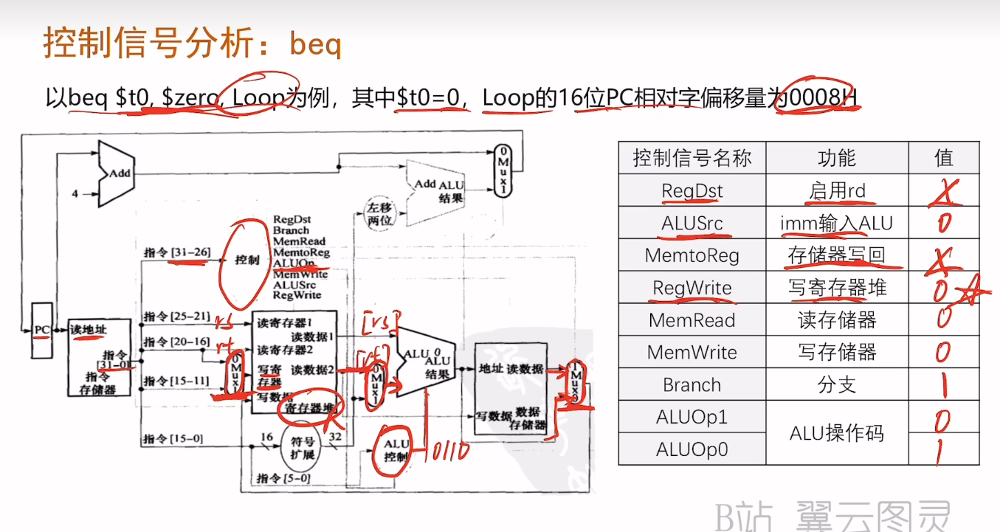
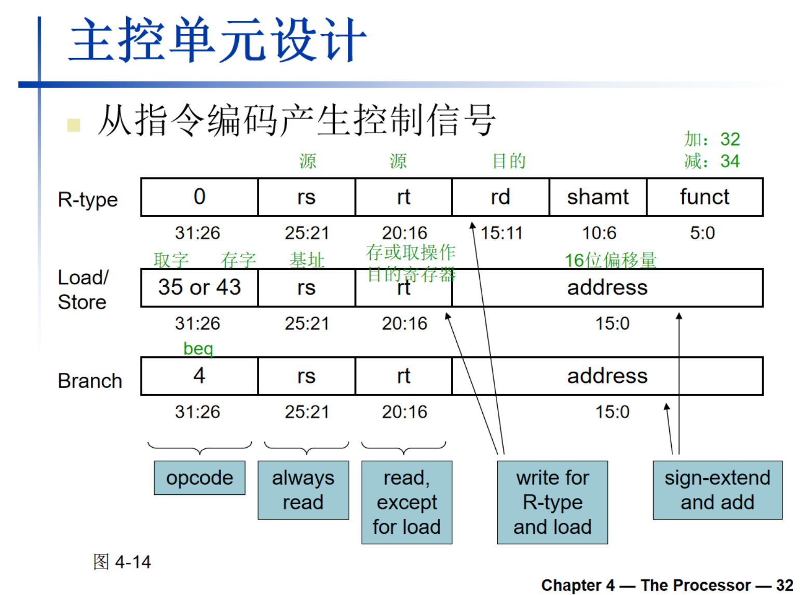
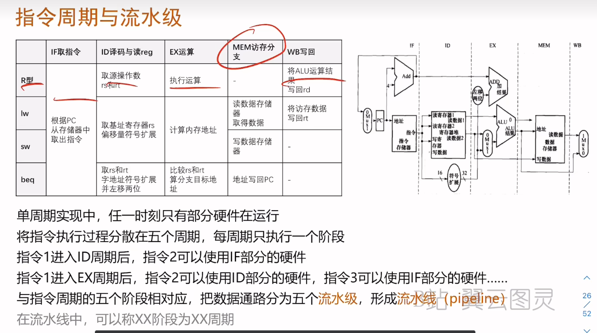

# 第二章-指令

## 1）这章在讲什么：一句话抓住主线

**指令（Instruction）是 CPU 能听懂的“最小命令”。** 程序=很多条指令按顺序执行；这套命令的“字典”叫**指令集 ISA**。不同架构 ISA 不同，但核心思想相似。Chapter_02_指令 - Sept12

这章用 **MIPS 指令集**做例子来解释“指令怎么写、怎么执行、怎么编码成 0/1、怎么实现分支/循环/函数调用”。Chapter_02_指令 - Sept12

------

## 2）关键知识点与核心论点（考试最爱考）

### A. 指令集与设计思想

- **ISA = 一台计算机的指令表**；不同架构指令集不同。Chapter_02_指令 - Sept12
- **设计原则 1：简单源于规整**（格式统一、规律性强 → 硬件实现更简单更快）。Chapter_02_指令 - Sept12
- **设计原则 2：更小更快**（寄存器数量/结构要折中；太多会拖慢时钟）。Chapter_02_指令 - Sept12
- **设计原则 3：加速大概率事件**（常量小、常见 → 用立即数指令；还有“折中”来保持32位统一长度）。Chapter_02_指令 - Sept12 Chapter_02_指令 - Sept12

------

## 3）分模块“讲明白”：原理 + 为什么这样设计 + 怎么做题

### 3.1 算术指令（add/sub 等）：为什么是“三操作数”

MIPS 算术指令典型形式：`add a, b, c` 表示 **a = b + c**（2 个源操作数 + 1 个目的操作数）。这种规整格式便于硬件流水线和译码。Chapter_02_指令 - Sept12

**重要例题（C → MIPS）**：
 `f = (g + h) - (i + j);`
 编译成：先加两次再减一次：`add t0,g,h`；`add t1,i,j`；`sub f,t0,t1`。Chapter_02_指令 - Sept12

**考试怎么考**：给 C 表达式，让你写 MIPS；或给 MIPS 让你还原 C。

------

### 3.2 寄存器：CPU“手边小本子”，快的原因是什么

- 算术指令的操作数主要在**寄存器**里。MIPS 有 **32 个 32-bit 寄存器**（一个 32 位数据叫 word）。Chapter_02_指令 - Sept12
- 常见命名：`$t0~$t9` 临时；`$s0~$s7` 保存变量；`$zero` 永远为 0。Chapter_02_指令 - Sept12 Chapter_02_指令 - Sept12
- **寄存器比内存快**：访问内存往往要额外 load/store 指令，所以编译器会尽量把常用变量放寄存器。Chapter_02_指令 - Sept12

**考试高频点**：

- `$zero` 的用途（复制寄存器、清零、比较等）。Chapter_02_指令 - Sept12
- `$t` 与 `$s` 的区别：是否需要被调用者保存（见过程调用部分）。Chapter_02_指令 - Sept12

------

### 3.3 内存访问（lw/sw）：为什么必须“先加载再运算”

内存用于存数组、结构体、动态数据等。MIPS 的规则是：

- **要用内存里的数据做运算**：先 `lw` 载入寄存器，再用算术指令算；算完要写回就 `sw`。Chapter_02_指令 - Sept12
- 内存按 **byte 编址**；word（4 字节）通常**4 字节对齐**（地址是 4 的倍数）。Chapter_02_指令 - Sept12

**例题 1：数组读**
 `g = h + A[8];`
 下标 8 → 字节偏移 `8 * 4 = 32`
 所以：`lw $t0, 32($s3)`；`add $s1,$s2,$t0`。Chapter_02_指令 - Sept12

**例题 2：数组写**
 `A[12] = h + A[8];`
 先读 A[8]，相加，再写 A[12]（偏移 48）：`sw $t0, 48($s3)`。Chapter_02_指令 - Sept12

**做题口诀（必背）**：

> 数组元素地址 = 基址 + 下标 × 元素字节数（int/word 是 4）
>
> 

------

### 3.4 立即数（addi）：为什么“常见情况要快”

立即数就是指令里直接写的常量：`addi $s3, $s3, 4`。
 优点：不用先把常量 load 到寄存器，省指令，符合“加速大概率事件”。Chapter_02_指令 - Sept12

------

### 3.5 有符号/无符号与补码：为什么负数用补码

- **无符号 n 位范围**：0 到 $2^n-1$。Chapter_02_指令 - Sept12
- **有符号用二进制补码**：最高位是符号位；范围约为 $-2^{n-1}$ 到 $2^{n-1}-1$。Chapter_02_指令 - Sept12 Chapter_02_指令 - Sept12
- **符号扩展**：小位数扩成大位数时，复制符号位（负数补 1，非负补 0）。Chapter_02_指令 - Sept12

**考试常考坑**：同一串比特，按 signed/unsigned 解释数值不同。课件给了 slt/sltu 的对比例子：`-1` 与 `4294967295` 的差别。Chapter_02_指令 - Sept12

------

### 3.6 指令如何变成 0/1：R 型 / I 型（必考重灾区）

**指令在机器里就是 32 位二进制（机器码）**，字段分得很规整。Chapter_02_指令 - Sept12

#### R 型（寄存器-寄存器算术/逻辑等）

字段：`op rs rt rd shamt funct`。Chapter_02_指令 - Sept12
 例子：`add $t0, $s1, $s2` 的字段拆分在课件里给了完整示范。Chapter_02_指令 - Sept12

**理解要点**：

- `op` 表示“这是哪一类指令”（R 型常用 op=0 叫 special）
- `funct` 决定具体运算（add/sub/and/or…）
- `shamt` 只给移位指令用

#### I 型（立即数算术 + lw/sw + 分支等）

字段：`op rs rt immediate(16 bits)`；立即数范围受 16 位限制。Chapter_02_指令 - Sept12
 课件强调：多种格式让编码更复杂，但换来 **统一 32 位长度**，是“折中”。Chapter_02_指令 - Sept12

**做题套路（编码题）**：

1. 判断是 R 还是 I
2. 查寄存器编号（$t/$s 映射）Chapter_02_指令 - Sept12
3. 填字段 → 拼成 32 位 → 常用十六进制压缩表示（4 bit 一组）。Chapter_02_指令 - Sept12

------

### 3.7 逻辑与移位：位运算为什么重要

逻辑操作是对“位”进行处理，常用于**打包/拆包、掩码、置位/清零**。Chapter_02_指令 - Sept12

- 移位：`sll` 左移补0（相当于乘 $2^i$）；`srl` 右移补0（无符号时相当于除 $2^i$）。Chapter_02_指令 - Sept12
- 掩码 AND：选择某些位，其它清零（例子给出了按位与结果）。Chapter_02_指令 - Sept12
- OR：把某些位强行置 1。Chapter_02_指令 - Sept12
- NOT：MIPS 用 `nor` + `$zero` 实现取反：`nor $t0,$t1,$zero`。Chapter_02_指令 - Sept12

------

### 3.8 分支与循环：beq/bne + j（为什么没有 blt）

- 决策指令：`beq/bne` 条件成立跳转；`j` 无条件跳转。Chapter_02_指令 - Sept12
- IF 编译示例：用 `bne` 跳到 Else，再 `j Exit` 跳过 else 块。Chapter_02_指令 - Sept12
- while 循环示例：用 `sll` 计算下标×4、`lw` 取数组元素、`bne` 退出、`addi` i++、`j` 回到 Loop。Chapter_02_指令 - Sept12

**为什么没有 blt/bge？**
 课件解释：硬件做 `<`、`≥` 比 `==`、`!=` 更慢；把复杂比较塞进分支会拖慢时钟，让所有指令受影响；所以 MIPS 用 `slt`（比较得到 0/1）+ `bne/beq` 组合，是经典折中。Chapter_02_指令 - Sept12 Chapter_02_指令 - Sept12

------

### 3.9 过程/函数调用：jal/jr + 栈（超高频）

过程调用的基本步骤：传参 → 转移控制权 → 分配资源 → 执行 → 返回结果 → 返回控制权。Chapter_02_指令 - Sept12

#### 寄存器约定（考点）

- `$a0-$a3` 传参；`$v0-$v1` 返回值。Chapter_02_指令 - Sept12
- `$t` 临时寄存器：可被调用者改写（不用保存）。Chapter_02_指令 - Sept12
- `$s` 保存寄存器：必须保存/恢复（需要用栈）。Chapter_02_指令 - Sept12
- `$sp` 栈指针；`$ra` 返回地址。Chapter_02_指令 - Sept12

#### 调用指令

- `jal label`：跳转并把“下一条指令地址”放入 `$ra`。Chapter_02_指令 - Sept12
- `jr $ra`：返回（把 `$ra` 送回 PC）。Chapter_02_指令 - Sept12

#### 叶子过程（不再调用别的函数）示例

`leaf_example` 用 `$s0` 存 f，所以要把 `$s0` 压栈保存，再恢复。完整 MIPS 代码在课件中给出。Chapter_02_指令 - Sept12

#### 非叶过程（会调用别的函数）示例：递归 fact

需要额外保存 `$ra` 和参数（因为 `jal` 会覆盖 `$ra`，参数寄存器也可能被改写），因此会压栈两个项。课件给了完整递归实现。Chapter_02_指令 - Sept12 Chapter_02_指令 - Sept12

------

### 3.10 内存布局 + 字符/字符串 + 字节/半字指令

- 内存布局：正文段（代码）、静态数据、堆（malloc/new）、栈（自动变量）。Chapter_02_指令 - Sept12
- 字符集：ASCII / Latin-1 / Unicode，UTF-8/UTF-16 可变长度编码。Chapter_02_指令 - Sept12
- 字节/半字访问：`lb/lh` 会**符号扩展**；`lbu/lhu` **零扩展**；`sb/sh` 存回去就是写 1 字节或半字。Chapter_02_指令 - Sept12
- 字符串拷贝 `strcpy`：课件给了 C 代码和对应 MIPS 循环实现（读一个字节，写一个字节，遇到 `'\0'` 结束）。Chapter_02_指令 - Sept12 Chapter_02_指令 - Sept12

------

## 4）整章总结（用自己的话概括）

这章用 MIPS 说明：**程序为什么能运行**——因为它最终会被翻译成 CPU 能执行的 32 位机器指令。指令集（ISA）定义了这些指令的种类、格式和语义。为了让硬件更快更便宜，MIPS 强调指令格式规整、常见情况快、用寄存器做运算、用 load/store 访问内存。随后讲了数的表示（补码、符号扩展）、指令编码（R 型/I 型）、位运算、分支与循环的实现方式，以及函数调用如何通过 `jal/jr` 和栈来保存现场并返回。Chapter_02_指令 - Sept12 Chapter_02_指令 - Sept12

------

## 5）重要例子/案例汇总（复习清单）

1. C 表达式到 MIPS（加减组合）Chapter_02_指令 - Sept12
2. 数组访问地址计算（A[8]→32）Chapter_02_指令 - Sept12
3. IF/ELSE 编译（bne + j）Chapter_02_指令 - Sept12
4. while 循环编译（sll 乘4 + lw + bne + j）Chapter_02_指令 - Sept12
5. `slt + bne` 实现 `<` 判断，解释为什么没有 bltChapter_02_指令 - Sept12 Chapter_02_指令 - Sept12
6. 叶子过程保存 `$s0` 的栈帧模板Chapter_02_指令 - Sept12
7. 递归 fact：保存 `$ra` 与参数，展示非叶过程栈用法Chapter_02_指令 - Sept12
8. strcpy：字节读写 + 遇 0 结束Chapter_02_指令 - Sept12

------

## 6）结论与影响（你学完能解决什么问题）

- 你能理解：**高级语言是如何一步步落到硬件执行的**（C → 汇编 → 机器码）。Chapter_02_指令 - Sept12 Chapter_02_指令 - Sept12
- 你能做题：数组地址、分支/循环翻译、R/I 指令字段、栈帧与调用约定，这是体系结构考试的核心分数区。Chapter_02_指令 - Sept12 Chapter_02_指令 - Sept12
- 你会明白“折中”：为什么 ISA 不追求“指令越多越好”，而要兼顾硬件速度

# 第五章-存储

## 0. 先建立一张“总地图”（你学的不是碎片）

这一章可以分成 6 个大块：

1. **局部性原理**：为什么缓存有用
2. **存储器层次结构**：Cache/DRAM/磁盘如何协作
3. **Cache 的工作机制**：映射、Tag/Valid、命中/缺失、写策略、替换策略
4. **Cache 性能计算**：CPI 与 AMAT（考试必考计算题）
5. **虚拟存储器 + TLB**：地址翻译、缺页、页表、TLB 缓存
6. **可靠性与一致性**：ECC、（多核）Cache一致性、常见陷阱

------

## 1. 局部性原理（Locality）——缓存能成立的“科学理由”

### 1.1 什么是局部性？

- **时间局部性**：刚用过的东西很快还会用
   例子：循环里的变量 `i`、循环体里的数组元素反复访问
- **空间局部性**：用了一个地址，附近的也可能马上用
   例子：数组 `A[0],A[1],A[2]...` 连续访问

### 1.2 为什么它重要？

因为有局部性，系统可以猜测：

> “你接下来大概率还会用刚用过的/附近的数据。”

所以我们把最近用过的数据放在更快的地方（Cache），就能大概率命中。

📌 **考试常问**：给你一段代码，问主要体现时间还是空间局部性（循环、数组是经典）。

------

## 2. 存储器层次结构（Memory Hierarchy）——“快小贵 vs 慢大便宜”

### 2.1 现实矛盾（必须记住）

- **SRAM（Cache）**：很快，但贵、容量小
- **DRAM（主存）**：比Cache慢很多，但便宜、容量大
- **磁盘/SSD**：更慢，但最便宜、容量最大
   课件用访问延迟和价格对比说明这一点 Chapter_05-存储-1212。

### 2.2 层次结构怎么工作？

核心流程（从下到上“复制”）：

- 数据长期在磁盘
- 热数据复制到 DRAM
- 更热的数据复制到 SRAM Cache
- CPU 从 Cache 取数据最快

### 2.3 “块（Block/Line）”是什么？

**块**=拷贝的最小单位。
 不是“一个字节一个字节搬”，而是“一搬搬一整块”。

📌 **为什么要搬一整块？**
 因为空间局部性：你用到一个地址，附近的也可能马上用，把附近的一起搬上来更划算。

------

## 3. Cache（高速缓存）机制——本章最核心、最容易出题

你只要牢牢记住 Cache 设计的“四问法”，就不会乱：

> **放哪？怎么找？缺了怎么办？写怎么办？**

------

## 3.1 命中与缺失（Hit/Miss）

- **命中 Hit**：CPU 要的数据就在 Cache
- **缺失 Miss**：不在 → 去下一级取一整块上来

指标：

- 命中率 Hit ratio
- 缺失率 Miss ratio = 1 − 命中率
   （课件给出定义 Chapter_05-存储-1212）

📌 **考试常见**：算命中率、缺失率、或根据访问序列模拟命中/缺失。

------

## 3.2 直接映射（Direct-Mapped Cache）——最常考的映射方式

### 3.2.1 直觉理解

Cache 有很多“格子”（行）。
 **每个内存块只能去某一个固定格子**（简单、快，但可能冲突）。

规则：

> Cache 行号 =（块地址）mod（Cache 行数） Chapter_05-存储-1212

### 3.2.2 地址如何拆分？（Tag/Index/Offset）

一个地址通常拆成：

- **Index**：告诉你去 Cache 的哪一行
- **Tag**：确认这一行里是不是你要的那块（防止“撞车”）
- **Offset**：块内偏移（块里具体哪个字节/字）

课件有“地址划分”与例题：
 比如 64 块、每块 16B，字节地址 1200：
 块地址 = 1200/16；Cache 块号 = 块地址 mod 64 Chapter_05-存储-1212

📌 **考试必考**：给 Cache 参数 + 地址，问映射到哪一块、Tag/Index/Offset 各多少位。

------

## 3.3 Tag 和 Valid 位——Cache 为什么能“判断有/没有”

每行除了数据，还有两类控制信息：

- **Valid bit（有效位）**：这行有没有有效数据（开机初始一般是 0） Chapter_05-存储-1212
- **Tag（标记）**：这行数据来自哪个内存块

判断流程：

1. 用 Index 找到行
2. 看 Valid=1 吗？
3. 比较 Tag 对不对？
    都满足→命中，否则缺失

------

## 3.4 组相联与全相联（Associativity）——解决冲突缺失

### 3.4.1 为什么需要相联？

直接映射的问题：不同内存块可能“算出来”都要放同一行 → 互相挤掉 → **冲突缺失**。

### 3.4.2 n 路组相联（n-way set associative）

- Cache 分成若干组（Set）
- 每组有 n 行（n 块）
- 块号决定组号：块号 mod 组数 Chapter_05-存储-1212
- 在组内可以放任意一行 → 冲突少了

全相联：只有 1 组，想放哪放哪（硬件开销最大）。

📌 **考点**：相联度提高 → 缺失率降低但收益递减（课件给了 SPEC2000 的数据例子 Chapter_05-存储-1212）。

------

## 3.5 替换策略（Replacement）——“该踢掉谁？”

当组内满了，必须换掉一个：

- **LRU（最近最少使用）**：踢掉最久没被用的（效果好，实现较复杂） Chapter_05-存储-1212
- **随机替换**：硬件简单，高相联度下效果接近 LRU Chapter_05-存储-1212

📌 **考点**：2 路 LRU 容易；4 路还行；>4 路难实现（课件明确提到 Chapter_05-存储-1212）。

------

## 3.6 写策略（Write Policy）——写数据是性能大坑

写操作有两条路：

### A) 写直达 Write-Through

- 写命中时：Cache 更新，同时也写主存
- 优点：简单一致
- 缺点：写主存慢，会拖垮性能
   课件给了 CPI 例子，并提出**写缓冲 write buffer**解决等待问题 Chapter_05-存储-1212。

写缓冲的本质：

> CPU 不等主存写完，先把数据塞进缓冲队列继续跑；缓冲满了才必须停。

### B) 写回 Write-Back

- 写命中时：只更新 Cache，不立刻写主存
- 用 **dirty bit** 记录这一块是否被修改
- 被替换时才写回主存 Chapter_05-存储-1212
- 优点：性能好（减少慢写）
- 缺点：实现复杂，需要维护脏位

📌 **考试问法**：比较两者优缺点；为什么磁盘/虚拟内存几乎只能写回（因为写磁盘太慢）。

------

## 4. Cache 性能计算——拿分大头（把题做对就高分）

你只要掌握两套公式：

## 4.1 CPI 角度（缺失带来的额外周期）

课件例题：给 I-cache miss rate、D-cache miss rate、miss penalty、CPI、load/store 比例，算理想 Cache 快多少倍 Chapter_05-存储-1212。

通用套路：

1. 先算 I-cache 缺失带来的额外周期
2. 再算 D-cache 缺失带来的额外周期（通常乘以 load/store 比例）
3. 加到基础 CPI 上得到实际 CPI
4. 速度提升 = 实际 CPI / 理想 CPI

📌 **考试技巧**：一定分清“每条指令的缺失率”还是“每次访问的缺失率”。

------

## 4.2 AMAT（平均访存时间）

$$
AMAT = Hit\ Time + Miss\ Rate \times Miss\ Penalty
$$

课件给了数值例子：命中 1 周期、缺失代价 20 周期、缺失率 5% → AMAT=2ns Chapter_05-存储-1212。

📌 **考点**：

- 缺失率下降不一定更快（可能命中时间变长）
- AMAT 是“权衡”的核心指标

------

## 5. 软件优化：分块（Blocking）——为什么算法写法能差十几倍

课件用 DGEMM（矩阵乘法）展示：

- 未优化：访问跨度大、局部性差 → miss 多
- 分块：把矩阵拆成 Cache 适合的小块 → 重用提升 → miss 降低 Chapter_05-存储-1212

你只要记住一句话：

> **分块的目的：让你正在用的数据，在 Cache 里多待一会儿，多用几次再换掉。**

📌 **考试问法**：为什么分块能加速？答：提升时间局部性、降低缺失率。

------

## 6. 虚拟存储器（Virtual Memory）+ 页表 + TLB ——新生最容易混乱的部分

## 6.1 虚拟存储器的直觉

把主存当作磁盘的 Cache：

- **Page（页）** 是 VM 的块
- **Page Fault（缺页）** 相当于 Cache miss，但代价极恐怖（百万周期） Chapter_05-存储-1212

为什么要虚拟内存？

- 每个进程有“看起来很大”的私有地址空间
- 隔离与保护更安全 Chapter_05-存储-1212

------

## 6.2 页表（Page Table）怎么实现地址翻译？

虚拟地址 = 虚页号 VPN + 页内偏移 offset

- VPN 用来查页表，得到物理页号 PPN
- offset 不变，拼出物理地址

PTE（页表项）里有：

- 物理页号
- 有效位、引用位、脏位等状态 Chapter_05-存储-1212

如果页不在内存：

- PTE 需要指向磁盘交换区位置（swap） Chapter_05-存储-1212

------

## 6.3 TLB（快表）为什么必须有？

没有 TLB，一次访存至少：

1. 访问内存读 PTE
2. 再访问内存读数据
    → 等于每次都变慢

TLB 就是 “页表的 Cache”，存最近用过的 PTE：
 典型：16–512 项，命中 0.5–1 周期，缺失 10–100 周期 Chapter_05-存储-1212

TLB 缺失两种情况：

- 页在内存：只是 PTE 不在 TLB → 载入即可
- 页不在内存：发生缺页 → OS 从磁盘调页 Chapter_05-存储-1212

📌 **考试必考**：区分 TLB miss vs page fault；以及它们与 cache miss 的组合（课件有讨论题 Chapter_05-存储-1212）。

------

## 7. 可靠性（ECC）与一致性（多核）

## 7.1 ECC（纠错码）

课件讲 SEC/DED：

- **1 位纠错，2 位检错**（单错可修复，双错可发现） Chapter_05-存储-1212
- DRAM 常用每 64 位数据配 8 位 ECC Chapter_05-存储-1212

你只需记住：

> ECC 用冗余位让系统对单比特错误“不崩”。

## 7.2 Cache 一致性（多核）

当多个 CPU 都缓存同一地址时，写入会导致其他核读到旧值。
 解决：一致性协议（监听 Snooping 或目录 Directory） Chapter_05-存储-1212

📌 入门考试通常考“为什么要一致性”，不要求你会写协议状态机（除非课程更深入）。

------

## 8. 考试高分策略：必背框架 + 必会题型

## 8.1 必背框架（10 秒默写）

- 局部性：时间/空间
- Cache 四问：放哪（映射）/怎么找（Tag+Valid）/缺了换谁（替换）/写怎么办（WT/WB）
- 性能：CPI 增量、AMAT
- VM：页表、缺页、TLB
- 可靠性：ECC（SEC/DED）

## 8.2 必会题型（最常见）

1. 地址拆分：Tag/Index/Offset 位数

2. 访问序列模拟：命中/缺失、Cache 内容变化

3. CPI/AMAT 计算

4. WT vs WB 对比、write buffer 作用

5. TLB miss vs Page fault vs Cache miss 区分

   

# 第四章：处理器

## ALU控制单元

