***\*散养家禽数智化养殖综合管理平台\*******\*设计说明文档\****

**文档版本：** V1.0

**编制日期：** 2026 年 2 月 23 日

------

目录

[散养家禽数智化养殖综合管理平台设计说明文档 ](#_Toc223352800)

[1. 引言 ](#_Toc223352801)

[1.1 编写目的 ](#_Toc223352802)

[1.2 项目背景 ](#_Toc223352803)

[1.3 定义 ](#_Toc223352804)

[2. 软件的结构 ](#_Toc223352805)

[2.1 整体设计框架 ](#_Toc223352806)

[2.2 系统总体架构 ](#_Toc223352807)

[3. 软件设计说明 ](#_Toc223352808)

[3.1 用户与权限管理模块 ](#_Toc223352809)

[3.2 企业与组织管理模块 ](#_Toc223352810)

[3.3 养殖场管理模块 ](#_Toc223352811)

[3.4 设备管理模块 ](#_Toc223352812)

[3.5 工单管理模块 ](#_Toc223352813)

[3.6 预警管理模块 ](#_Toc223352814)

[3.7 通知管理模块 ](#_Toc223352815)

[3.8 牲畜出入库管理模块 ](#_Toc223352816)

[3.9 媒体文件管理模块 ](#_Toc223352817)

[3.10 实时通信模块 ](#_Toc223352818)

[4. 数据流程说明 ](#_Toc223352819)

[4.1 数据主要流程图 ](#_Toc223352820)

[4.2 数据存储策略 ](#_Toc223352821)

[附录 ](#_Toc223352822)

[A. 技术栈总览 ](#_Toc223352823)

[B. 数据库表结构总览 ](#_Toc223352824)

[C. API 接口分类 ](#_Toc223352825)

 

 

------

## 1. 引言

### 1.1 编写目的

本文档旨在说明**散养家禽数智化养殖综合管理平台**的整体架构设计、功能模块划分、数据流程及关键技术实现细节。文档面向以下受众：

\- **开发人员**：理解系统架构，进行功能开发和代码维护

\- **测试人员**：了解功能需求，编写测试用例

\- **运维人员**：了解系统部署架构和数据存储方案

\- **项目管理人员**：掌握系统功能范围和技术选型

### 1.2 项目背景

#### 行业现状与问题

传统养殖业存在以下痛点：

\- **数字化程度低**：依赖人工记录，数据分散且易丢失

\- **设备管理困难**：设备状态无法实时监控，故障发现滞后

\- **人力成本高**：日常巡检、数据记录等工作占用大量人力

\- **管理效率低下**：信息传递不畅，问题响应速度慢

\- **存活率不高**：环境异常无法及时发现，导致牲畜健康问题

#### 系统解决方案

散养家禽数智化养殖综合管理平台基于**端 - 边 - 云协同架构**，提供以下解决方案：

1. **设备智能化**：通过 IoT 设备实时采集环境数据，支持设备状态监控
2. **数据集中化**：统一数据存储和管理，支持多维度数据分析
3. **工单自动化**：设备异常自动生成工单，闭环管理处理流程
4. **实时通知**：通过 WebSocket/SSE 实现消息实时推送
5. **多租户隔离**：支持多企业数据隔离，保障数据安全

#### 系统组成概述

系统由以下核心部分组成：

\- **端设备**：各类 IoT 传感器、监控摄像头

\- **边设备**：边缘计算网关，负责本地数据处理

\- **云服务器**：中心业务系统，负责数据存储和业务处理

\- **用户应用**：Web 管理后台、移动端应用

### 1.3 定义

| 术语/缩写        | 定义/全称                    | 说明                         |
| ---------------- | ---------------------------- | ---------------------------- |
| **IoT**          | Internet of Things           | 物联网，指各类智能传感器设备 |
| **RBAC**         | Role-Based Access Control    | 基于角色的访问控制           |
| **WebSocket**    | WebSocket Protocol           | 双向实时通信协议             |
| **SSE**          | Server-Sent Events           | 服务端推送事件               |
| **OBS**          | Object Storage Service       | 对象存储服务（华为云）       |
| **MyBatis-Plus** | MyBatis-Plus                 | ORM 持久层框架               |
| **MongoDB**      | MongoDB                      | 文档型 NoSQL 数据库          |
| **Redis**        | Remote Dictionary Server     | 内存数据库/缓存              |
| **Sa-Token**     | Sa-Token                     | Java 权限认证框架            |
| **FLV**          | Flash Video                  | 视频流格式                   |
| **RTMP**         | Real-Time Messaging Protocol | 实时消息传输协议             |
| **BCrypt**       | BCrypt                       | 密码加密算法                 |

------

## 2. 软件的结构

### 2.1 整体设计框架

散养家禽数智化养殖综合管理平台采用**分层架构**设计，系统划分为以下功能模块：

 

**图 2.1 系统功能模块图**

#### 核心功能模块说明

| 模块名称          | 功能描述                                     |
| ----------------- | -------------------------------------------- |
| **用户管理**      | 用户注册、登录、信息管理、密码管理、企业加入 |
| **企业/权限管理** | 企业信息维护、邀请码管理、角色权限分配       |
| **养殖场管理**    | 养殖场/养殖点（鸡舍）的增删改查              |
| **设备管理**      | IoT 设备注册、状态监控、数据采集             |
| **工单管理**      | 工单创建、派发、认领、处理、完结             |
| **预警管理**      | 异常检测、预警生成、预警通知                 |
| **通知管理**      | 系统通知推送、历史记录查询                   |
| **出入库管理**    | 牲畜数量变化记录、库存统计                   |
| **媒体管理**      | 图片/视频上传、存储、访问                    |
| **实时通信**      | WebSocket 双向通信、SSE 消息推送             |

### 2.2 系统总体架构

系统采用**端 - 边 - 云协同架构**，整体技术架构如下图所示：

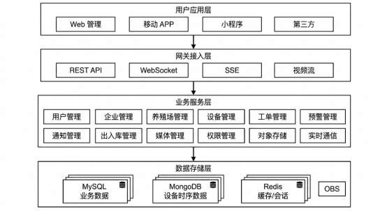 

**图 2.2 系统总体架构图**

#### 架构层次说明

| 层次       | 组件                       | 技术选型              | 职责               |
| ---------- | -------------------------- | --------------------- | ------------------ |
| **用户层** | Web 管理后台、移动 APP     | Vue.js/React、Flutter | 用户交互界面       |
| **网关层** | API 网关                   | Spring Gateway        | 请求路由、认证鉴权 |
| **业务层** | Spring Boot 应用           | Spring Boot 3.5.5     | 业务逻辑处理       |
| **数据层** | MySQL、MongoDB、Redis、OBS | -                     | 数据存储与缓存     |
| **边端**   | 边缘计算网关               | -                     | 协议转换、边缘计算 |
| **端侧**   | IoT 设备                   | -                     | 数据采集、执行控制 |

#### 数据流向说明

1. **设备数据流**：端设备 → 边缘网关 → 云服务器 → MongoDB（时序数据）
2. **业务数据流**：用户请求 → API 网关 → 业务服务 → MySQL（业务数据）
3. **媒体文件流**：用户上传 → OBS 存储 → 数据库存链接 → CDN 分发
4. **实时消息流**：系统事件 → WebSocket/SSE → 客户端实时推送

------

## 3. 软件设计说明

### 3.1 用户与权限管理模块

#### 3.1.1 模块概述

用户与权限管理模块负责系统用户的整个生命周期管理，包括注册、登录、身份验证、权限控制等功能。该模块基于**RBAC（Role-Based Access Control）**模型，实现细粒度的权限控制。

#### 3.1.2 用例图

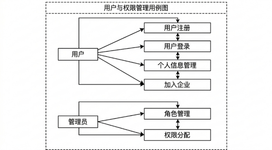 

**图 3.1 用户与权限管理用例图**

#### 3.1.3 功能需求分析

1. **用户注册**

o 支持手机号 + 密码注册

o 支持企业邀请码加入企业

o 密码使用 BCrypt 加密存储

o 手机号唯一性校验

2. **用户登录**

o 支持用户名/手机号 + 密码登录

o 基于 Sa-Token 实现会话管理

o Token 有效期 30 天，支持并发登录

o 登录成功后返回用户信息及权限

3. **密码管理**

o 支持密码修改

o 支持密码重置（需管理员操作）

o 密码强度校验

4. **个人信息管理**

o 查看和修改个人基本信息

o 查看所属企业及角色

o 账号状态查询

5. **企业加入**

o 通过邀请码申请加入企业

o 企业管理员审核（可选）

o 自动分配默认角色

6. **角色权限管理**

o 角色创建、修改、删除

o 权限分配（菜单权限、操作权限）

o 用户角色关联管理

#### 3.1.4 权限区分

| 角色           | 用户管理          | 角色管理      | 权限管理 |
| -------------- | ----------------- | ------------- | -------- |
| **普通员工**   | 查看/修改个人信息 | 无            | 无       |
| **企业管理员** | 查看本企业用户    | 查看/分配角色 | 分配权限 |
| **系统管理员** | 全部权限          | 全部权限      | 全部权限 |

------

### 3.2 企业与组织管理模块

#### 3.2.1 模块概述

企业与组织管理模块负责企业信息的维护、企业邀请码管理、组织架构管理等功能。企业是系统的核心业务单元，所有业务数据均与企业关联，实现多租户数据隔离。

#### 3.2.2 用例图

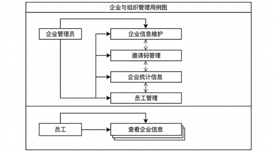 

**图 3.2 企业与组织管理用例图**

#### 3.2.3 功能需求分析

7. **企业 CRUD**

o 创建企业，设置企业名称、地址、联系人等信息

o 修改企业基本信息

o 查看企业详情

o 企业注销（软删除）

8. **邀请码管理**

o 自动生成企业邀请码

o 邀请码有效期管理

o 邀请码使用情况统计

9. **企业统计信息**

o 企业下养殖场数量统计

o 企业下设备数量统计

o 企业下员工数量统计

o 企业工单处理情况统计

10. **员工管理**

o 查看企业下所有员工

o 员工角色分配

o 员工状态管理（启用/禁用）

------

### 3.3 养殖场管理模块

#### 3.3.1 模块概述

养殖场管理模块负责养殖基地的基础信息管理，包括养殖场和养殖点（如鸡舍）的层级化管理。

#### 3.3.2 用例图

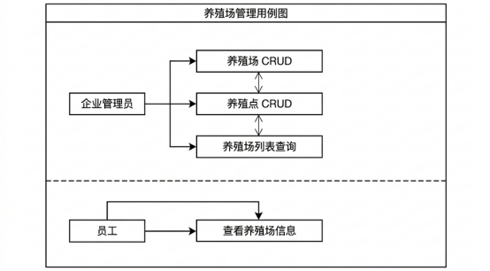 

**图 3.3 养殖场管理用例图**

#### 3.3.3 功能需求分析

11. **养殖场管理**

o 创建养殖场，设置名称、地址、负责人

o 修改养殖场信息

o 删除养殖场（软删除）

o 查询企业下所有养殖场

12. **养殖点管理**

o 在养殖场下创建养殖点（如鸡舍）

o 设置养殖点牲畜总数

o 支持扩展属性存储（properties 字段）

o 养殖点增删改查

13. **层级关系**

o 企业 → 养殖场 → 养殖点 三级架构

o 养殖点必须从属于某个养殖场

o 养殖场必须从属于某个企业

------

### 3.4 设备管理模块

#### 3.4.1 模块概述

设备管理模块负责 IoT 设备的全生命周期管理，包括设备注册、状态监控、数据采集等功能。支持多种设备类型，如环境传感器、监控摄像头、智能饲喂器等。

#### 3.4.2 用例图

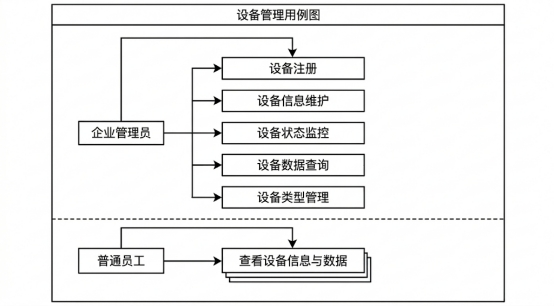 

**图 3.4 设备管理用例图**

#### 3.4.3 功能需求分析

14. **设备 CRUD**

o 设备注册：名称、MAC 地址、类型、安装位置

o 设备信息修改

o 设备删除（软删除）

o 设备分页查询

15. **设备状态监控**

o 在线/离线/故障状态标识

o 设备心跳检测（定时任务）

o 状态变更实时推送（WebSocket）

16. **设备数据采集**

o 支持多种设备类型

o 设备数据存入 MongoDB

o 支持历史数据查询

17. **视频流管理**

o 摄像头设备支持 RTMP 推流

o FLV 播放地址生成

o 推流状态监控

18. **设备类型管理**

o 设备类型定义

o 设备类型 CRUD

#### 3.4.4 特殊机制

\- **心跳检测**：定时任务检测设备在线状态，超时未上报视为离线

\- **状态推送**：设备状态变更通过 WebSocket 实时推送给客户端

\- **扩展属性**：支持 JSON 格式存储设备特有属性

------

### 3.5 工单管理模块

#### 3.5.1 模块概述

工单管理模块负责任务工单的全流程管理，包括工单创建、派发、认领、处理、完结等功能。支持工单媒体文件上传，实现工单处理的可视化。

#### 3.5.2 用例图

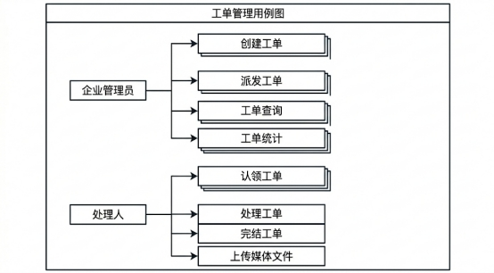 

**图 3.5 工单管理用例图**

#### 3.5.3 功能需求分析

1. **工单 CRUD**

o 创建工单：标题、描述、状态（待处理/已完成/紧急）

o 工单查询（支持分页、条件筛选）

o 工单详情查看

o 工单删除（软删除）

2. **工单派发**

o 管理员派发工单给指定处理人

o 派发通知推送

3. **工单认领**

o 处理人主动认领工单

o 认领状态标记

4. **工单处理**

o 填写解决方案描述

o 填写巡查情况描述

o 上传现场照片/视频

o 标记工单完成

5. **工单统计**

o 企业工单总数统计

o 待处理工单数量

o 已完成工单数量

o 处理人工作量统计

#### 3.5.4 特殊机制

\- **自动派单**：设备故障/预警自动创建工单

\- **媒体文件**：支持图片/视频上传至 OBS，数据库存储链接

\- **通知推送**：工单状态变更通过 SSE 推送通知

------

### 3.6 预警管理模块

#### 3.6.1 模块概述

预警管理模块负责系统异常事件的检测、预警生成和预警通知。支持设备异常、环境异常等多种预警类型。

#### 3.6.2 用例图

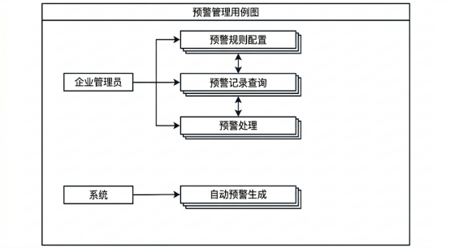 

**图 3.6 预警管理用例图**

#### 3.6.3 功能需求分析

1. **预警规则配置**

o 设置预警阈值

o 配置预警通知方式

o 设置预警级别

2. **预警生成**

o 设备离线自动预警

o 环境数据异常预警

o 设备故障预警

3. **预警通知**

o 站内消息通知

o 短信通知（可选）

o APP 推送通知

4. **预警处理**

o 预警确认

o 预警处理记录

o 预警转工单

------

### 3.7 通知管理模块

#### 3.7.1 模块概述

通知管理模块负责系统通知的生成、推送、存储和查询。支持多种通知类型，如工单通知、预警通知、系统通知等。

#### 3.7.2 用例图

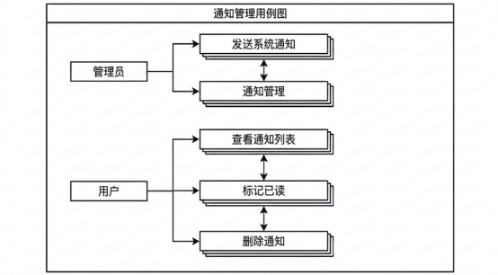 

**图 3.7 通知管理用例图**

#### 3.7.3 功能需求分析

5. **通知 CRUD**

o 创建通知（标题、内容、类型、接收人）

o 通知查询（分页、按类型筛选）

o 通知删除（软删除）

6. **通知推送**

o SSE 实时推送

o 站内消息存储

7. **通知状态管理**

o 已读/未读状态标记

o 批量标记已读

------

### 3.8 牲畜出入库管理模块

#### 3.8.1 模块概述

牲畜出入库管理模块负责养殖场牲畜数量变化的记录和管理，支持入库、出库操作，提供库存统计功能。

#### 3.8.2 用例图

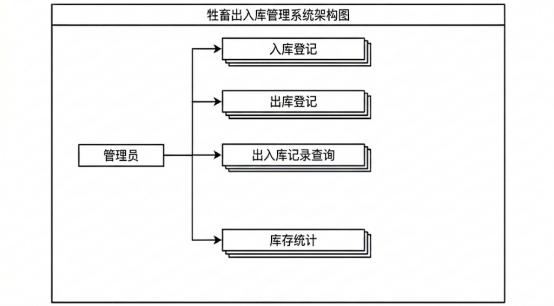 

**图 3.8 牲畜出入库管理用例图**

#### 3.8.3 功能需求分析

8. **入库登记**

o 选择养殖场/养殖点

o 录入入库数量

o 记录入库原因

9. **出库登记**

o 选择养殖场/养殖点

o 录入出库数量

o 记录出库原因

10. **记录查询**

o 按时间范围查询

o 按养殖场筛选

o 出入库类型筛选

11. **库存统计**

o 实时库存计算

o 库存变化趋势

------

### 3.9 媒体文件管理模块

#### 3.9.1 模块概述

媒体文件管理模块负责图片、视频等媒体文件的上传、存储和访问。基于华为云 OBS 对象存储服务实现。

#### 3.9.2 用例图

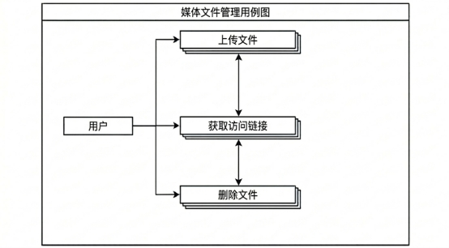 

**图 3.9 媒体文件管理用例图**

#### 3.9.3 功能需求分析

12. **文件上传**

o 支持图片上传

o 支持视频上传

o 文件大小限制

o 文件格式校验

13. **文件存储**

o 存储至华为云 OBS

o 数据库存储访问链接

o 文件分类管理

14. **文件访问**

o 生成临时访问链接

o 支持 CDN 加速（可选）

------

### 3.10 实时通信模块

#### 3.10.1 模块概述

实时通信模块提供 WebSocket 和 SSE 两种实时通信方式，支持设备状态推送、通知推送等实时场景。

#### 3.10.2 用例图

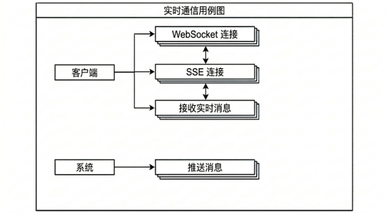 

**图 3.10 实时通信用例图**

#### 3.10.3 功能需求分析

15. **WebSocket 连接**

o 客户端建立 WebSocket 连接

o 连接认证（Token 验证）

o 心跳检测（30 秒间隔）

o 断线重连

16. **SSE 连接**

o 客户端建立 SSE 连接

o 通知消息推送

o 自动重连机制

17. **消息推送**

o 设备状态变更推送

o 通知消息推送

o 工单状态推送

------

## 4. 数据流程说明

### 4.1 数据主要流程图

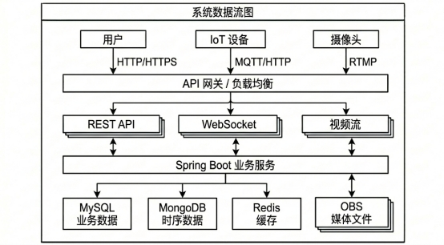 

**图 4.1 系统数据流图**

#### 数据来源说明

| 数据来源       | 数据类型           | 采集方式      |
| -------------- | ------------------ | ------------- |
| **用户交互**   | 业务操作数据       | HTTP REST API |
| **IoT 传感器** | 环境数据、设备状态 | MQTT/HTTP     |
| **摄像头**     | 视频流             | RTMP 推流     |
| **系统内部**   | 通知、预警、工单   | 系统自动生成  |

#### 数据处理流程

18. **设备数据处理**

o 边缘网关协议转换

o 数据清洗和格式化

o MongoDB 存储原始数据

o Redis 缓存最新状态

19. **业务数据处理**

o API 请求参数校验

o 业务逻辑处理

o MySQL 持久化存储

o 多租户数据隔离

20. **媒体文件处理**

o 文件上传至 OBS

o 数据库存储访问链接

o CDN 分发加速

### 4.2 数据存储策略

#### 4.2.1 关系型数据（MySQL）

**存储内容**：

\- 用户信息（users 表）

\- 企业信息（enterprises 表）

\- 养殖场/养殖点（farm、farm_sites 表）

\- 设备信息（devices、device_types 表）

\- 工单信息（orders、order_media 表）

\- 通知信息（notifications 表）

\- 出入库记录（animal_in_out 表）

\- 角色权限（roles、permissions、user_roles、role_permission 表）

**存储特点**：

\- 支持事务 ACID 特性

\- 多租户数据隔离（enterprise_id 字段）

\- 逻辑删除（deleted_at 字段）

\- 自动填充创建/更新时间

#### 4.2.2 时序数据（MongoDB）

**存储内容**：

\- 设备采集数据（device_datas 表）

\- 历史状态记录

**存储特点**：

\- 文档型存储，灵活的数据结构

\- 高写入性能

\- 支持时间范围查询

\- 软删除支持（deleted_at 字段）

#### 4.2.3 缓存数据（Redis）

**存储内容**：

\- Sa-Token 会话信息

\- 热点业务数据缓存

\- 设备最新状态缓存

\- 分布式锁

**存储特点**：

\- 内存存储，高性能读写

\- 支持过期时间

\- 支持发布订阅模式

#### 4.2.4 媒体文件（OBS）

**存储内容**：

\- 工单现场照片

\- 工单现场视频

\- 用户上传图片

**存储特点**：

\- 海量存储

\- 高可靠性

\- 数据库仅存储访问链接

\- 支持 CDN 加速访问

#### 4.2.5 持久化策略

| 数据类型         | 持久化时机       | 保留策略             |
| ---------------- | ---------------- | -------------------- |
| **业务数据**     | 实时写入 MySQL   | 软删除，永久保留     |
| **设备时序数据** | 实时写入 MongoDB | 按时间分区，定期归档 |
| **会话数据**     | 实时写入 Redis   | Token 过期自动删除   |
| **媒体文件**     | 实时上传 OBS     | 关联删除时同步删除   |

------

## 附录

### A. 技术栈总览

| 分类           | 技术         | 版本    | 用途          |
| -------------- | ------------ | ------- | ------------- |
| **后端框架**   | Spring Boot  | 3.5.5   | 应用框架      |
| **编程语言**   | Java         | 17      | 开发语言      |
| **ORM 框架**   | MyBatis-Plus | 3.5.12  | 数据访问      |
| **权限认证**   | Sa-Token     | 1.44.0  | 权限控制      |
| **数据库**     | MySQL        | -       | 业务数据存储  |
| **文档数据库** | MongoDB      | -       | 时序数据存储  |
| **缓存**       | Redis        | -       | 缓存/会话存储 |
| **对象存储**   | 华为云 OBS   | 3.25.10 | 媒体文件存储  |
| **实时通信**   | WebSocket    | -       | 双向通信      |
| **实时推送**   | SSE          | -       | 单向推送      |
| **密码加密**   | BCrypt       | -       | 密码加密      |
| **视频流**     | FLV/RTMP     | -       | 视频推流/播放 |

### B. 数据库表结构总览

| 表名            | 中文名     | 主要字段                                     |
| --------------- | ---------- | -------------------------------------------- |
| users           | 用户表     | id, enterprise_id, username, password, phone |
| enterprises     | 企业表     | id, name, address, invited_code              |
| farm            | 养殖场表   | id, enterprise_id, name, address             |
| farm_sites      | 养殖点表   | id, farm_id, name, sum, properties           |
| devices         | 设备表     | id, enterprise_id, name, mac, type, site_id  |
| device_types    | 设备类型表 | id, name                                     |
| device_datas    | 设备数据表 | _id, device_id, data, created_at             |
| orders          | 工单表     | id, enterprise_id, title, status, creator_id |
| order_media     | 工单媒体表 | id, order_id, media_url, media_type          |
| notifications   | 通知表     | id, enterprise_id, title, content, type      |
| animal_in_out   | 出入库表   | id, enterprise_id, site_id, count, type      |
| roles           | 角色表     | id, name                                     |
| permissions     | 权限表     | id, name                                     |
| user_roles      | 用户角色表 | user_id, role_id                             |
| role_permission | 角色权限表 | role_id, permission_id                       |

### C. API 接口分类

| 分类           | 路径前缀      | 说明                 |
| -------------- | ------------- | -------------------- |
| 用户接口       | /user         | 登录/注册/信息管理   |
| 企业接口       | /enterprise   | 企业信息/统计/邀请码 |
| 养殖场接口     | /farm         | 养殖场 CRUD          |
| 养殖点接口     | /farmsite     | 养殖点 CRUD          |
| 设备接口       | /device       | 设备 CRUD/分页查询   |
| 设备类型接口   | /deviceType   | 设备类型管理         |
| 设备数据接口   | /deviceData   | 数据采集/查询        |
| 工单接口       | /order        | 工单 CRUD/派发/认领  |
| 预警接口       | /warn         | 预警管理             |
| 通知接口       | /notification | 通知管理             |
| 出入库接口     | /animalinout  | 出入库记录           |
| 对象存储接口   | /obs          | 文件上传             |
| SSE 接口       | /sse          | SSE 连接             |
| WebSocket 接口 | /ws           | WebSocket 连接       |
| 管理员接口     | /admin        | 管理员功能           |

------

**文档结束**